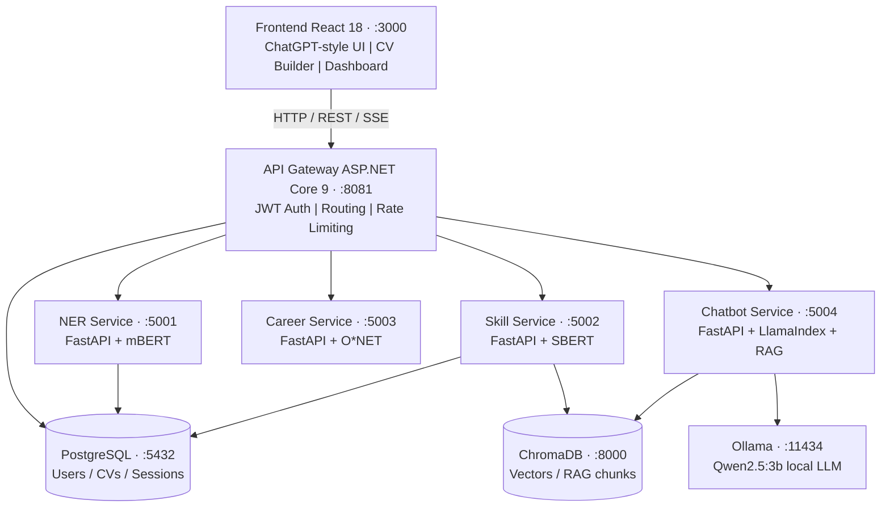

# 2.1 Kiến trúc tổng thể hệ thống

## 2.1.1 Tổng quan thiết kế

Hệ thống CV Assistant được thiết kế theo kiến trúc **microservices** [[21]](../tai_lieu_tham_khao.md#ref-21) gồm 9 thành phần độc lập, giao tiếp với nhau qua giao thức HTTP/REST. Quyết định chọn microservices thay vì monolithic xuất phát từ bản chất của bài toán: hệ thống tích hợp nhiều module AI không đồng nhất về công nghệ (ASP.NET Core, Python FastAPI, LLM server), mỗi module có yêu cầu tài nguyên và vòng đời phát triển khác nhau. Việc tách biệt từng module thành service độc lập cho phép cải tiến, thay thế (ví dụ nâng cấp NER model) hay mở rộng (scale riêng NER Service khi tải tăng) mà không ảnh hưởng đến các phần còn lại. Toàn bộ hệ thống được container hóa bằng Docker và quản lý qua Docker Compose để đảm bảo triển khai nhất quán trên mọi môi trường.

**Hình 2.1: Kiến trúc microservices hệ thống CV Assistant**

## 2.1.2 Mô tả các thành phần

**Bảng 2.1: Đặc tả các microservice trong hệ thống**

| # | Service | Công nghệ | Cổng | Chức năng chính |
|---|---|---|---|---|
| 1 | Frontend | React 18, TypeScript | 3000 | Giao diện ChatGPT-style, CV Builder, Dashboard |
| 2 | API Gateway | ASP.NET Core 9, C# | 8081 | JWT Auth, routing, quản lý user, CV versioning |
| 3 | NER Service | FastAPI, Python 3.10 | 5001 | Trích xuất thực thể CV/JD bằng mBERT [[33]](../tai_lieu_tham_khao.md#ref-33) |
| 4 | Skill Service | FastAPI, Python 3.10 | 5002 | Skill matching, ATS score, phân tích thị trường |
| 5 | Career Service | FastAPI, Python 3.10 | 5003 | Lộ trình nghề nghiệp, gợi ý bước tiếp theo |
| 6 | Chatbot Service | FastAPI, LlamaIndex | 5004 | RAG chatbot [[15]](../tai_lieu_tham_khao.md#ref-15), sinh và tối ưu CV |
| 7 | PostgreSQL | PostgreSQL 15 | 5432 | Users, CV history, sessions, feedback |
| 8 | ChromaDB | ChromaDB 0.4 | 8000 | Vector DB [[26]](../tai_lieu_tham_khao.md#ref-26) cho RAG và lịch sử hội thoại |
| 9 | Ollama | Ollama + Qwen2.5:3b | 11434 | Serve LLM local [[27]](../tai_lieu_tham_khao.md#ref-27) (chế độ offline) |

## 2.1.3 Luồng dữ liệu tổng thể

Hệ thống hỗ trợ ba luồng sử dụng chính, mỗi luồng tương ứng với một use case cụ thể của người dùng.

```mermaid
sequenceDiagram
    actor U as Người dùng
    participant FE as Frontend
    participant GW as API Gateway
    participant NER as NER Service
    participant SKILL as Skill Service
    participant CHAT as Chatbot Service
    participant PG as PostgreSQL
    participant CHROMA as ChromaDB
    participant LLM as LLM (Ollama/Groq)

    rect rgb(30, 60, 90)
        Note over U,PG: Luồng 1 — Phân tích CV + ATS Score
        U->>FE: Upload file CV (PDF/TXT)
        FE->>GW: POST /api/ner/parse-cv [JWT]
        GW->>NER: Forward multipart file
        NER-->>GW: Entities JSON (tên, kỹ năng, kinh nghiệm...)
        GW->>PG: Lưu CVHistory
        GW-->>FE: Trả về entities
        U->>FE: Dán JD text
        FE->>GW: POST /api/skills/match
        GW->>SKILL: CV skills + JD skills
        SKILL-->>GW: ATS score + matched/missing skills
        GW-->>FE: Hiển thị kết quả
    end

    rect rgb(30, 80, 60)
        Note over U,LLM: Luồng 2 — Tư vấn nghề nghiệp (Streaming)
        U->>FE: Gửi tin nhắn chat
        FE->>GW: POST /api/chatbot/chat/stream [JWT]
        GW->>CHAT: Forward request
        CHAT->>CHROMA: Retrieve top-3 chunks liên quan
        CHROMA-->>CHAT: Context documents
        CHAT->>LLM: Prompt (System + Memory + Context + CV + History)
        LLM-->>CHAT: Token stream (SSE)
        CHAT-->>GW: SSE chunks
        GW-->>FE: SSE chunks
        FE-->>U: Hiển thị từng token realtime
    end

    rect rgb(80, 50, 30)
        Note over U,PG: Luồng 3 — CV Builder + Export PDF
        U->>FE: Nhập thông tin CV + nhấn "AI Improve"
        FE->>GW: POST /api/chatbot/cv/suggest
        GW->>CHAT: Section text cần cải thiện
        CHAT-->>GW: Bullet points chuẩn ATS
        GW-->>FE: Gợi ý AI
        U->>FE: Accept + Export PDF
        FE->>GW: POST /api/ner/generate-pdf
        GW->>NER: Structured CV data
        NER-->>GW: File PDF
        GW->>PG: Lưu CvVersion mới
        GW-->>FE: Download PDF
    end
```

**Luồng 1 — Phân tích CV và tính ATS Score** là luồng cốt lõi nhất: người dùng upload file CV lên Frontend, request được gửi qua API Gateway (xác thực JWT), API Gateway forward file multipart đến NER Service. NER Service load file, trích xuất text, chạy mBERT pipeline để nhận diện các thực thể (tên, kỹ năng, kinh nghiệm, học vấn...) rồi trả về danh sách entities có cấu trúc. API Gateway lưu kết quả vào CVHistory (PostgreSQL) và trả về Frontend để hiển thị. Nếu người dùng cung cấp thêm JD, Skill Service được gọi tiếp theo để thực hiện matching và tính ATS score.

**Luồng 2 — Tư vấn nghề nghiệp qua Chatbot** hoạt động theo mô hình streaming: người dùng gửi tin nhắn từ Frontend, API Gateway proxy request đến Chatbot Service. Chatbot Service thực hiện retrieval từ ChromaDB để lấy context liên quan, kết hợp với thông tin CV/JD của user từ User Memory, rồi gửi prompt tổng hợp cho LLM (Qwen2.5:3b qua Ollama hoặc Llama-3.3-70b qua Groq [[28]](../tai_lieu_tham_khao.md#ref-28)). LLM sinh response dạng stream (Server-Sent Events), được pipe qua Chatbot Service → API Gateway → Frontend và hiển thị từng token một giống ChatGPT.

**Luồng 3 — CV Builder** là luồng phức tạp nhất với nhiều bước: người dùng điền thông tin CV qua form, từng phần có thể được AI cải thiện qua Chatbot Service. Khi xuất PDF, dữ liệu CV được gửi đến NER Service để generate file PDF chuẩn ATS. API Gateway lưu mỗi lần chỉnh sửa như một version mới trong CvDocument versioning system (PostgreSQL), cho phép người dùng xem lịch sử và khôi phục bất kỳ version nào.

## 2.1.4 Stack công nghệ tổng hợp

| Lớp | Công nghệ |
|---|---|
| Frontend | React 18, TypeScript, Tailwind CSS |
| API Gateway | ASP.NET Core 9, C#, .NET 9 [[30]](../tai_lieu_tham_khao.md#ref-30), EF Core, Npgsql, BCrypt |
| AI Services | Python 3.10, FastAPI, HuggingFace Transformers [[19]](../tai_lieu_tham_khao.md#ref-19) |
| NLP Models | mBERT BertForTokenClassification (NER) [[33]](../tai_lieu_tham_khao.md#ref-33), Sentence-BERT all-MiniLM-L6-v2 (Skill Matching) [[34]](../tai_lieu_tham_khao.md#ref-34) |
| LLM | Qwen2.5:3b via Ollama [[27]](../tai_lieu_tham_khao.md#ref-27) (local), Llama-3.3-70b via Groq Cloud [[28]](../tai_lieu_tham_khao.md#ref-28) |
| RAG Framework | LlamaIndex [[25]](../tai_lieu_tham_khao.md#ref-25), ChromaDB 0.4 [[26]](../tai_lieu_tham_khao.md#ref-26) |
| Database | PostgreSQL 15 (relational), ChromaDB (vector) |
| DevOps | Docker, Docker Compose |
| Ngôn ngữ phát triển | Python, C# (.NET), TypeScript |

---

[← Chương 1](../chuong1/1.6_microservices_synthetic_data.md) | [→ 2.2 Dữ liệu và Pipeline Huấn luyện NER](2.2_du_lieu_synthetic.md)
