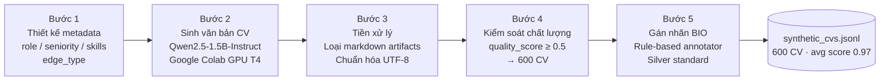

# 2.2 Dữ liệu và Pipeline Huấn luyện NER

## 2.2.1 Tổng quan bài toán dữ liệu

Huấn luyện mô hình NER đòi hỏi một lượng đáng kể văn bản đã được gán nhãn BIO ở cấp độ token. Đối với bài toán phân tích CV và JD trong ngành CNTT, thách thức không chỉ nằm ở khối lượng dữ liệu mà còn ở chỗ không tồn tại bộ dữ liệu CV tiếng Việt có nhãn NER chi tiết nào được công bố công khai. Trong khi các bộ dữ liệu quốc tế như CoNLL-2003 hay bộ dữ liệu Resume-NER của Lim et al. [[4]](../tai_lieu_tham_khao.md#ref-4) phục vụ cho tiếng Anh, thị trường Việt Nam thiếu hoàn toàn nguồn dữ liệu tương đương.

Phương án thu thập CV thực tế từ các nền tảng như LinkedIn, TopCV, hay ITviec gặp hai rào cản nghiêm trọng không thể vượt qua. Thứ nhất, CV chứa thông tin cá nhân nhạy cảm bao gồm họ tên, địa chỉ, số điện thoại và email — việc thu thập và sử dụng mà không có sự đồng ý của chủ thể vi phạm Nghị định 13/2023/NĐ-CP về bảo vệ dữ liệu cá nhân [[31]](../tai_lieu_tham_khao.md#ref-31) và vi phạm điều khoản sử dụng của các nền tảng nói trên. Thứ hai, chi phí gán nhãn NER ở cấp độ token cho một nghìn CV với mười loại thực thể đòi hỏi nhiều giờ công của annotator có chuyên môn, ước tính lên đến hàng chục triệu đồng — vượt xa nguồn lực của một đề tài nghiên cứu sinh viên.

Giải pháp được chọn là sinh dữ liệu CV synthetic có kiểm soát bằng LLM, kết hợp với quy trình tự động gán nhãn BIO theo phương pháp silver standard. Phương pháp này giải quyết đồng thời cả ba vấn đề: tuân thủ pháp lý vì không sử dụng dữ liệu cá nhân thật, chi phí tính toán thấp hơn nhiều so với gán nhãn thủ công, và phân phối dữ liệu có thể được kiểm soát chủ động để đảm bảo cân bằng về vai trò nghề nghiệp và cấp độ kinh nghiệm.

## 2.2.2 Pipeline Sinh dữ liệu CV Synthetic



Pipeline sinh dữ liệu được thực thi trên Google Colab với GPU T4 miễn phí, sử dụng mô hình Qwen2.5-1.5B-Instruct [[35]](../tai_lieu_tham_khao.md#ref-35) làm engine sinh văn bản. Việc lựa chọn Qwen2.5-1.5B thay vì các LLM lớn hơn như GPT-4 hay Llama-3.3-70b xuất phát từ hai lý do thực tế: mô hình này hoàn toàn miễn phí để chạy trên Colab GPU và đủ năng lực sinh văn bản CV chất lượng tốt khi được cung cấp prompt có cấu trúc rõ ràng.

Bước đầu tiên của pipeline là thiết kế schema kiểm soát, trong đó mỗi CV được mô tả bởi một metadata record JSON với các trường định nghĩa rõ ràng. Trường `role` xác định vai trò nghề nghiệp (Backend Developer, Frontend Developer, DevOps Engineer...), `seniority` phân loại cấp độ (junior, mid, senior, fresher), `yoe` ghi số năm kinh nghiệm, `skills` liệt kê danh sách công nghệ cần xuất hiện trong CV, và `company` chỉ định tên công ty làm việc gần nhất. Đặc biệt, trường `edge_type` kiểm soát đa dạng hóa phong cách CV: giá trị `normal` tạo CV tiêu chuẩn đầy đủ các section, `short` tạo CV ngắn dưới 200 từ phù hợp với fresher hoặc CV tóm tắt, `verbose` tạo CV dài trên 500 từ cho ứng viên nhiều kinh nghiệm, và `mixed_vi_en` tạo CV xen lẫn tiếng Việt và thuật ngữ kỹ thuật tiếng Anh — phản ánh thực tế đa dạng của CV ngành CNTT tại Việt Nam nơi lập trình viên thường viết CV theo phong cách pha trộn ngôn ngữ.

Bước thứ hai là sinh nội dung văn bản từ metadata đầu vào. Từ mỗi metadata record, hệ thống tạo ra một prompt có cấu trúc hướng dẫn Qwen2.5-1.5B-Instruct viết CV theo định dạng plain text với các section SUMMARY, EXPERIENCE, EDUCATION, và SKILLS. Thay vì sử dụng template cố định với nội dung tĩnh, LLM được tự do quyết định phong cách diễn đạt, cách sắp xếp nội dung, và từ ngữ sử dụng trong mỗi CV — tạo ra sự đa dạng tự nhiên không thể đạt được bằng template. Mỗi CV được sinh trong khoảng 3–5 giây trên Colab GPU T4.

Bước thứ ba là tiền xử lý để tạo trường `text_clean` từ văn bản thô. Quá trình này loại bỏ các markdown artifacts còn sót lại từ quá trình sinh (ký tự `**`, `##`, `---`), chuẩn hóa khoảng trắng và ký tự xuống dòng thừa, đồng thời xử lý encoding UTF-8 đặc biệt quan trọng với tên người Việt có dấu. Trường `text_clean` được lưu song song với trường `text` gốc để phục vụ cho cả NER training và debugging.

Bước thứ tư là kiểm soát chất lượng tự động thông qua chỉ số `quality_score`. Mỗi CV được chấm điểm tổng hợp từ ba tiêu chí: độ dài văn bản nằm trong khoảng hợp lệ từ 100 đến 1000 từ được cộng 0.3 điểm, sự hiện diện đầy đủ của các section EXPERIENCE, SKILLS, và EDUCATION được cộng 0.4 điểm, và tỷ lệ kỹ năng trong metadata xuất hiện thực tế trong văn bản đạt từ 60% trở lên được cộng 0.3 điểm. Tổng `quality_score` dao động từ 0 đến 1.0; những CV có điểm dưới 0.5 bị loại khỏi bộ dữ liệu. Kết quả cuối cùng là 600 CV synthetic chất lượng cao với `quality_score` trung bình đạt 0.97 — con số này phản ánh Qwen2.5-1.5B-Instruct sinh ra hầu hết CV đáp ứng đầy đủ các tiêu chí chất lượng khi được cung cấp metadata đầu vào có cấu trúc rõ ràng.

## 2.2.3 Thống kê Bộ dữ liệu

Bộ dữ liệu 600 CV được phân bố đều qua mười nhóm nghề nghiệp, mỗi nhóm gồm 60 CV với phân bố cấp độ seniority được thiết kế để phản ánh thực tế thị trường. Chi tiết phân bố được trình bày trong Bảng 2.2.

**Bảng 2.2: Thống kê tập dữ liệu CV synthetic** (`data/synthetic_cvs.jsonl`, 600 mẫu, trung bình 285 từ/CV)

| Vai trò | Số CV | Quality Score TB |
|---|---|---|
| Backend Developer | 61 | 0.997 |
| Full-stack Developer | 61 | 0.997 |
| Data Analyst | 61 | 0.997 |
| Frontend Developer | 60 | 0.997 |
| Data Scientist | 60 | 0.997 |
| DevOps Engineer | 60 | 0.997 |
| AI Engineer | 59 | 0.997 |
| Mobile Developer | 59 | 0.997 |
| Project Manager | 59 | 0.997 |
| QA Engineer | 60 | 0.997 |
| **Tổng cộng** | **600** | **0.996** |

Phân bố seniority thực tế trong bộ dữ liệu: Junior 216 CV (36%), Mid 235 CV (39%), Senior 113 CV (19%), Lead 25 CV (4%), Principal 11 CV (2%). Phân bố nghiêng về mid-level phản ánh thực tế thị trường tuyển dụng CNTT Việt Nam, nơi nhóm này chiếm đa số trong các tin đăng tuyển. `quality_score` trung bình 0.996 cho thấy Qwen2.5-1.5B-Instruct [[35]](../tai_lieu_tham_khao.md#ref-35) sinh CV đạt chất lượng cao khi được cung cấp metadata có cấu trúc.

## 2.2.4 Pipeline Gán nhãn BIO (Silver Standard)

Sau khi có bộ 600 CV synthetic, bước tiếp theo là gán nhãn BIO ở cấp độ token để tạo dữ liệu huấn luyện cho mô hình NER. Do không có annotator con người, đề tài sử dụng phương pháp silver standard — tức là gán nhãn tự động bằng rule-based system, chấp nhận rằng kết quả có thể có một tỷ lệ lỗi nhất định thay vì đạt độ chính xác tuyệt đối của gán nhãn thủ công.

Quy trình gán nhãn bắt đầu bằng việc phân tách `text_clean` thành danh sách token theo khoảng trắng, đồng thời ghi nhận character offset cho từng token để ánh xạ lại vào văn bản gốc. Sau đó, mỗi loại thực thể được xử lý bằng rule riêng biệt phù hợp với đặc thù của nó. Với thực thể PER (tên người), hệ thống so khớp với trường `name` trong metadata nếu có, đồng thời áp dụng regex pattern nhận diện tên người Việt (chuỗi chữ hoa có dấu) và tên người Anh. Với thực thể SKILL, hệ thống đối chiếu với danh sách kỹ năng trong metadata và toàn bộ ontology kỹ năng khoảng 500 entries bao gồm các alias và biến thể viết tắt. Với ORG, hệ thống khớp với trường `company` trong metadata và một danh sách các công ty IT Việt Nam phổ biến. DATE được nhận diện qua pattern regex cho năm (2018–2026) và khoảng thời gian định dạng "Tháng Năm – Tháng Năm". JOB\_TITLE, DEGREE, MAJOR, LOC, và CERT được khớp với danh sách từ khoá tương ứng được curate trước.

Một tính năng quan trọng của pipeline là context-aware matching: các thực thể như MAJOR chỉ được phép khớp bên trong vùng section EDUCATION của CV (được phát hiện qua header detection từ SmartCVParser), qua đó tránh nhầm lẫn với các đoạn văn bản có từ khoá tương tự nhưng nằm sai ngữ cảnh. Sau khi thu được tập hợp các entity span, hệ thống chuyển đổi sang chuỗi nhãn BIO tương ứng với từng token trong danh sách đã phân tách.

Hạn chế cốt yếu của phương pháp silver labeling cần được nhận thức rõ ràng. Pipeline này gán nhãn theo ranh giới token dựa trên khoảng trắng (whitespace tokenization), trong khi mô hình NER khi inference sử dụng WordPiece subword tokenization của mBERT — hai cách phân tách token này không tương đồng với nhau. Khi đánh giá mô hình bằng cách so sánh output của mô hình với silver labels trên 200 mẫu, kết quả F1 tổng thể chỉ đạt 0.03 — con số này không phản ánh hiệu suất thực của mô hình mà là hiện tượng tokenization mismatch. Phân tích chi tiết về hiện tượng này và cách đánh giá chính xác hơn thông qua demo định tính được trình bày đầy đủ trong Chương 3.

## 2.2.5 Cấu trúc Dữ liệu Lưu trữ

Toàn bộ bộ dữ liệu được lưu tại `data/synthetic_cvs.jsonl` (2.7 MB, 600 dòng) theo định dạng JSON Lines — mỗi dòng là một JSON object đại diện cho một CV với đầy đủ metadata, văn bản thô và văn bản đã làm sạch. Định dạng này cho phép đọc streaming từng CV mà không cần load toàn bộ file vào RAM — quan trọng khi xử lý batch cho 600 CV trong bộ nhớ giới hạn của Google Colab.

Cấu trúc một record JSONL hoàn chỉnh trong bộ dữ liệu:

```json
{
  "id": "cv_042",
  "role": "Backend Developer",
  "seniority": "mid",
  "yoe": 3,
  "skills": ["Java", "Spring Boot", "PostgreSQL", "Docker", "Kafka"],
  "company": "VNG Corporation",
  "edge_type": "normal",
  "quality_score": 1.0,
  "text": "## NGUYEN VAN AN\n...(raw LLM output)...",
  "text_clean": "NGUYEN VAN AN\n\nSUMMARY\nExperienced Backend Developer...",
  "bio_tokens": ["NGUYEN", "VAN", "AN", "SUMMARY", ...],
  "bio_labels": ["B-PER", "I-PER", "I-PER", "O", ...]
}
```

Hàm chuyển đổi entity spans sang chuỗi BIO labels trong pipeline gán nhãn:

```python
def spans_to_bio(tokens: list[str], entities: list[dict]) -> list[str]:
    """Chuyển danh sách entity spans sang chuỗi BIO labels."""
    labels = ["O"] * len(tokens)
    for ent in entities:
        start_tok, end_tok = ent["token_start"], ent["token_end"]
        etype = ent["type"]
        labels[start_tok] = f"B-{etype}"
        for i in range(start_tok + 1, end_tok + 1):
            labels[i] = f"I-{etype}"
    return labels
```

Phân tích phân bố nhãn thực thể trên 200 mẫu đầu tiên của bộ dữ liệu được trình bày trong Bảng 2.3. Kết quả cho thấy SKILL là loại thực thể chiếm tỷ lệ áp đảo với 3.799 instances, tương đương 58.8% tổng số thực thể — phản ánh đặc thù của CV ngành CNTT nơi phần Skills thường liệt kê danh sách dài các công nghệ. Đây cũng chính là loại thực thể thách thức nhất cho mô hình do sự đa dạng cực lớn trong cách viết tên công nghệ (ReactJS / React.js / React / react), sự xuất hiện của các từ viết tắt (k8s cho Kubernetes, EKS cho Elastic Kubernetes Service), và vấn đề subword tokenization khiến những tên công nghệ có dấu chấm hoặc số bị tách thành nhiều subword.

**Bảng 2.3: Phân bố nhãn thực thể trong tập dữ liệu (200 mẫu silver labels)**

| Loại thực thể | Số lượng | Tỷ lệ |
|---|---|---|
| SKILL | 3.799 | 58.8% |
| DATE | 693 | 10.7% |
| JOB\_TITLE | 560 | 8.7% |
| ORG | 552 | 8.5% |
| LOC | 300 | 4.6% |
| MAJOR | 242 | 3.7% |
| DEGREE | 168 | 2.6% |
| PER | 116 | 1.8% |
| CERT | 35 | 0.5% |
| **Tổng** | **6.465** | **100%** |

Sự mất cân bằng nhãn rõ nét trong bộ dữ liệu — SKILL chiếm gần 59% trong khi CERT chỉ chiếm 0.5% — là một thực tế phản ánh đúng bản chất của CV ngành CNTT chứ không phải artefact của quá trình sinh dữ liệu. Trong training, mất cân bằng này được xử lý một phần bởi cross-entropy loss tiêu chuẩn, nhưng các thực thể hiếm như CERT và DEGREE có thể sẽ có F1 thấp hơn do ít dữ liệu huấn luyện hơn — điều này được xác nhận qua kết quả đánh giá định lượng ở Chương 3.

---

[← 2.1 Kiến trúc tổng thể](2.1_kien_truc_tong_the.md) | [→ 2.3 NER Service](2.3_ner_service.md)
