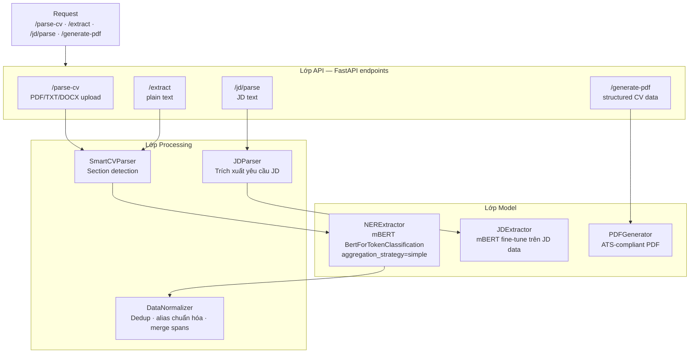

# 2.3 NER Service — Thiết kế và Huấn luyện

## 2.3.1 Tổng quan NER Service

NER Service là thành phần trung tâm của toàn bộ pipeline phân tích, đảm nhận nhiệm vụ trích xuất các thực thể có cấu trúc từ văn bản CV và JD thô. Service được xây dựng bằng FastAPI (Python 3.10) [[19]](../tai_lieu_tham_khao.md#ref-19), lắng nghe tại cổng `:5001`, và được API Gateway proxy đến thông qua `NerProxyController`. Lý do chọn FastAPI thay vì Flask hay Django là vì FastAPI cung cấp async IO tự nhiên, tự động sinh OpenAPI documentation, tích hợp tốt với Pydantic để validation, và đặc biệt là async inference cho phép xử lý nhiều request CV song song — quan trọng khi NER model có latency cao lúc load.

Service cung cấp nhiều endpoint phục vụ các use case khác nhau. Endpoint `/parse-cv` nhận file upload (PDF/TXT/DOCX) và trả về kết quả extraction đầy đủ có cấu trúc theo section CV. Endpoint `/extract` nhận plain text và trả về danh sách entities phẳng. Endpoint `/batch/extract` cho phép xử lý nhiều text cùng lúc, tận dụng HuggingFace pipeline's batch processing. Endpoint `/jd/parse` xử lý JD với model chuyên biệt. Endpoint `/generate-pdf` nhận structured CV data và xuất file PDF chuẩn ATS. Sự phân tách rõ ràng giữa các endpoint này phản ánh các use case thực tế khác nhau: upload CV file của người dùng thực, gọi API programmatic từ các service khác, và xuất kết quả cuối cùng.

## 2.3.2 Kiến trúc nội bộ NER Service



Bên trong, NER Service được tổ chức thành ba lớp chức năng rõ ràng. Lớp model (`services/extractor.py`) chứa `NERExtractor` — class cốt lõi quản lý vòng đời của mBERT model và thực hiện inference. Lớp processing (`services/normalizer.py`, `services/jd_parser.py`) thực hiện post-processing: chuẩn hóa entities, gộp thực thể trùng, phân tích cấu trúc JD. Lớp output (`services/pdf_generator.py`) tạo file PDF từ structured CV data. Ngoài ra, `shared/utils/cv_parser.py` chứa `SmartCVParser` — một component chia sẻ giữa các service — thực hiện phân tích cấu trúc section của CV.

Một điểm thiết kế quan trọng là **singleton pattern với lazy initialization** cho model: `_extractor` global variable được khởi tạo chỉ khi có request đầu tiên, tránh load model (vài trăm MB) khi service khởi động và chỉ tốn thời gian load một lần duy nhất trong suốt vòng đời service. Tương tự, hệ thống có hai extractor riêng biệt: `_extractor` cho CV NER model và `_jd_extractor` cho JD NER model — hai model có cùng kiến trúc nhưng được fine-tune trên phân phối dữ liệu khác nhau, phản ánh sự khác biệt đáng kể về văn phong giữa CV (viết từ góc nhìn ứng viên, thường dùng bullet points, ngôn ngữ thành tích) và JD (viết từ góc nhìn nhà tuyển dụng, thường dùng danh sách yêu cầu, ngôn ngữ hướng dẫn).

## 2.3.3 Lớp NERExtractor và xử lý Inference

`NERExtractor` sử dụng HuggingFace Transformers pipeline [[19]](../tai_lieu_tham_khao.md#ref-19) với `aggregation_strategy="simple"` — tham số then chốt cho phép pipeline tự động xử lý vấn đề subword alignment. Thay vì trả về nhãn cho từng subword riêng lẻ (B-SKILL cho "Re", I-SKILL cho "##act", I-SKILL cho ".", I-SKILL cho "##js"), pipeline với aggregation_strategy="simple" tự động hợp nhất các subword liên tiếp có cùng entity group thành một span duy nhất, trả về `entity_group` (tên loại thực thể đã bỏ tiền tố B-/I-), `word` (văn bản span đã hợp nhất), `start`/`end` (character offset trong text gốc), và `score` (confidence trung bình). Cách tiếp cận này giải quyết phần lớn vấn đề subword tokenization một cách thanh lịch trong một dòng config.

Sau khi có danh sách raw entities từ HuggingFace pipeline, `_post_process_entities()` thực hiện thêm bước làm sạch: loại bỏ các entities quá ngắn (< 2 ký tự sau trim) có khả năng cao là artifacts, chuẩn hóa confidence score, và đảm bảo character offset chính xác. Kết quả cuối được trả về dưới dạng danh sách `Entity` objects với các trường text, type, start, end, confidence.

Code khởi tạo `NERExtractor` với lazy initialization và mock fallback:

```python
from transformers import pipeline as hf_pipeline

_extractor = None  # singleton — chỉ load một lần

def get_extractor() -> "NERExtractor":
    global _extractor
    if _extractor is None:
        _extractor = NERExtractor()
    return _extractor

class NERExtractor:
    def __init__(self, model_path: str = "models/ner/final"):
        try:
            self.pipe = hf_pipeline(
                "ner",
                model=model_path,
                tokenizer=model_path,
                aggregation_strategy="simple",  # tự gộp subword → span
                device=-1,                       # CPU inference
            )
            self.mock_mode = False
        except Exception:
            self.mock_mode = True   # fallback khi chưa có model

    def extract(self, text: str) -> list[dict]:
        if self.mock_mode:
            return self._mock_extract(text)
        raw = self.pipe(text)
        return self._post_process_entities(raw)

    def _post_process_entities(self, raw: list) -> list[dict]:
        results = []
        for ent in raw:
            word = ent["word"].strip()
            if len(word) < 2:       # bỏ fragment quá ngắn
                continue
            results.append({
                "text":       word,
                "type":       ent["entity_group"],
                "start":      ent["start"],
                "end":        ent["end"],
                "confidence": round(ent["score"], 4),
            })
        return results
```

Khi model không có sẵn (file không tồn tại hoặc lỗi load), service tự động chuyển sang **mock mode**: trích xuất bằng keyword matching đơn giản từ danh sách từ khóa định sẵn như "Python" → SKILL, "Google" → ORG, "Data Analyst" → JOB_TITLE. Mock mode đảm bảo toàn bộ hệ thống vẫn khởi động và test được trong môi trường development không có model file — một thiết kế defensive quan trọng giúp các developer frontend và backend không bị block khi chưa có model.

## 2.3.4 Cấu hình mô hình NER

Mô hình CV NER được lưu tại thư mục `models/ner/final/` (676.3 MB file `model.safetensors`), cấu hình trong `models/ner/final/config.json`: kiến trúc BertForTokenClassification [[3]](../tai_lieu_tham_khao.md#ref-3), 21 nhãn phân loại, vocab_size = 119.547 (mBERT vocabulary đầy đủ), hidden_size = 768, 12 lớp Transformer encoder và 12 attention heads. Tổng cộng khoảng 178 triệu tham số của mBERT backbone cộng với 768 × 21 = 16.128 tham số của lớp classification head. Model JD NER lưu tại `models/ner/jd_final/` có cùng kiến trúc nhưng khác về trọng số do được fine-tune trên dữ liệu JD (`data/processed/annotated_hf/jd_train.jsonl`, 100 mẫu).

## 2.3.5 Quy trình huấn luyện

Quá trình huấn luyện được thực hiện trên Google Colab với GPU T4 miễn phí. Bước đầu tiên là chuẩn bị dữ liệu: 600 CV từ `data/synthetic_cvs.jsonl` (2.7 MB) được silver-labeled bằng rule-based annotator — chương trình tự động khớp từng từ với dictionary kỹ năng, regex ngày tháng, danh sách tên trường để gán nhãn BIO mà không cần người gán thủ công — sau đó chia theo tỷ lệ 80/10/10 thành tập train (`data/processed/annotated_hf/synthetic_it_train.jsonl` — 480 CV), validation và test (`data/processed/annotated_hf/synthetic_it_test.jsonl` — 60 CV). Tập val được dùng để lựa chọn checkpoint tốt nhất.

Bước tokenization thực hiện alignment giữa word-level labels và subword tokens của mBERT: mỗi từ được tokenize thành một hoặc nhiều subword; subword đầu tiên nhận nhãn của từ đó, các subword tiếp theo (có tiền tố ##) nhận giá trị -100 để bị bỏ qua khi tính cross-entropy loss. Đây là cách tiếp cận chuẩn được HuggingFace khuyến nghị cho token classification với subword tokenizers.

Cấu hình huấn luyện gồm: AdamW optimizer với learning rate 2e-5 và weight decay 0.01, linear warmup trên 10% tổng số training steps theo sau là linear decay, batch size 16 với gradient accumulation 2 bước (effective batch size 32), 5 epochs với early stopping dựa trên Val F1. Dropout 0.1 được áp dụng cả trong BERT layers (hidden dropout) và trước lớp classifier. Sau khi huấn luyện xong, checkpoint tốt nhất được export về máy cục bộ trước khi Colab session hết hạn.

Một hạn chế thực tế quan trọng cần ghi nhận: do Google Colab session không được mount Google Drive, toàn bộ training log chi tiết (loss curve, validation F1 theo từng epoch) bị mất sau khi session kết thúc. Chỉ có file model weights cuối cùng được lưu thành công tại `models/ner/final/` (676.3 MB). Log huấn luyện còn lại được ghi tại `data/training_log.csv`. Đây là lý do không có training metrics định lượng đầy đủ trong báo cáo này; thay vào đó, đánh giá mô hình được thực hiện qua demo định tính (mục 3.2).

## 2.3.6 SmartCVParser và DataNormalizer

`SmartCVParser` là một component phân tích cấu trúc văn bản CV, nhận diện ranh giới và loại của từng section dựa trên header keywords. Khi phát hiện dòng text chỉ chứa các từ như "EXPERIENCE", "WORK HISTORY", hay "PROFESSIONAL EXPERIENCE" theo sau bởi dấu hai chấm hay newline, parser đánh dấu bắt đầu section EXPERIENCE. Thông tin section này có hai ứng dụng: thứ nhất, giúp cải thiện precision của NER bằng cách loại bỏ entities sai section (ví dụ MAJOR không nên xuất hiện ngoài section EDUCATION); thứ hai, cho phép tổ chức kết quả NER theo cấu trúc CV có ngữ nghĩa thay vì chỉ là danh sách phẳng.

`DataNormalizer` thực hiện post-processing sau NER để nâng cao chất lượng kết quả đầu ra. Bước deduplication loại bỏ entity trùng lặp hoàn toàn về cả text lẫn type. Bước chuẩn hóa tên kỹ năng áp dụng mapping từ ontology để thống nhất cách viết: "ReactJS" → "React.js", "nodejs" → "Node.js", "k8s" → "Kubernetes". Bước merge spans liền kề xử lý trường hợp entities bị tách sai do tokenization, ví dụ "Ho" (LOC) + "Chi" (LOC) + "Minh" (LOC) được hợp nhất thành "Ho Chi Minh City" (LOC) duy nhất.

---

[← 2.2 Dữ liệu và Pipeline Huấn luyện NER](2.2_du_lieu_synthetic.md) | [→ 2.4 Skill Matching Service](2.4_skill_matching_service.md)
