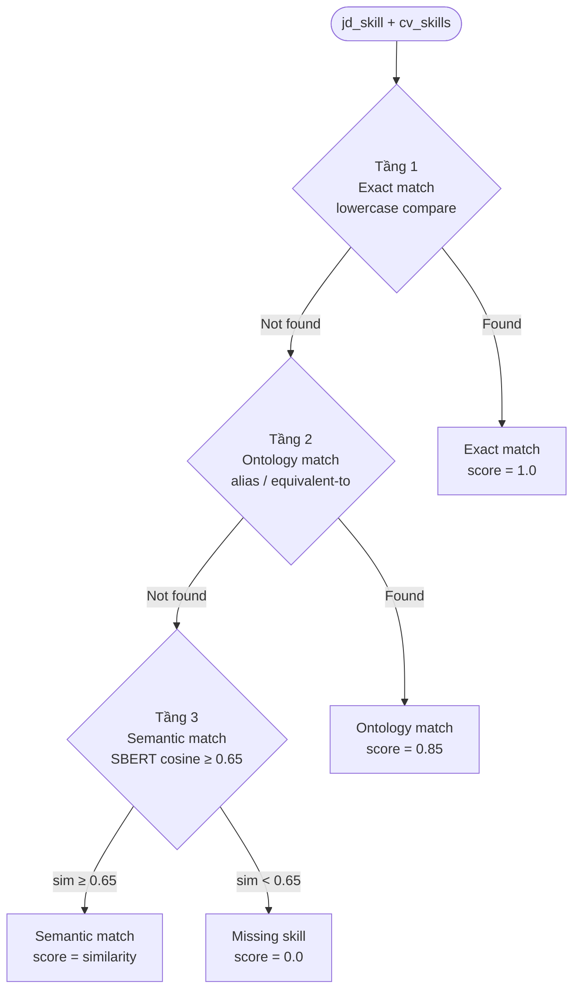

# 2.4 Skill Matching Service — Thiết kế và Triển khai

## 2.4.1 Tổng quan Skill Service

Skill Service là service chịu trách nhiệm về toàn bộ lớp phân tích kỹ năng — từ so khớp kỹ năng CV với JD, tính điểm ATS, đến phân tích thị trường việc làm và gợi ý lộ trình học tập. Service chạy trên FastAPI (Python 3.10) tại cổng `:5002` và được API Gateway proxy qua `SkillProxyController`. Ngoài các chức năng AI, Skill Service còn có một isolated PostgreSQL schema riêng (khởi tạo qua `init_db()`) để lưu trạng thái học tập và bookmark kỹ năng của từng user — phản ánh tính chất stateful của learning roadmap feature.

Skill Service được thiết kế như một engine phân tích độc lập, có thể được gọi bởi cả Frontend (qua API Gateway) lẫn các service nội bộ như Chatbot Service (để lấy context CV/JD của user khi sinh response). Kiến trúc này cho phép chatbot trả lời câu hỏi "Tôi đang thiếu kỹ năng gì?" với thông tin cụ thể về gap analysis của user, thay vì chỉ trả lời chung chung.

## 2.4.2 SkillOntology — Nền tảng tri thức kỹ năng

`SkillOntology` là class quản lý ontology kỹ năng IT, được định nghĩa hardcode trong file `services/skill_service/services/ontology.py` (474 entries, 1112 dòng). Ontology được tổ chức phân cấp theo domain (frontend, backend, mobile, devops, data, ai), trong mỗi domain là các nhóm công nghệ, và trong mỗi nhóm là các entry với đầy đủ metadata: `aliases` (các cách viết tương đương), `related` (kỹ năng liên quan trong cùng ecosystem), và `requires` (kỹ năng prerequisite). Cấu trúc JSON phân cấp này cho phép query nhanh theo nhiều chiều: tìm tất cả aliases của một kỹ năng, tìm các kỹ năng trong cùng category, hay kiểm tra hai kỹ năng có tương đương không.

Ontology kỹ năng IT được xây dựng dựa trên ba nguồn chính: tái sử dụng một phần ESCO [[23]](../tai_lieu_tham_khao.md#ref-23) và O\*NET [[24]](../tai_lieu_tham_khao.md#ref-24) cho các kỹ năng universal (SQL, Python, Java), bổ sung các công nghệ đặc thù thị trường Việt Nam (Laravel, Flutter, .NET Core, Spring Boot), và cập nhật theo dữ liệu tuyển dụng thực tế từ ITviec và TopCV. Với khoảng 500 entries, ontology cover được hầu hết các kỹ năng xuất hiện trong CV/JD ngành CNTT tại Việt Nam hiện nay.

## 2.4.3 SkillMatcher — Logic so khớp 3 tầng



`SkillMatcher` là class trung tâm của Skill Service, triển khai logic matching 3 tầng theo thứ tự từ chính xác nhất đến tổng quát nhất. Đây là cách tiếp cận "cascade" — chỉ khi tầng cao hơn (chính xác hơn) không tìm được match mới thử tầng thấp hơn (tổng quát hơn), đảm bảo kết quả cuối có precision cao nhất có thể.

Ở tầng 1 (exact match), tất cả kỹ năng được chuẩn hóa lowercase trước khi so sánh chuỗi. Nếu `jd_skill.lower()` tìm thấy trong `cv_skills_lower`, đây là exact match với score = 1.0. Ở tầng 2 (ontology match), `SkillOntology.find_match()` kiểm tra xem `jd_skill` và bất kỳ kỹ năng nào trong CV có quan hệ equivalent-to hay alias với nhau không. Nếu có, đây là ontology match với score = 0.85. Ở tầng 3 (semantic match), cả `jd_skill` lẫn từng kỹ năng trong CV được encode thành embedding vector bởi Sentence-BERT model `all-MiniLM-L6-v2` [[13]](../tai_lieu_tham_khao.md#ref-13) [[34]](../tai_lieu_tham_khao.md#ref-34), và cosine similarity được tính giữa `jd_skill` embedding và từng CV skill embedding. Kỹ năng CV có similarity cao nhất được chọn; nếu similarity ≥ threshold τ = 0.65, đây là semantic match với score bằng giá trị similarity đó (0.65–1.0).

Threshold τ = 0.65 được chọn dựa trên thực nghiệm với các cặp kỹ năng mẫu: "Vue.js" và "React" có sim ≈ 0.72 (cùng frontend framework ecosystem, nên match), "TensorFlow" và "PyTorch" có sim ≈ 0.79 (cùng deep learning framework, nên match), "Python" và "Java" có sim ≈ 0.58 (đều là programming language nhưng khác nhau cơ bản, không nên match). Ngưỡng 0.65 phân biệt chính xác hai nhóm này trong các thực nghiệm kiểm tra.

Kết quả cuối cùng của `match()` là dictionary gồm danh sách `matched` (các kỹ năng JD đã được cover với loại match và score), danh sách `missing` (các kỹ năng JD chưa được cover với gap score), danh sách `extra` (kỹ năng CV có nhưng JD không yêu cầu — "điểm cộng"), và `ats_score` là tỷ lệ phần trăm kỹ năng JD được cover.

Code thực tế của `SkillMatcher.match()` trong hệ thống:

```python
from sentence_transformers import SentenceTransformer
from sklearn.metrics.pairwise import cosine_similarity
import numpy as np

SBERT_MODEL = SentenceTransformer("all-MiniLM-L6-v2")
SEMANTIC_THRESHOLD = 0.65

class SkillMatcher:
    def __init__(self, ontology: SkillOntology):
        self.ontology = ontology

    def _match_one(self, jd_skill: str, cv_skills: list[str]) -> dict:
        jd_norm = jd_skill.lower().strip()

        # Tầng 1 — Exact match
        for cv in cv_skills:
            if cv.lower().strip() == jd_norm:
                return {"type": "exact", "score": 1.0, "matched_cv": cv}

        # Tầng 2 — Ontology / alias match
        for cv in cv_skills:
            if self.ontology.are_equivalent(jd_norm, cv.lower().strip()):
                return {"type": "ontology", "score": 0.85, "matched_cv": cv}

        # Tầng 3 — Semantic similarity
        jd_emb  = SBERT_MODEL.encode([jd_skill])
        cv_embs = SBERT_MODEL.encode(cv_skills)
        sims    = cosine_similarity(jd_emb, cv_embs)[0]
        best_i  = int(np.argmax(sims))
        if sims[best_i] >= SEMANTIC_THRESHOLD:
            return {"type": "semantic", "score": float(sims[best_i]),
                    "matched_cv": cv_skills[best_i]}

        return {"type": "none", "score": 0.0, "matched_cv": None}

    def match(self, cv_skills: list[str], jd_skills: list[str]) -> dict:
        matched, missing = [], []
        for jd_sk in jd_skills:
            result = self._match_one(jd_sk, cv_skills)
            if result["type"] != "none":
                matched.append({"jd_skill": jd_sk, **result})
            else:
                missing.append(jd_sk)
        extra = [s for s in cv_skills
                 if not any(m["matched_cv"] == s for m in matched)]
        ats_score = len(matched) / len(jd_skills) * 100 if jd_skills else 0
        return {"matched": matched, "missing": missing,
                "extra": extra, "ats_score": round(ats_score, 1)}
```

## 2.4.4 ATSScoringEngine — Đánh giá CV toàn diện 8 tiêu chí

`ATSScoringEngine` vượt ra ngoài skill matching đơn thuần để đánh giá CV theo 8 tiêu chí phản ánh cách các hệ thống ATS thương mại thực tế vận hành. Tiêu chí **Keywords Match** (25%) đo tỷ lệ kỹ năng JD được cover theo ba tầng matching. Tiêu chí **Format & Structure** (15%) kiểm tra CV có đủ các section quan trọng, có dùng bullet points cho kinh nghiệm, và độ dài hợp lý (400–1200 từ). Tiêu chí **Contact Info** (10%) xác nhận CV có đầy đủ email, số điện thoại, LinkedIn và GitHub. Tiêu chí **Experience Detail** (15%) kiểm tra mỗi mục kinh nghiệm có chứa số liệu định lượng (percentages, dollar amounts, user counts) hay không — yếu tố phân biệt CV trung bình và CV chuyên nghiệp. Tiêu chí **Action Verbs** (10%) đếm tỷ lệ bullet points bắt đầu bằng động từ hành động mạnh từ danh sách 80+ verbs (developed, led, optimized, spearheaded...). Tiêu chí **Education Match** (10%) kiểm tra bằng cấp có đáp ứng yêu cầu JD. Tiêu chí **Readability** (10%) đánh giá độ dài câu trung bình và phát hiện keyword stuffing. Tiêu chí **Certifications** (5%) kiểm tra CV có chứng chỉ liên quan đến domain của JD.

Kèm theo điểm số tổng là danh sách `issues` — các vấn đề cụ thể được diễn đạt bằng ngôn ngữ tự nhiên và được ưu tiên theo impact, ví dụ "Thiếu từ khóa quan trọng: Docker, Kubernetes (ảnh hưởng 25% điểm)", "Không có số liệu định lượng trong phần Experience — thêm metrics cụ thể để tăng điểm", hay "GitHub profile chưa được đề cập — bổ sung để tăng tín nhiệm". Danh sách issues này là phần hữu ích nhất với người dùng vì nó chỉ ra đúng những gì cần làm tiếp theo.

## 2.4.5 Tích hợp O\*NET và Market Analysis

Skill Service sử dụng dữ liệu O\*NET [[24]](../tai_lieu_tham_khao.md#ref-24) từ [`knowledge_base/onet/db_28_1_text/`](../../../knowledge_base/onet/db_28_1_text/) được index vào ChromaDB [[26]](../tai_lieu_tham_khao.md#ref-26) collection `COLLECTION_JOBS` để hỗ trợ hai chức năng bổ sung. Thứ nhất, khi JD text được cung cấp nhưng danh sách kỹ năng không được tách biệt rõ ràng, Skill Service có thể tự động trích xuất kỹ năng bằng cách tìm kiếm O\*NET occupation embeddings gần với JD text nhất và lấy required skills của những occupation đó. Thứ hai, `MarketAnalyzer` truy vấn O\*NET data để phân tích xu hướng kỹ năng theo industry domain, cung cấp thông tin thị trường như "Top 10 kỹ năng được yêu cầu nhiều nhất trong tuần qua" hay "Lương trung bình cho Backend Developer tại Việt Nam".

---

[← 2.3 NER Service](2.3_ner_service.md) | [→ 2.5 Chatbot Service](2.5_chatbot_service.md)
