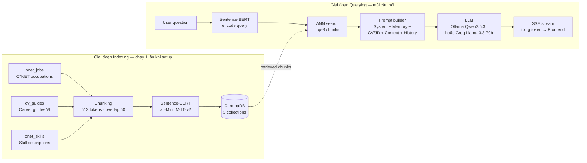
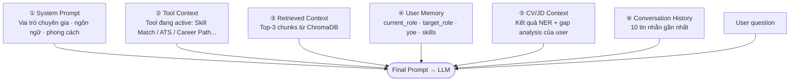

# 2.5 Chatbot Service — RAG Pipeline và Tư vấn Nghề nghiệp

## 2.5.1 Tổng quan Chatbot Service

Chatbot Service là thành phần phức tạp và sáng tạo nhất trong hệ thống, tích hợp kiến trúc RAG [[15]](../tai_lieu_tham_khao.md#ref-15) với LLM để cung cấp tư vấn nghề nghiệp cá nhân hóa thực sự. Service chạy trên FastAPI tại cổng `:5004` với một đặc điểm kỹ thuật quan trọng phân biệt nó với các service còn lại: hỗ trợ **Server-Sent Events (SSE)** để streaming response từng token về Frontend — tạo trải nghiệm người dùng giống hệt ChatGPT với chữ xuất hiện dần dần thay vì chờ toàn bộ response.

Ngoài chức năng chatbot tư vấn cốt lõi, Chatbot Service còn đảm nhận các chức năng liên quan đến tạo nội dung CV: viết lại từng section CV theo chuẩn ATS (`/cv/rewrite`), sinh CV hoàn chỉnh từ thông tin đầu vào (`/cv/generate`), tối ưu toàn bộ CV theo một JD cụ thể (`/cv/optimize`), gợi ý bullet points chuyên nghiệp cho từng vị trí kinh nghiệm (`/cv/suggest`). Tất cả những chức năng này đều sử dụng cùng một LLM backend, chỉ khác nhau ở prompt template và cách tổ chức input/output.

## 2.5.2 Kiến trúc RAG Pipeline chi tiết



Knowledge base của Chatbot Service được xây dựng từ nhiều nguồn và index vào ChromaDB [[26]](../tai_lieu_tham_khao.md#ref-26) (lưu tại [`knowledge_base/chatbot_chroma/`](../../../knowledge_base/chatbot_chroma/)) thành ba collections riêng biệt. Collection `onet_jobs` chứa dữ liệu mô tả nghề nghiệp từ O\*NET — thông tin về yêu cầu kỹ năng, mức độ kinh nghiệm, và đặc điểm công việc cho hàng trăm vị trí IT. Collection `cv_guides` chứa các career guide tự viết về lộ trình phát triển cho 10 vai trò IT chính trong thị trường Việt Nam, bao gồm gợi ý kỹ năng học theo thứ tự, chứng chỉ liên quan và mức lương ước tính theo seniority. Collection `onet_skills` chứa mô tả chi tiết về từng kỹ năng từ O\*NET taxonomy, hữu ích khi người dùng hỏi "Kỹ năng X là gì và học ở đâu?".

Trong giai đoạn indexing, tất cả documents được chia thành chunks kích thước 512 tokens với overlap 50 tokens (để giữ ngữ cảnh giữa các chunk), mỗi chunk được encode thành embedding vector bằng Sentence-BERT [[13]](../tai_lieu_tham_khao.md#ref-13), và lưu vào ChromaDB kèm metadata (source, document_type, role...). Giai đoạn indexing này chạy một lần khi setup hệ thống và không cần lặp lại trừ khi knowledge base được cập nhật.

Khi người dùng gửi câu hỏi, `ChatService` thực hiện retrieval theo ba bước: câu hỏi được encode thành embedding bởi cùng Sentence-BERT model, ChromaDB thực hiện approximate nearest neighbor search để tìm top-3 chunks có embedding gần nhất, kết quả được re-ranked theo relevance score. Ba chunks được chọn thường chứa một chunk từ `cv_guides` (thông tin nghề nghiệp cụ thể), một chunk từ `onet_jobs` (mô tả vị trí công việc), và một chunk từ `onet_skills` (mô tả kỹ năng liên quan) — bộ ba context này đủ để LLM trả lời hầu hết câu hỏi nghề nghiệp một cách cụ thể và có cơ sở.

## 2.5.3 Xây dựng Prompt và cơ chế cá nhân hóa



Điểm phân biệt lớn nhất của hệ thống so với chatbot RAG thông thường là cơ chế **cá nhân hóa sâu** thông qua việc tổng hợp nhiều nguồn context khác nhau vào một prompt duy nhất. Prompt cuối cùng gửi cho LLM có cấu trúc phân lớp rõ ràng.

Lớp đầu tiên là **System Prompt** định nghĩa vai trò của assistant là chuyên gia tư vấn nghề nghiệp IT, phong cách giao tiếp và ngôn ngữ (tiếng Việt hoặc tiếng Anh tùy preference của user). Lớp thứ hai là **Tool Context Prompt** — đây là tính năng đặc biệt của hệ thống: chatbot biết tool nào đang active trên panel phải của Frontend (Skill Match, Career Path, CV Upload, ATS Score, JD Analysis, Skill Graph, hay Market Dashboard) và điều chỉnh hành vi tương ứng. Ví dụ khi Skill Match tool đang active, chatbot chủ động hỏi về vị trí target và tech stack của user thay vì chờ user hỏi — tạo trải nghiệm proactive assistant thay vì passive Q&A bot. Lớp thứ ba là **Retrieved Context** gồm các document chunks từ ChromaDB liên quan đến câu hỏi. Lớp thứ tư là **User Memory** — thông tin đã lưu về user từ các session trước (current role, target role, skills, số năm kinh nghiệm). Lớp thứ năm là **CV/JD Context** — tóm tắt kết quả phân tích CV và JD hiện tại của user, nếu có. Lớp cuối cùng là **Conversation History** — 10 tin nhắn gần nhất để đảm bảo tính nhất quán của hội thoại.

Tổng hợp tất cả các lớp này, mỗi câu trả lời của chatbot không chỉ dựa trên knowledge base chung mà còn được điều chỉnh phù hợp với tình trạng cụ thể của từng user: một fresher Backend Developer với 0 năm kinh nghiệm sẽ nhận được tư vấn hoàn toàn khác so với một senior developer 5 năm kinh nghiệm cùng hỏi câu hỏi "Tôi nên học gì tiếp theo?".

Hàm xây dựng prompt đa lớp trong `ChatService`:

```python
def build_prompt(self, user_question: str, context: str,
                 user_memory: dict, cv_summary: str,
                 active_tool: str, history: list[dict]) -> str:

    tool_hint = TOOL_CONTEXT_PROMPTS.get(active_tool, "")

    system = f"""Bạn là chuyên gia tư vấn nghề nghiệp IT.
Trả lời bằng tiếng Việt, ngắn gọn, thực tế, dựa trên dữ liệu.
{tool_hint}"""

    memory_block = ""
    if user_memory:
        memory_block = f"""
[Thông tin người dùng]
Vai trò hiện tại : {user_memory.get('current_role', 'Chưa rõ')}
Mục tiêu        : {user_memory.get('target_role',  'Chưa rõ')}
Kinh nghiệm     : {user_memory.get('yoe', 0)} năm
Kỹ năng chính   : {', '.join(user_memory.get('skills', []))}"""

    cv_block = f"\n[Tóm tắt CV/JD]\n{cv_summary}" if cv_summary else ""

    history_block = "\n".join(
        f"{m['role'].upper()}: {m['content']}"
        for m in history[-10:]          # 10 tin nhắn gần nhất
    )

    return (f"SYSTEM: {system}\n"
            f"{memory_block}{cv_block}\n"
            f"[Kiến thức liên quan]\n{context}\n\n"
            f"[Lịch sử hội thoại]\n{history_block}\n\n"
            f"USER: {user_question}\nASSISTANT:")
```

Ví dụ `TOOL_CONTEXT_PROMPTS` cho một số tool:

```python
TOOL_CONTEXT_PROMPTS = {
    "match": (
        "Skill Match tool đang active. Hãy chủ động hỏi vị trí target "
        "và tech stack của user nếu chưa biết."
    ),
    "ats": (
        "ATS Score tool đang active. Tập trung giải thích điểm số "
        "và gợi ý cải thiện theo thứ tự ưu tiên impact."
    ),
    "career": (
        "Career Path tool đang active. Gợi ý lộ trình cụ thể, "
        "ước tính thời gian và chứng chỉ liên quan."
    ),
}
```

## 2.5.4 Dual LLM Backend: Ollama và Groq

`ChatService` hỗ trợ chuyển đổi giữa hai LLM backend thông qua dependency injection được cấu hình từ environment variable `CHAT_USE_GROQ`. Khi `use_groq=False` (mặc định), hệ thống khởi tạo `OllamaClient` pointing đến local Ollama server tại `http://localhost:11434` với model `qwen2.5:3b` [[29]](../tai_lieu_tham_khao.md#ref-29) [[27]](../tai_lieu_tham_khao.md#ref-27). Khi `use_groq=True`, hệ thống khởi tạo `GroqClient` với API key từ environment variable, sử dụng model `llama-3.3-70b-versatile` trên Groq Cloud [[28]](../tai_lieu_tham_khao.md#ref-28).

Cả hai client đều implement cùng interface với method `chat_stream()` trả về iterator của string chunks, cho phép phần còn lại của code hoàn toàn trong suốt với backend LLM đang dùng. Chatbot Service stream response bằng cách yield từng chunk dưới dạng SSE events `data: {"content": "..."}`, API Gateway forward stream này về Frontend, và JavaScript trên Frontend parse từng event và append vào UI — chuỗi 3 lớp streaming này tạo ra trải nghiệm real-time mượt mà.

## 2.5.5 User Memory Service

`MemoryService` lưu trữ thông tin cá nhân hóa của từng user tại `data/user_memory/{user_id}.json`. Mỗi khi chatbot thu thập được thông tin mới về user qua hội thoại (ví dụ user đề cập "Tôi đang làm Backend Developer được 3 năm"), memory service tự động update profile. Khi session mới bắt đầu, memory được load và inject vào prompt. Cơ chế này tạo ra "bộ nhớ dài hạn" cho chatbot — không phải bộ nhớ phiên (session memory dựa trên conversation history) mà là bộ nhớ về con người và tình huống nghề nghiệp của user, tồn tại qua nhiều session khác nhau.

---

[← 2.4 Skill Matching Service](2.4_skill_matching_service.md) | [→ 2.6 API Gateway và Frontend](2.6_api_gateway_frontend.md)
