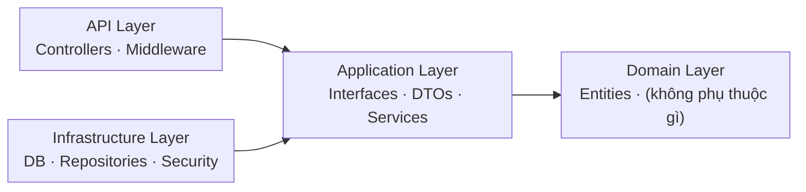
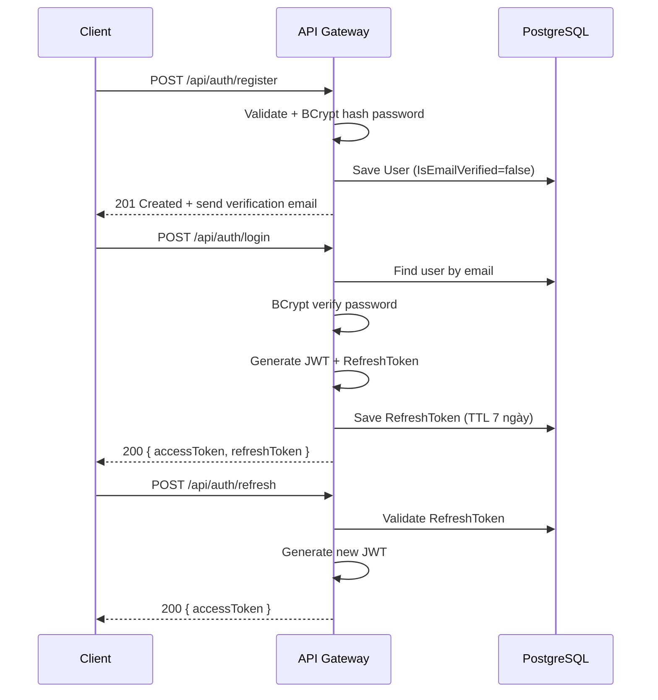

# 2.6 API Gateway (.NET 9) và Frontend React 18

## 2.6.1 Tổng quan API Gateway

API Gateway là **điểm vào duy nhất** (single entry point) của toàn bộ hệ thống, được xây dựng bằng **ASP.NET Core 9** (.NET 9 [[30]](../tai_lieu_tham_khao.md#ref-30), C#) theo kiến trúc **Clean Architecture** phân tầng rõ ràng. Lắng nghe tại cổng `:8081`.

Lý do chọn .NET 9 / ASP.NET Core cho API Gateway:
- **ASP.NET Core** cung cấp hệ sinh thái đầy đủ cho REST API: JWT authentication tích hợp sẵn, Entity Framework Core ORM, Swagger/OpenAPI tự động.
- **Clean Architecture** giúp tách biệt rõ nghiệp vụ (Application), domain model (Domain), persistence (Infrastructure) khỏi API layer.
- **Entity Framework Core** với Npgsql provider cho PostgreSQL — quản lý migration schema database an toàn.
- **IHttpClientFactory** — pattern chuẩn để proxy request đến các Python microservice, tự động quản lý connection pooling.

## 2.6.2 Kiến trúc Clean Architecture

Dự án API Gateway được tổ chức thành 4 layer:

```
CvAssistant.ApiGateway/
├── CvAssistant.ApiGateway.Domain/          ← Domain layer (entities, không phụ thuộc gì)
│   └── Entities/
│       ├── User.cs
│       ├── ChatSession.cs, ChatMessage.cs
│       ├── CVHistory.cs
│       ├── CvDocument.cs, CvVersion.cs
│       ├── CvTemplate.cs
│       ├── CollectorProgress.cs
│       ├── JDHistory.cs
│       └── Feedback.cs
│
├── CvAssistant.ApiGateway.Application/     ← Application layer (interfaces, DTOs, services)
│   ├── Interfaces/
│   │   ├── Repositories/   ← IUserRepository, ICVHistoryRepository, ...
│   │   ├── Services/       ← IAuthService, IChatService, ICvDocumentService, ...
│   │   └── Security/       ← IJwtUtils, IPasswordHasher
│   ├── DTOs/               ← Request/Response objects
│   └── Services/           ← Application service implementations
│
├── CvAssistant.ApiGateway.Infrastructure/  ← Infrastructure layer (DB, security, external)
│   ├── Data/
│   │   └── AppDbContext.cs (EF Core DbContext)
│   ├── Repositories/       ← Concrete repository implementations
│   └── Security/
│       ├── JwtUtils.cs
│       ├── PasswordHasher.cs (BCrypt)
│       └── EmailService.cs
│
└── CvAssistant.ApiGateway.API/             ← Presentation layer (controllers, middleware)
    ├── Controllers/        ← 16 controllers
    ├── Middleware/
    │   ├── RateLimitingMiddleware.cs
    │   └── ExceptionMiddleware.cs
    └── Program.cs          ← DI registration, middleware pipeline
```



Nguyên tắc Clean Architecture: **phụ thuộc chỉ hướng vào trong** — API layer phụ thuộc Application, Application phụ thuộc Domain, Infrastructure phụ thuộc Application. Domain không phụ thuộc gì.

## 2.6.3 Domain Entities và Database Schema

API Gateway quản lý toàn bộ dữ liệu người dùng và lịch sử thông qua **PostgreSQL 15** với EF Core migrations. Các entity chính:

**User** — Quản lý tài khoản người dùng:
```csharp
public class User
{
    public long Id { get; set; }
    public string Email { get; set; }           // unique index
    public string Password { get; set; }        // BCrypt hash
    public string? Name { get; set; }
    public string Role { get; set; } = "User";  // User | Admin
    public string? RefreshToken { get; set; }
    public DateTime? RefreshTokenExpiryTime { get; set; }
    public bool IsEmailVerified { get; set; }
    public bool IsDeleted { get; set; }         // soft delete
    public DateTime CreatedAt { get; set; }
    // Navigation: ChatSessions, CVHistories, CvDocuments
}
```

**CvDocument + CvVersion** — Quản lý CV builder với versioning:
```csharp
public class CvDocument
{
    public long Id { get; set; }
    public long UserId { get; set; }
    public string Name { get; set; }
    public string? Template { get; set; }
    public string? TargetJd { get; set; }
    public int? AtsScore { get; set; }
    public int CurrentVersion { get; set; } = 1;
    public bool IsDeleted { get; set; }         // soft delete
    public ICollection<CvVersion> Versions { get; set; }
}

public class CvVersion
{
    public long Id { get; set; }
    public long CvDocumentId { get; set; }
    public int VersionNumber { get; set; }
    public string DataJson { get; set; }        // CV data serialized as JSON
    public string? Note { get; set; }
    public string? Tag { get; set; }
    public bool IsStarred { get; set; }
    public DateTime CreatedAt { get; set; }
}
```

**Bảng 2.4: Các entity trong PostgreSQL (API Gateway)**

| Entity | Mô tả | Quan hệ |
|---|---|---|
| User | Tài khoản người dùng, auth fields, soft delete | 1-N ChatSession, CVHistory, CvDocument |
| ChatSession | Phiên hội thoại với chatbot | N-1 User, 1-N ChatMessage, 1-1 CollectorProgress |
| ChatMessage | Từng tin nhắn trong session | N-1 ChatSession |
| CVHistory | Lịch sử CV upload/parse | N-1 User |
| CvDocument | Tài liệu CV trong CV Builder | N-1 User, 1-N CvVersion |
| CvVersion | Phiên bản CV (versioning) | N-1 CvDocument |
| CvTemplate | Mẫu CV có sẵn | — |
| CollectorProgress | Tiến trình thu thập thông tin CV | 1-1 ChatSession |
| JDHistory | Lịch sử JD đã phân tích | N-1 User |
| Feedback | Phản hồi từ người dùng | N-1 User |

## 2.6.4 Hệ thống Authentication — JWT + Refresh Token

### a) Luồng đăng ký và đăng nhập



### b) JWT Token structure

`JwtUtils` sinh JWT với các claims:
- `ClaimTypes.NameIdentifier` = email
- `ClaimTypes.Email` = email
- `ClaimTypes.Role` = "User" | "Admin"
- Expires: configurable (mặc định 24 giờ — 86.400.000ms)
- Algorithm: HMAC-SHA256

Code sinh JWT trong `JwtUtils.cs`:

```csharp
public string GenerateAccessToken(User user)
{
    var key         = new SymmetricSecurityKey(Encoding.UTF8.GetBytes(_jwtKey));
    var credentials = new SigningCredentials(key, SecurityAlgorithms.HmacSha256);

    var claims = new[]
    {
        new Claim(ClaimTypes.NameIdentifier, user.Email),
        new Claim(ClaimTypes.Email,          user.Email),
        new Claim(ClaimTypes.Role,           user.Role ?? "User"),
    };

    var token = new JwtSecurityToken(
        claims:   claims,
        expires:  DateTime.UtcNow.AddMilliseconds(_expiryMs),
        signingCredentials: credentials
    );
    return new JwtSecurityTokenHandler().WriteToken(token);
}

public string GenerateRefreshToken()
{
    var bytes = new byte[64];
    RandomNumberGenerator.Fill(bytes);
    return Convert.ToBase64String(bytes);   // 64-byte ngẫu nhiên
}
```

**Refresh Token** là chuỗi ngẫu nhiên 64 bytes (base64), lưu trong database với TTL 7 ngày. Khi access token hết hạn, client dùng refresh token để lấy access token mới mà không cần đăng nhập lại.

### c) JWT validation trong middleware

```csharp
// Program.cs
builder.Services.AddAuthentication(JwtBearerDefaults.AuthenticationScheme)
    .AddJwtBearer(x => {
        x.TokenValidationParameters = new TokenValidationParameters
        {
            ValidateIssuerSigningKey = true,
            IssuerSigningKey = new SymmetricSecurityKey(key),
            ValidateLifetime = true,
            ClockSkew = TimeSpan.Zero  // Không cho phép trễ
        };
    });
```

`ClockSkew = TimeSpan.Zero` đảm bảo token hết hạn đúng thời điểm, không có thêm tolerance mặc định 5 phút.

## 2.6.5 Middleware Pipeline

Hai middleware tùy chỉnh được đăng ký trong pipeline:

### a) RateLimitingMiddleware

Bảo vệ endpoint nhạy cảm khỏi brute-force attack:
- Áp dụng cho: `/api/auth/login` và `/api/auth/reset-password`
- Giới hạn: 5 lần/phút/IP
- Sau khi vượt ngưỡng: trả về HTTP 429 Too Many Requests

```csharp
private static readonly ConcurrentDictionary<string, RateLimitEntry> _clients = new();
private const int MaxAttempts = 5;
private static readonly TimeSpan Window = TimeSpan.FromMinutes(1);
```

Sử dụng `ConcurrentDictionary` (thread-safe) với sliding window theo IP + path.

### b) ExceptionMiddleware

Bắt toàn bộ unhandled exception trong pipeline, trả về JSON response có cấu trúc thống nhất thay vì stack trace raw. Đảm bảo client luôn nhận JSON kể cả khi có lỗi không mong muốn.

## 2.6.6 Controllers và Proxy Pattern

API Gateway có **16 controllers** chia thành hai loại:

**Controllers xử lý trực tiếp tại Gateway (business logic):**

| Controller | Route | Chức năng |
|---|---|---|
| AuthController | `/api/auth` | Register, Login, Refresh, Verify email, Reset password |
| UserController | `/api/users` | Lấy/cập nhật profile, avatar |
| CvDocumentController | `/api/cv-documents` | CRUD CV document + versioning (diff, restore) |
| CVHistoryController | `/api/cv-history` | Lịch sử CV upload |
| FeedbackController | `/api/feedback` | Thu thập feedback, Admin xem tất cả |
| TemplateController | `/api/templates` | Danh sách CV templates |
| ChatController | `/api/chat` | Quản lý chat sessions |
| CollectorController | `/api/collector` | Trạng thái thu thập thông tin CV Builder |
| AdminController | `/api/admin` | Dashboard quản trị (Admin only) |
| MonitoringController | `/api/health` | Health check, metrics hệ thống |
| HealthController | `/health` | Simple health endpoint cho Docker |

**Proxy Controllers (forward đến Python microservices):**

| Controller | Route | Forward đến |
|---|---|---|
| NerProxyController | `/api/ner` | NER Service `:5001` |
| SkillProxyController | `/api/skills` | Skill Service `:5002` |
| CareerProxyController | `/api/career` | Career Service `:5003` |
| ChatbotProxyController | `/api/chatbot` | Chatbot Service `:5004` |
| JDProxyController | `/api/jd` | NER Service `:5001` (JD endpoints) |

### Ví dụ: NerProxyController — File upload + history lưu

`NerProxyController` thực hiện nhiều hơn là proxy đơn thuần — sau khi forward file lên NER Service thành công, nó còn lưu file vào `wwwroot/uploads/cvs/` và ghi lịch sử vào database:

```csharp
[HttpPost("parse-cv")]
[RequestSizeLimit(10_000_000)]  // 10MB
public async Task<IActionResult> ParseCv([FromForm] IFormFile file)
{
    // 1. Forward multipart file lên NER Service
    var client = _httpClientFactory.CreateClient("NerService");
    using var content = new MultipartFormDataContent();
    content.Add(new StreamContent(file.OpenReadStream()), "file", file.FileName);
    var response = await client.PostAsync("/parse-cv", content);
    var result = await response.Content.ReadAsStringAsync();

    // 2. Nếu thành công: lưu file local + ghi CVHistory
    if (response.IsSuccessStatusCode)
    {
        var uploadsDir = Path.Combine(_environment.ContentRootPath, "wwwroot", "uploads", "cvs");
        var uniqueFileName = $"{Guid.NewGuid()}_{file.FileName}";
        // ... save file ...
        await _cvHistoryService.SaveHistoryAsync(email, new SaveCVHistoryRequest(
            file.FileName, fileUrl, result
        ));
    }
    return Content(result, "application/json");
}
```

### Ví dụ: ChatbotProxyController — SSE Streaming

Chatbot sử dụng Server-Sent Events để stream response từng token. Controller sử dụng `ResponseHeadersRead` để không buffer toàn bộ response:

```csharp
[HttpPost("chat/stream")]
public async Task ChatStream([FromBody] object body)
{
    var client = _httpClientFactory.CreateClient("ChatbotService");
    var request = new HttpRequestMessage(HttpMethod.Post, "/chat/stream")
        { Content = json };

    // KHÔNG chờ toàn bộ response — pipe trực tiếp từng chunk
    using var response = await client.SendAsync(
        request, HttpCompletionOption.ResponseHeadersRead);

    Response.ContentType = "text/event-stream";
    Response.Headers["Cache-Control"] = "no-cache";
    Response.Headers["Connection"] = "keep-alive";

    await response.Content.CopyToAsync(Response.Body);
}
```

## 2.6.7 IHttpClientFactory và Named Clients

`IHttpClientFactory` là pattern .NET chuẩn để tạo `HttpClient` với named configuration, tránh socket exhaustion khi tạo `new HttpClient()` liên tục:

```csharp
// Program.cs — đăng ký 4 named HttpClient
builder.Services.AddHttpClient("NerService", client => {
    client.BaseAddress = new Uri(config["Services:NerUrl"] ?? "http://localhost:5001");
    client.Timeout = TimeSpan.FromSeconds(60);  // NER cần thời gian load model
});
builder.Services.AddHttpClient("SkillService", client => {
    client.BaseAddress = new Uri(config["Services:SkillUrl"] ?? "http://localhost:5002");
    client.Timeout = TimeSpan.FromSeconds(30);
});
builder.Services.AddHttpClient("CareerService", ...);
builder.Services.AddHttpClient("ChatbotService", client => {
    client.Timeout = TimeSpan.FromSeconds(120);  // LLM generation có thể lâu
});
```

Mỗi proxy controller inject `IHttpClientFactory` và gọi `CreateClient("ServiceName")` để lấy configured client — URL base address và timeout đã được set sẵn, controller chỉ cần chỉ định path.

## 2.6.8 CV Document Versioning

`CvDocumentController` cung cấp hệ thống versioning đầy đủ cho CV Builder:

- `POST /api/cv-documents/{id}/versions` — Tạo version mới (auto-increment VersionNumber)
- `GET /api/cv-documents/{id}/diff?versionA=1&versionB=3` — So sánh hai version
- `POST /api/cv-documents/{id}/versions/{versionNumber}/restore` — Khôi phục version cũ
- `PUT /api/cv-documents/versions/{versionId}` — Cập nhật metadata version (note, tag, starred)

`DataJson` trong `CvVersion` lưu toàn bộ dữ liệu CV dạng JSON serialized, cho phép khôi phục chính xác bất kỳ version nào. Tính năng này đặc biệt hữu ích khi người dùng tạo nhiều phiên bản CV cho các vị trí ứng tuyển khác nhau.

---

## 2.6.9 Frontend (React 18)

### a) Tổng quan

Frontend được xây dựng bằng **React 18** với **TypeScript**, tổ chức theo layout **hai panel**:
- **Panel trái**: Giao diện ChatGPT-style — danh sách session, input message, streaming response hiển thị theo từng token.
- **Panel phải (Artifact Panel)**: Hiển thị kết quả từ các tool AI (NER entities, ATS score, skill graph, CV preview, market dashboard...).

Thiết kế hai panel giúp người dùng vừa trò chuyện với AI vừa theo dõi kết quả phân tích trực quan, không cần chuyển trang.

### b) Các tính năng chính

**CV Builder** — Form nhập thông tin CV theo section: Personal Info, Summary, Experience (với bullet points), Education, Skills, Projects, Certifications. Tích hợp AI suggestions: nút "AI Improve" trên mỗi bullet point gọi Chatbot Service `/cv/suggest` để viết lại chuyên nghiệp hơn. Hỗ trợ chọn template và xuất PDF trực tiếp qua NER Service.

**Skill Match Tool** — Upload hoặc dán JD text, nhập kỹ năng CV. Kết quả hiển thị màu: xanh (exact match), vàng (ontology/semantic match), đỏ (missing). ATS score dạng progress bar với breakdown 8 tiêu chí.

**ATS Score Tool** — Upload CV + JD, nhận điểm tổng và danh sách issues ưu tiên kèm gợi ý cải thiện cụ thể.

**Career Path Tool** — Nhập current role + target role, hiển thị lộ trình dạng timeline với milestones và kỹ năng cần đạt ở từng bước.

**Skill Knowledge Graph** — Visualize đồ thị kỹ năng IT từ ontology. Click vào node để xem related skills và learning path.

**Market Dashboard** — Xu hướng kỹ năng theo thời gian, phân phối theo industry/role, dữ liệu lương ước tính từ O\*NET.

### c) Streaming Chat với SSE

```typescript
const response = await fetch('/api/chatbot/chat/stream', {
    method: 'POST',
    headers: {
        'Authorization': `Bearer ${token}`,
        'Content-Type': 'application/json'
    },
    body: JSON.stringify({ message, session_id, tool_context })
});

const reader = response.body!.getReader();
const decoder = new TextDecoder();

while (true) {
    const { done, value } = await reader.read();
    if (done) break;
    const chunk = decoder.decode(value);
    // Parse từng dòng "data: {...}\n\n"
    for (const line of chunk.split('\n')) {
        if (line.startsWith('data: ')) {
            const data = JSON.parse(line.slice(6));
            appendToken(data.content);  // Append từng token vào UI
        }
    }
}
```

---

## 2.6.10 Triển khai với Docker Compose

Toàn bộ hệ thống được container hóa bằng Docker Compose:

```yaml
services:
  frontend:
    build: ./frontend
    ports: ["3000:3000"]
    environment:
      - VITE_API_URL=http://localhost:8081

  api-gateway:
    build: ./services/api_gateway
    ports: ["8081:8081"]
    depends_on: [postgres]
    environment:
      - ConnectionStrings__DefaultConnection=Host=postgres;Database=cvassistant;...
      - jwt__secret=${JWT_SECRET}
      - Services__NerUrl=http://ner-service:5001
      - Services__SkillUrl=http://skill-service:5002
      - Services__CareerUrl=http://career-service:5003
      - Services__ChatbotUrl=http://chatbot-service:5004

  ner-service:
    build: ./services/ner_service
    ports: ["5001:5001"]
    volumes: ["./models:/app/models"]

  skill-service:
    build: ./services/skill_service
    ports: ["5002:5002"]
    depends_on: [postgres, chromadb]

  career-service:
    build: ./services/career_service
    ports: ["5003:5003"]

  chatbot-service:
    build: ./services/chatbot_service
    ports: ["5004:5004"]
    depends_on: [chromadb, ollama]
    environment:
      - CHAT_USE_GROQ=${USE_GROQ:-false}
      - CHAT_GROQ_API_KEY=${GROQ_API_KEY:-}
      - CHAT_MODEL_NAME=qwen2.5:3b

  postgres:
    image: postgres:15-alpine
    ports: ["5432:5432"]
    environment:
      - POSTGRES_DB=cvassistant
      - POSTGRES_PASSWORD=${DB_PASSWORD}
    volumes: ["pgdata:/var/lib/postgresql/data"]

  chromadb:
    image: chromadb/chroma:0.4.24
    ports: ["8000:8000"]
    volumes: ["chromadata:/chroma/chroma"]

  ollama:
    image: ollama/ollama
    ports: ["11434:11434"]
    volumes: ["ollama_data:/root/.ollama"]

volumes:
  pgdata:
  chromadata:
  ollama_data:
```

**Khởi động toàn bộ hệ thống:** `docker-compose up -d`

Sau lần đầu khởi động, cần pull Ollama model: `docker exec -it ollama ollama pull qwen2.5:3b`

---

## 2.6.11 Tóm tắt Chương 2

Chương 2 đã trình bày thiết kế chi tiết toàn bộ hệ thống CV Assistant:

- **2.1** — Kiến trúc microservices 9 thành phần, luồng dữ liệu 3 use case, stack công nghệ.
- **2.2** — Pipeline sinh 600 CV synthetic bằng Qwen2.5-1.5B-Instruct với kiểm soát chất lượng; quy trình gán nhãn BIO silver standard; phân phối nhãn (SKILL 58.8%).
- **2.3** — NER Service FastAPI với mBERT BertForTokenClassification, `aggregation_strategy="simple"`, dual CV/JD model, SmartCVParser, DataNormalizer.
- **2.4** — Skill Service với 3-tier matching (Exact → Ontology → Semantic SBERT cosine similarity), ATSScoringEngine 8 tiêu chí, tích hợp O\*NET ChromaDB.
- **2.5** — Chatbot Service RAG: LlamaIndex indexing, ChromaDB retrieval, dual LLM Ollama Qwen2.5:3b / Groq Llama-3.3-70b, tool-aware context prompts, user memory.
- **2.6** — API Gateway ASP.NET Core 9 Clean Architecture (4 layer), JWT + BCrypt + Refresh Token, 16 controllers (11 business + 5 proxy), RateLimiting middleware, CV versioning; Frontend React 18 hai-panel layout, SSE streaming; Docker Compose deployment.

---

[← 2.5 Chatbot Service](2.5_chatbot_service.md) | [→ Chương 3: Thực nghiệm và Đánh giá](../chuong3/3.1_moi_truong_thuc_nghiem.md)
