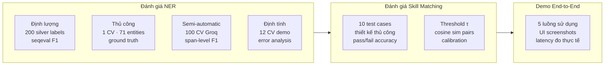

# 3.1 Môi trường Thực nghiệm

## 3.1.1 Cấu hình Phần cứng

Toàn bộ thực nghiệm của đề tài được thực hiện trên hai môi trường phần cứng khác nhau tùy theo giai đoạn phát triển. Quá trình huấn luyện mô hình NER được thực hiện trên Google Colab sử dụng GPU NVIDIA Tesla T4 miễn phí với 16 GB VRAM, đủ năng lực fine-tune mBERT [[3]](../tai_lieu_tham_khao.md#ref-3) [[33]](../tai_lieu_tham_khao.md#ref-33) với batch size 16. Môi trường Colab cung cấp RAM 12 GB và CPU Intel Xeon 2-core, đủ cho việc load và xử lý bộ dữ liệu 600 CV. Đây là lựa chọn thực tế phù hợp với điều kiện của đề tài nghiên cứu sinh viên khi không có quyền truy cập vào GPU server chuyên dụng.

Quá trình triển khai và kiểm thử hệ thống end-to-end được thực hiện trên máy tính cá nhân với cấu hình: CPU Intel Core i5-12450H (8 nhân, 12 luồng, 4.4 GHz Boost), RAM 16 GB DDR4 3200 MHz, ổ cứng SSD NVMe 512 GB, hệ điều hành Ubuntu 22.04 LTS. Cấu hình này không có GPU NVIDIA nên Ollama [[27]](../tai_lieu_tham_khao.md#ref-27) chạy LLM ở chế độ CPU inference, dẫn đến latency cao hơn (10–30 giây mỗi response) so với GPU inference, nhưng vẫn đủ để kiểm thử chức năng đầy đủ của hệ thống trong môi trường development.

## 3.1.2 Môi trường Phần mềm

Hệ thống được phát triển và kiểm thử trên nền tảng phần mềm được mô tả chi tiết trong Bảng 3.1.

**Bảng 3.1: Môi trường phần mềm thực nghiệm**

| Thành phần | Phiên bản | Ghi chú |
|---|---|---|
| Hệ điều hành | Ubuntu 22.04 LTS | Máy development |
| Docker Engine | 24.0.7 | Container runtime |
| Docker Compose | 2.21.0 | Orchestration |
| Python | 3.10.12 | AI services |
| .NET SDK | 9.0 | API Gateway [[30]](../tai_lieu_tham_khao.md#ref-30) |
| Node.js | 20.11 LTS | Frontend build |
| PostgreSQL | 15.4 | Relational DB |
| ChromaDB | 0.4.24 | Vector DB [[26]](../tai_lieu_tham_khao.md#ref-26) |
| Ollama | 0.1.38 | LLM local server [[27]](../tai_lieu_tham_khao.md#ref-27) |
| PyTorch | 2.1.2+cpu | NER model inference |
| HuggingFace Transformers | 4.37.2 | mBERT pipeline [[19]](../tai_lieu_tham_khao.md#ref-19) |
| Sentence-Transformers | 2.4.0 | Skill matching [[13]](../tai_lieu_tham_khao.md#ref-13) [[34]](../tai_lieu_tham_khao.md#ref-34) |
| FastAPI | 0.109.1 | AI service framework |
| LlamaIndex | 0.10.12 | RAG framework [[25]](../tai_lieu_tham_khao.md#ref-25) |
| React | 18.2.0 | Frontend framework |

## 3.1.3 Cấu hình Mô hình NER

Mô hình NER được fine-tune từ `bert-base-multilingual-cased` (mBERT) [[33]](../tai_lieu_tham_khao.md#ref-33) với các hyperparameter huấn luyện được trình bày trong Bảng 3.2. Quá trình huấn luyện diễn ra trên Google Colab T4 GPU với thời gian tổng khoảng 45–60 phút cho 5 epochs. Dữ liệu huấn luyện gồm 480 CV synthetic từ `data/processed/annotated_hf/synthetic_it_train.jsonl` (split 80%) và 60 CV validation từ `data/processed/annotated_hf/synthetic_it_val.jsonl` (split 10%).

**Bảng 3.2: Hyperparameter huấn luyện mô hình NER**

| Hyperparameter | Giá trị |
|---|---|
| Backbone | bert-base-multilingual-cased |
| Số nhãn | 21 (BIO scheme) |
| Learning rate | 2e-5 (AdamW) |
| Weight decay | 0.01 |
| Batch size | 16 |
| Gradient accumulation | 2 bước (effective batch = 32) |
| Số epochs | 5 |
| Warmup ratio | 10% tổng steps |
| LR scheduler | Linear decay sau warmup |
| Dropout | 0.1 (hidden + classifier) |
| Tập train | 480 CV (80%) |
| Tập validation | 60 CV (10%) |
| Tập test | 60 CV (10%) |
| Early stopping | Dựa trên Val F1 |

## 3.1.4 Thiết kế Thực nghiệm

Thực nghiệm của đề tài được tổ chức thành ba phần độc lập nhưng có liên hệ với nhau. Phần đầu tiên đánh giá chất lượng mô hình NER thông qua hai cách tiếp cận bổ sung cho nhau: đánh giá định lượng trên 200 mẫu silver labels (với lưu ý về hạn chế của phương pháp này) và đánh giá định tính thông qua demo trực tiếp trên tập 12 CV thực tế. Phần thứ hai đánh giá độ chính xác của Skill Matcher thông qua 10 test case được thiết kế để cover các tình huống matching từ đơn giản đến phức tạp. Phần thứ ba là demo end-to-end toàn bộ hệ thống, minh họa ba luồng sử dụng chính và giao diện người dùng.

**Hình 3.0: Cấu trúc thực nghiệm đề tài**

Cách tiếp cận đánh giá kết hợp định lượng và định tính được lựa chọn có chủ ý, phù hợp với thực tế kỹ thuật của đề tài: khi silver labels có sai số cấu trúc do tokenization mismatch, chỉ số F1 định lượng không đủ tin cậy để đánh giá đơn lẻ, và việc bổ sung đánh giá định tính trên dữ liệu thực tế cung cấp bằng chứng hữu ích hơn về năng lực thực sự của mô hình.

---

[← Chương 2](../chuong2/2.6_api_gateway_frontend.md) | [→ 3.2 Kết quả NER](3.2_ket_qua_ner.md)
