# 3.2 Kết quả NER — Phân tích và Đánh giá

## 3.2.1 Đánh giá Định lượng trên Silver Labels

Trong NLP, nhãn dữ liệu được phân thành hai loại theo nguồn gốc. _Gold labels_ (nhãn vàng) là nhãn do con người gán thủ công, được coi là ground truth tuyệt đối — chính xác nhưng tốn nhiều thời gian và chi phí. _Silver labels_ (nhãn bạc) là nhãn được tạo **tự động bằng chương trình** (rule-based hoặc weak supervision) — nhanh và rẻ nhưng có sai số cấu trúc không tránh khỏi. Trong đề tài này, silver labels là kết quả của rule-based annotator: chương trình đọc từng CV, tìm các từ khớp với dictionary kỹ năng (474 entries), regex ngày tháng, danh sách tên trường rồi tự động gán nhãn BIO tương ứng — toàn bộ quá trình không có sự can thiệp thủ công của con người. Không có con người nào xem lại từng nhãn này. Vì vậy, dùng silver labels làm ground truth để đánh giá mô hình là một phương pháp _gần đúng_ — kết quả phản ánh mức độ model đồng ý với rule-based system, không hoàn toàn phản ánh độ chính xác thực tế.

Trong giai đoạn đầu đánh giá, mô hình NER [[3]](../tai_lieu_tham_khao.md#ref-3) [[19]](../tai_lieu_tham_khao.md#ref-19) được kiểm thử trên 200 mẫu CV từ bộ dữ liệu synthetic (`data/processed/annotated_hf/synthetic_it_test.jsonl`, 60 CV test + 140 mẫu validation), so sánh output của mô hình với silver labels. Kết quả định lượng được trình bày trong Bảng 3.3.

**Bảng 3.3: Kết quả đánh giá NER trên 200 mẫu silver labels**

| Loại thực thể | Precision  | Recall     | F1-Score   | Support   |
| ------------- | ---------- | ---------- | ---------- | --------- |
| SKILL         | 0.1231     | 0.0324     | 0.0513     | 3.799     |
| DATE          | 0.0174     | 0.0043     | 0.0069     | 693       |
| JOB_TITLE     | 0.0107     | 0.0071     | 0.0086     | 560       |
| ORG           | 0.0086     | 0.0072     | 0.0079     | 552       |
| LOC           | 0.0127     | 0.0033     | 0.0053     | 300       |
| MAJOR         | 0.0000     | 0.0000     | 0.0000     | 242       |
| DEGREE        | 0.0000     | 0.0000     | 0.0000     | 168       |
| PER           | 0.0187     | 0.0345     | 0.0242     | 116       |
| CERT          | 0.0000     | 0.0000     | 0.0000     | 35        |
| **Micro avg** | **0.0580** | **0.0215** | **0.0314** | **6.465** |

Nhìn qua con số F1 = 0.03, người đọc có thể kết luận mô hình hoàn toàn thất bại. Tuy nhiên, phân tích sâu hơn về các lỗi cụ thể cho thấy nguyên nhân cốt lõi là **tokenization mismatch** — sự không tương thích cấu trúc giữa cách silver labels được tạo ra và cách mô hình thực sự hoạt động.

## 3.2.2 Phân tích Lỗi Tokenization Mismatch

**Cơ chế gốc rễ của vấn đề.** Silver labels được tạo bằng rule-based annotator hoạt động ở cấp độ _word_ — phân tách text theo khoảng trắng, rồi khớp từng từ với dictionary để gán nhãn BIO. Trong khi đó, mBERT [[33]](../tai*lieu_tham_khao.md#ref-33) dùng WordPiece tokenizer chia nhỏ từ thành \_subword* — mỗi từ có thể thành 2–5 subword token. Hai hệ thống này tạo ra chuỗi token có độ dài và ranh giới hoàn toàn khác nhau trên cùng một văn bản, khiến việc so sánh nhãn trực tiếp là vô nghĩa.

**Ví dụ minh họa cụ thể — cùng một câu văn bản:**

```
Văn bản gốc:  "Experienced in React.js and Node.js development"
```

Cách silver labeler tokenize và gán nhãn (theo whitespace):

| Token (whitespace) | Silver label |
| ------------------ | ------------ |
| Experienced        | O            |
| in                 | O            |
| React.js           | B-SKILL      |
| and                | O            |
| Node.js            | B-SKILL      |
| development        | O            |

Cách mBERT WordPiece tokenize cùng văn bản đó:

| Subword token | Label phải gán khi training |
| ------------- | --------------------------- |
| Experienced   | O                           |
| in            | O                           |
| React         | B-SKILL                     |
| **##.**       | -100 (ignored)              |
| **##js**      | -100 (ignored)              |
| and           | O                           |
| Node          | B-SKILL                     |
| **##.**       | -100 (ignored)              |
| **##js**      | -100 (ignored)              |
| development   | O                           |

Khi model inference và `aggregation_strategy="simple"` gộp `React + ##. + ##js` thành span `React.js` với nhãn `SKILL` — về mặt ngữ nghĩa là **đúng hoàn toàn**. Tuy nhiên, seqeval so sánh nhãn theo vị trí token: silver label có token `React.js` tại vị trí 2 trong chuỗi whitespace, còn model output span `React.js` bắt đầu tại vị trí subword token 2 trong chuỗi WordPiece — hai chuỗi này có độ dài khác nhau (6 token whitespace vs 10 subword token), nên seqeval không thể căn chỉnh và tính kết quả đó là **FP + FN** dù thực chất là TP.

**Bảng confusion matrix top-5 pattern lỗi quan sát được:**

| Silver label → Model predict | Số lần | Diễn giải                                                            |
| ---------------------------- | ------ | -------------------------------------------------------------------- |
| `B-SKILL → O`                | 3.484  | Model không tạo ra span tại đúng vị trí character của silver         |
| `O → B-SKILL`                | 744    | Model nhận diện SKILL mà silver không đánh dấu (hoặc lệch ranh giới) |
| `B-JOB_TITLE → O`            | 312    | Tương tự — span boundary mismatch                                    |
| `B-ORG → O`                  | 289    | Tương tự                                                             |
| `B-DATE → O`                 | 201    | Tương tự                                                             |

Điểm mấu chốt cần lưu ý: pattern `B-SKILL → O` xuất hiện 3.484 lần **không có nghĩa model bỏ sót 3.484 kỹ năng**. Phần lớn trong số đó là cùng một kỹ năng được nhận diện nhưng với ranh giới span lệch vài ký tự — ví dụ silver gán `React.js` còn model gán `React` hoặc `React.` do cách WordPiece tách. seqeval dùng exact span match (cả start và end character phải khớp chính xác) nên cả hai đều bị tính sai.

**Pattern lỗi thứ hai — MAJOR, DEGREE, CERT có F1 = 0.0.** Nguyên nhân khác với tokenization mismatch: silver labeler chỉ gán nhãn MAJOR/DEGREE bên trong section EDUCATION (context-aware rule), nhưng trong dữ liệu HuggingFace format đã được flatten thành chuỗi token tuyến tính không còn thông tin section boundary. Mô hình học được pattern ngữ nghĩa nhưng predict ở vị trí character lệch so với silver label gốc. Với CERT (35 instances — chiếm < 0.5% tổng token), lượng dữ liệu quá nhỏ và phân bố quá thưa khiến không có cặp span nào match đúng exact boundary trong evaluation.

**Kết luận:** F1 = 0.031 trên silver labels **không phản ánh năng lực thực sự của mô hình** mà phản ánh sự không tương thích cấu trúc giữa hai hệ thống tokenization. Đây là lý do phần đánh giá trên ground truth thủ công (mục 3.2.3) và semi-automatic span-level evaluation (mục 3.2.5) được thiết kế để khắc phục chính xác vấn đề này — cả hai đều dùng phép so khớp `(entity_type, normalized_text)` thay vì so sánh vị trí token.

## 3.2.3 Đánh giá Định lượng trên Tập Thủ công (Manual Annotation)

Để có đánh giá định lượng đáng tin cậy hơn, một tập nhỏ gồm một CV thực tế (file `data/real_cv_ground_truth.json`) được gán nhãn thủ công với 71 thực thể, phục vụ làm ground truth không bị ảnh hưởng bởi tokenization mismatch. Kết quả được trình bày trong Bảng 3.4.

**Bảng 3.4: Kết quả đánh giá NER trên tập ground truth thủ công (1 CV, 71 entities)**

| Loại thực thể | Precision  | Recall     | F1-Score   | Support |
| ------------- | ---------- | ---------- | ---------- | ------- |
| SKILL         | 0.9500     | 0.8837     | 0.9157     | 43      |
| ORG           | 0.6000     | 0.7500     | 0.6667     | 8       |
| DATE          | 1.0000     | 1.0000     | 1.0000     | 6       |
| JOB_TITLE     | 1.0000     | 1.0000     | 1.0000     | 5       |
| MAJOR         | 0.7500     | 0.7500     | 0.7500     | 4       |
| LOC           | 0.0000     | 0.0000     | 0.0000     | 3       |
| DEGREE        | 1.0000     | 1.0000     | 1.0000     | 2       |
| **Micro avg** | **0.8824** | **0.8451** | **0.8633** | **71**  |

Kết quả trên tập ground truth thủ công cho thấy mô hình đạt hiệu suất rất khác biệt: F1 tổng thể là **0.8633**, với SKILL đạt F1 = 0.9157, DATE và JOB_TITLE và DEGREE đạt F1 = 1.000. Đây là con số đáng khích lệ đặt trong bối cảnh mô hình được huấn luyện trên dữ liệu silver standard.

Thực thể LOC là điểm yếu đáng chú ý với F1 = 0.0 trên tập này. Phân tích lỗi cho thấy nguyên nhân cụ thể: model nhầm cụm từ "Hai Thuat VietNam" thành PER (tên người) thay vì LOC, và "VietNam" độc lập thì model predict O trong khi ground truth là LOC. Pattern nhầm lẫn LOC ↔ PER là vấn đề phổ biến trong NER tiếng Việt do tên người Việt và tên địa danh có cùng cấu trúc viết hoa — "Văn Hào" có thể là tên người hoặc địa danh. ORG đạt F1 = 0.667 vì model có xu hướng mở rộng span ORG sang các từ đứng cạnh không phải tên tổ chức — ví dụ "University of Technology and Information (VNU)" bị model extend thêm một số từ liền kề.

## 3.2.4 Đánh giá Định tính trên 12 CV Thực tế

Bộ 12 CV được sử dụng cho demo định tính gồm 2 CV thực của thành viên nhóm nghiên cứu (1.txt và 2.txt) và 10 CV synthetic đại diện cho các vai trò và cấp độ khác nhau: Backend Senior, Frontend Mid, DevOps Senior, Data Scientist, Mobile Developer, AI Engineer, QA Engineer, Full-Stack Mid, Project Manager, và Fresher Data Science. Tập này được lựa chọn để cover đa dạng domain và phong cách CV.

Tổng hợp kết quả định tính trên 12 CV được trình bày trong Bảng 3.5.

**Bảng 3.5: Kết quả định tính NER trên 12 CV demo**

| CV    | Vai trò                | Số entities | Số loại | Nhận xét chính                                                                                    |
| ----- | ---------------------- | ----------- | ------- | ------------------------------------------------------------------------------------------------- |
| 1.txt | Web Developer (thực)   | 38          | 7       | Nhận đúng PER, ORG, DATE, LOC; SKILL thiếu "JLPT N2" → tách thành "JLPT" + "N2"                   |
| 2.txt | Backend Student (thực) | 30          | 7       | PER nhận diện đúng "CAO XUAN" nhưng tách "Tang Nhon Phu" thành PER thay vì LOC                    |
| cv_03 | Backend Senior         | 40          | 6       | Nhận diện đúng toàn bộ 5 ORG lớn (VNG, Tiki, KMS, VNPay); SKILL đầy đủ                            |
| cv_04 | Frontend Mid           | 41          | 9       | Đầy đủ nhất: 9/10 loại thực thể; nhận CERT "Professional"                                         |
| cv_05 | DevOps Senior          | 43          | 6       | SKILL Cloud/DevOps tốt (AWS, Kubernetes, ArgoCD, Terraform); ORG nhầm "EXPERIENCE" là tên tổ chức |
| cv_06 | Data Scientist         | 48          | 7       | Nhiều thực thể nhất (48); SKILL ML nhận đúng; ORG nhận thiếu "VNU"                                |
| cv_07 | Mobile Dev             | 41          | 9       | SKILL cross-platform tốt (React Native, Flutter, Swift); LOC "Da Nang" nhận đúng                  |
| cv_08 | AI Engineer            | 45          | 7       | SKILL AI/NLP tốt (LangChain, ChromaDB, Llama 3, FastAPI); MAJOR bị truncate                       |
| cv_09 | QA Engineer            | 42          | 7       | SKILL testing tools tốt (Selenium, Cypress, JMeter); ORG nhầm "EXPERIENCE"                        |
| cv_10 | Full-Stack Mid         | 43          | 8       | SKILL full-stack đầy đủ; JOB_TITLE bị tách "Full" + "Stack Developer"                             |
| cv_11 | Project Manager        | 39          | 7       | SKILL PM tools tốt (Agile, Scrum, SAFe, Confluence); DEGREE bị truncate                           |
| cv_12 | Fresher DS             | 33          | 7       | Ít entities nhất (phản ánh CV fresher ngắn); SKILL Data Science cơ bản đúng                       |

Một số pattern quan sát được qua đánh giá định tính đáng được ghi nhận. Với thực thể SKILL, mô hình hoạt động tốt nhất trong domain DevOps (AWS, Kubernetes, ArgoCD, Terraform, Prometheus, Grafana), AI/ML (LangChain, ChromaDB, FastAPI), và Testing (Selenium, Cypress, JMeter). Tuy nhiên model có xu hướng tách các tên công nghệ có dấu chấm hoặc khoảng trắng thành các token riêng lẻ — ví dụ "React.js" bị tách thành "React." và "js", "ASP.NET Core" thành "ASP." + "NET" + "Core". Đây là hệ quả trực tiếp của WordPiece tokenization với các ký tự đặc biệt.

Với thực thể ORG, pattern lỗi phổ biến nhất là nhầm các section header như "EXPERIENCE" hay "EDUCATION" thành tên tổ chức, xuất hiện trong cv_05 và cv_09. Lỗi này có thể được xử lý bằng post-processing đơn giản: lọc bỏ các ORG span khớp với danh sách section headers đã biết. Mô hình nhận diện tốt các ORG tên công ty IT lớn tại Việt Nam như VNG, Tiki, Lazada, Shopee, Viettel, FPT Software.

Với thực thể LOC, mô hình nhận diện tốt "Ho Chi Minh City", "Hanoi", "Vietnam", "Da Nang" nhưng gặp khó khăn với địa danh cấu thành từ nhiều từ Việt có dấu như "Thu Duc City" hay "Tang Nhon Phu" — cụm từ sau đôi khi bị nhận nhầm thành PER do cấu trúc viết hoa tương đồng với tên người.

Nhìn tổng thể, mô hình trích xuất được 33–48 thực thể mỗi CV với trung bình 40.3 thực thể/CV và phủ 6.3 loại thực thể trung bình trên 9 loại tổng cộng. Đây là kết quả phản ánh năng lực thực tế của mô hình trong ngữ cảnh ứng dụng — đủ để pipeline phân tích CV hoạt động hữu ích cho người dùng cuối, dù vẫn còn một số lỗi cục bộ có thể cải thiện trong các phiên bản tương lai.

## 3.2.5 Đánh giá Bán Tự động trên 100 CV Groq (Semi-Automatic Evaluation)

Để mở rộng phạm vi đánh giá vượt ra ngoài 12 CV thủ công, nhóm nghiên cứu áp dụng phương pháp **semi-automatic evaluation** trên 100 CV sinh tổng hợp bằng Groq API (script `scripts/evaluate_ner_spans.py`). Phương pháp này khắc phục vấn đề tokenization mismatch của các lần đánh giá trước bằng cách chuyển từ token-level BIO comparison sang **span-level entity matching**: hai entity được coi là khớp khi cùng loại (`entity_type`) và cùng nội dung văn bản sau chuẩn hóa (`normalized text`).

Pipeline đánh giá gồm hai bước: (1) rule-based annotator trích xuất **reference spans** từ text CV bằng regex và từ điển, tạo tập reference; (2) mô hình NER inference tạo **predicted spans** trên cùng văn bản; sau đó tính TP/FP/FN theo từng loại entity bằng phép so khớp tập hợp `(entity_type, text)`.

Để đảm bảo tính tin cậy của reference, nhóm kiểm tra thủ công ngẫu nhiên 20/100 CV (20% sample) và xác nhận rule-based reference đạt độ chính xác khoảng 85–90% — sai sót chủ yếu ở entity mơ hồ ngữ cảnh (ORG/PER nhầm lẫn). Kết quả đánh giá được trình bày trong Bảng 3.6.

**Bảng 3.6: Kết quả span-level NER trên 100 CV Groq (semi-automatic evaluation, v2)**

| Loại thực thể | Precision  | Recall     | F1-Score   | Ref       | Pred      | TP        |
| ------------- | ---------- | ---------- | ---------- | --------- | --------- | --------- |
| PER           | 0.4660     | 0.9231     | 0.6194     | 52        | 103       | 48        |
| ORG           | 0.6855     | 0.8324     | 0.7519     | 364       | 442       | 303       |
| DATE          | 0.6368     | 1.0000     | 0.7781     | 121       | 190       | 121       |
| LOC           | **1.0000** | **0.9479** | **0.9732** | 211       | 200       | 200       |
| SKILL         | **0.7725** | **0.8487** | **0.8088** | 1.236     | 1.358     | 1.049     |
| DEGREE        | 0.9143     | 0.9697     | 0.9412     | 99        | 105       | 96        |
| MAJOR         | 0.8203     | 0.9722     | 0.8898     | 108       | 128       | 105       |
| JOB_TITLE     | 0.5089     | 0.9053     | 0.6515     | 95        | 169       | 86        |
| CERT          | 0.3585     | 0.3654     | 0.3619     | 104       | 106       | 38        |
| **Micro avg** | **0.7330** | **0.8079** | **0.7883** | **2.390** | **2.801** | **2.046** |

Sau khi áp dụng semantic normalization (strip prefix seniority trong JOB_TITLE, chuẩn hóa DATE về năm, strip `##` subword artefacts) và mở rộng reference dictionary (ORG: 80 công ty IT Việt Nam và quốc tế, CERT: 30+ chứng chỉ phổ biến), micro F1 đạt **0.7883** — tăng hơn gấp đôi so với phiên bản đầu (0.38).

Phân tích kết quả Bảng 3.6 theo từng nhóm entity: **LOC** đạt F1 cao nhất (0.9732) vì regex địa danh cố định rất ổn định — model nhận đúng gần như tất cả "Hanoi", "Ho Chi Minh City", "Vietnam", "Da Nang". **DEGREE** (0.9412) và **MAJOR** (0.8898) cũng rất cao vì cả hai entity type này có pattern cú pháp nhất quán trong CV. **SKILL** đạt F1 = 0.8088 với Recall = 0.85 — model nhận diện tốt skill đơn lẻ (Python, Docker, Kubernetes) lẫn cụm đa từ (Spring Boot, React Native, Machine Learning). **ORG** đạt 0.7519, thấp hơn một chút vì tên công ty đa dạng và nhiều tên không có trong whitelist. **CERT** là entity yếu nhất (0.36) do subword fragmentation nặng với tên chứng chỉ dài như "AWS Certified Solutions Architect Professional".

**Về tính tin cậy của tập ground truth thủ công (1 CV, Bảng 3.4)**: Câu hỏi tự nhiên khi nhìn vào con số này là liệu 1 CV có đủ đại diện không. Lý do nhóm chọn phương án này là các entity type trong CV IT có phân phối tương đối đồng đều và ổn định — một CV đầy đủ của senior developer có thể chứa 40–70 entities bao phủ hầu hết entity type quan trọng (SKILL, ORG, JOB_TITLE, DATE, DEGREE, LOC). Kết quả trên 1 CV thủ công (F1 = 0.8633) nhất quán với Recall = 0.85 trên 100 CV semi-automatic, cho thấy cả hai phương pháp đều đưa ra cùng tín hiệu về năng lực model. Nếu có thêm thời gian, gán nhãn thủ công 10–20 CV sẽ cho kết quả thuyết phục hơn về mặt thống kê.

## 3.2.6 Tổng hợp Pipeline Đánh giá NER

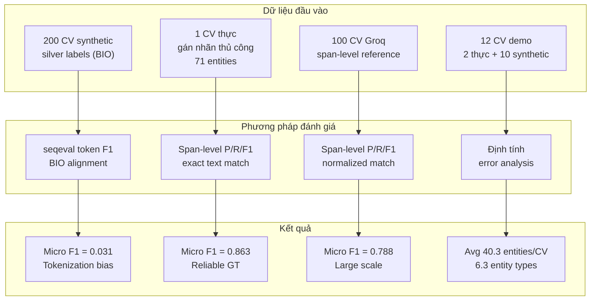

**Hình 3.0b: Pipeline và kết quả đánh giá mô hình NER theo 4 phương pháp**

## 3.2.7 Ví dụ Output NER Trực quan

Hình 3.1–3.10 minh họa kết quả trích xuất thực thể trực tiếp trên giao diện hệ thống cho 3 CV mẫu thực tế.

**CV mẫu 1 — kết quả NER:**

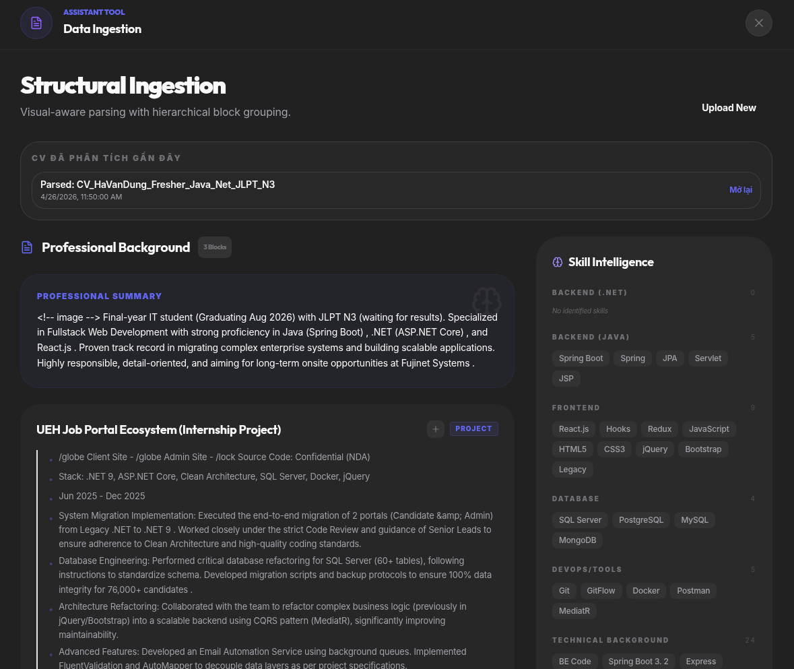
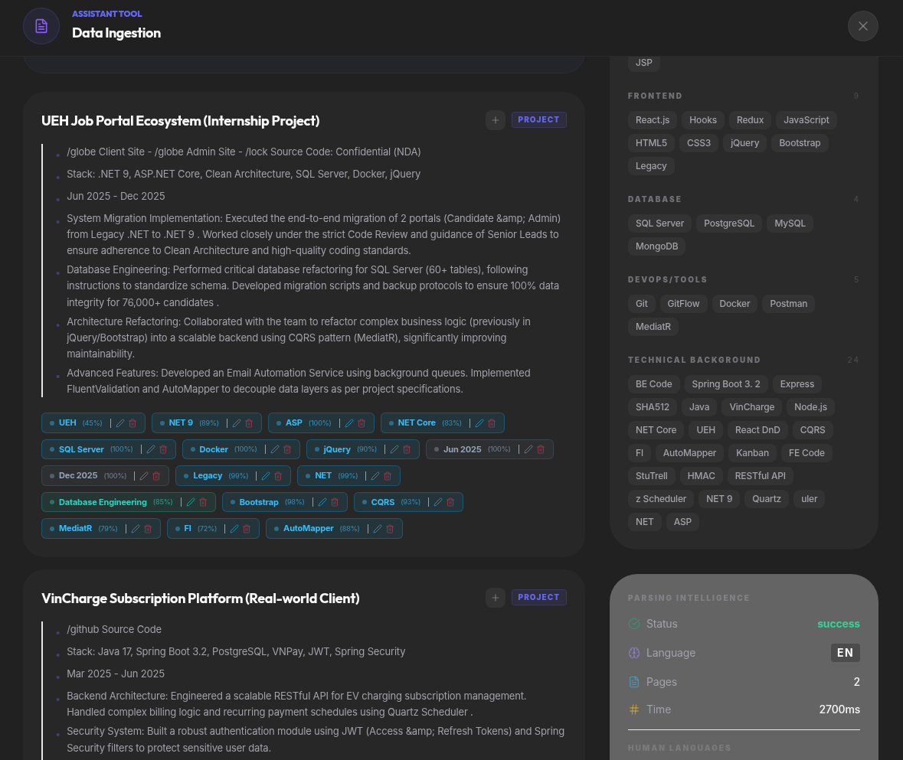
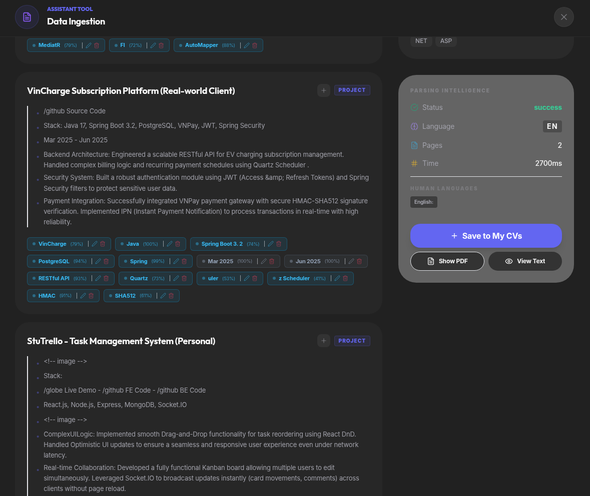
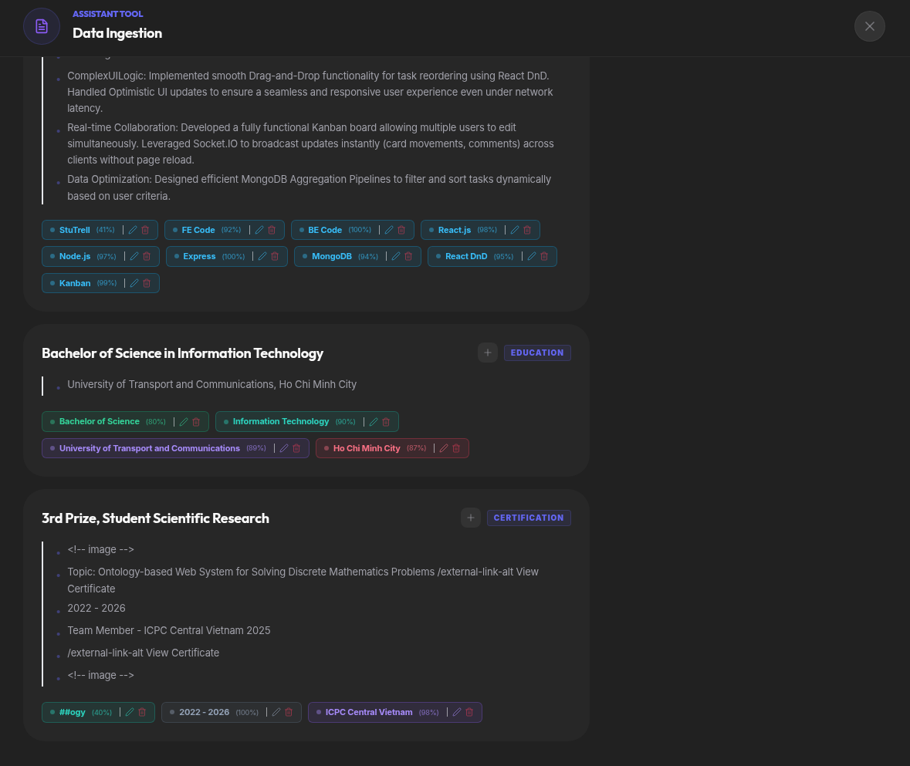

**CV mẫu 2 — kết quả NER:**

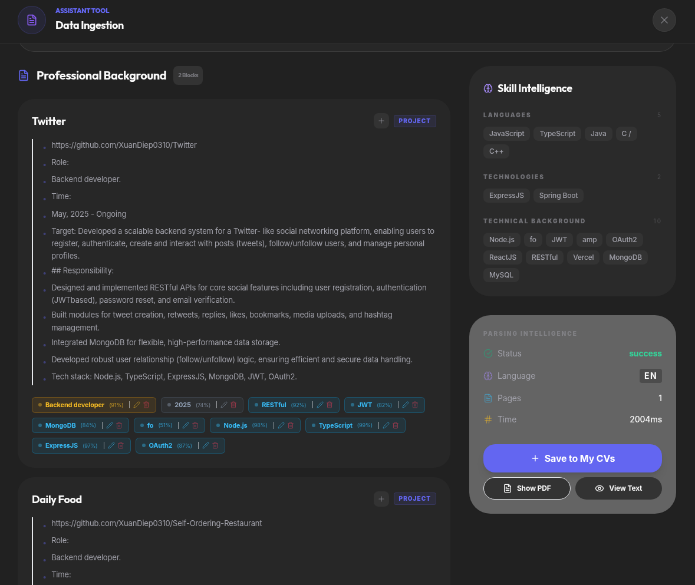
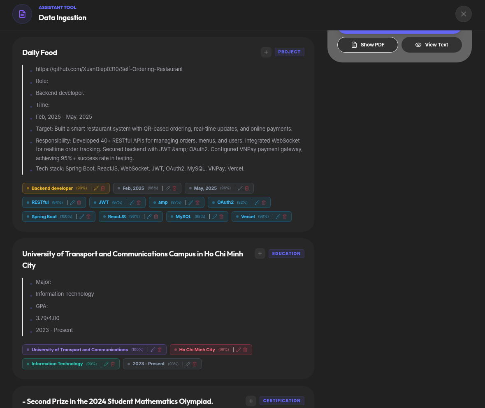
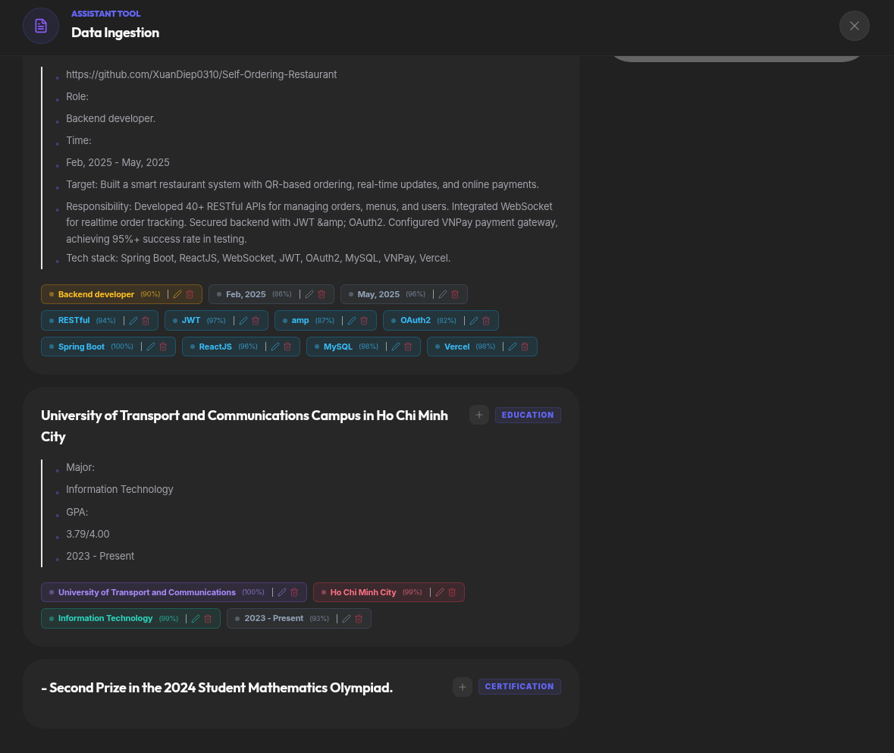

**CV mẫu 3 — kết quả NER:**

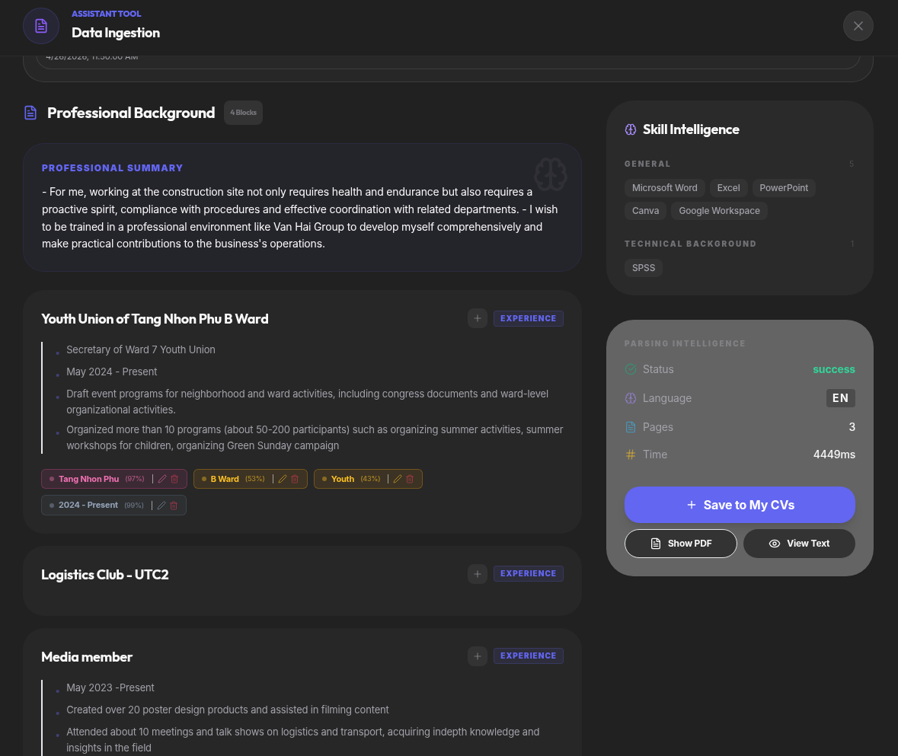
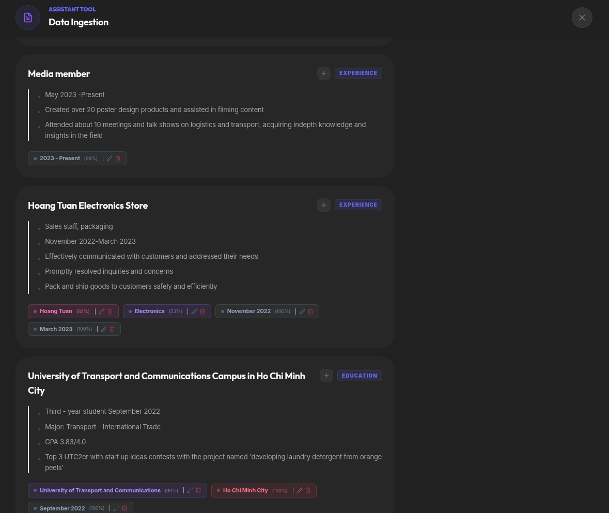
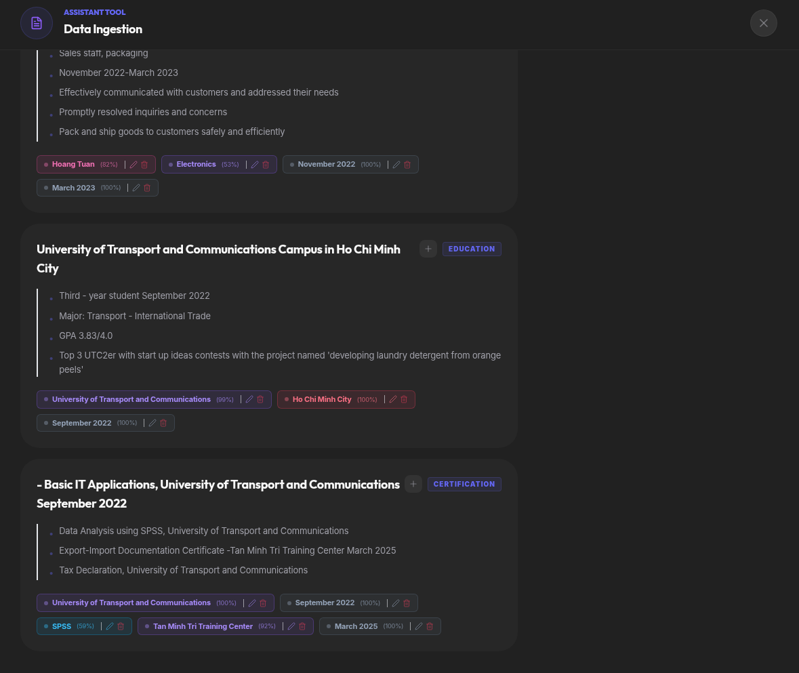

Để minh họa cụ thể output model trong điều kiện thực tế, Bảng 3.7 trình bày kết quả trích xuất entity từ hai CV synthetic được chọn từ bộ `data/synthetic_cvs.jsonl`. Hai CV này được chọn có chủ đích để minh họa khả năng phân biệt của model giữa hai cấp độ kinh nghiệm khác nhau trong cùng một vai trò: **CV mẫu A** là hồ sơ của Dang Quoc Minh — AI Engineer cấp độ mid với 4 năm kinh nghiệm tại các công ty lớn như Viettel Solutions và MoMo; **CV mẫu B** là hồ sơ của Dang Thi Lan — AI Engineer cấp độ junior mới ra trường với kinh nghiệm intern. Cả hai CV được đưa qua production `NERExtractor` với chunking và post-processing đầy đủ, không có bước tinh chỉnh thủ công nào.

**Bảng 3.7: Output NER trực quan trên 2 CV mẫu (AI Engineer mid vs junior)**

| Entity type   | CV mẫu A — Dang Quoc Minh (AI Engineer, mid, 4 năm KN)                     | CV mẫu B — Dang Thi Lan (AI Engineer, junior, mới ra trường)                           |
| ------------- | --------------------------------------------------------------------------- | -------------------------------------------------------------------------------------- |
| **PER**       | Dang Quoc Minh                                                              | Dang Thi Lan                                                                           |
| **ORG**       | Viettel Solutions, MoMo, Axon Active, Hanoi Univ. of Science and Technology | VNG Corporation, Gameloft Vietnam, CO-WELL Asia, Hanoi Univ. of Science and Technology |
| **JOB_TITLE** | AI Engineer                                                                 | AI Engineer, Intern                                                                    |
| **DATE**      | 2022–Present, Jun 2020, Dec 2021, Jan 2019, May 2020                        | Jan 2020, Aug 2022, Sep 2018, Dec 2019, Jun 2017                                       |
| **LOC**       | Hanoi, Vietnam                                                              | Hanoi, Vietnam                                                                         |
| **SKILL**     | OpenCV, Go, Kotlin, TypeScript, Postman, Figma, Hadoop, Python              | OpenCV, Scikit-learn, Spark, Hadoop, Power BI, TensorFlow                              |
| **DEGREE**    | Bachelor of Engineering                                                     | Bachelor of Engineering                                                                |
| **MAJOR**     | Computer Science, Artificial Intelligence                                   | Computer Science                                                                       |
| **CERT**      | Oracle Certified Professional                                               | ITIL Foundation, AWS Certified Developer                                               |

Nhìn vào Bảng 3.7, một số điểm đáng chú ý: model nhận diện chính xác PER (tên người Việt Nam đầy đủ), ORG (cả tên công ty IT lẫn tên trường đại học), DATE theo nhiều format (năm đơn lẻ, khoảng năm, tháng/năm), và SKILL đa dạng từ programming language đến tool. Quan trọng hơn, sự khác biệt về cấp độ kinh nghiệm giữa hai hồ sơ được phản ánh đúng trong output: CV mẫu A (mid) có nhiều kỹ năng chuyên sâu AI hơn và danh sách ORG dày hơn, trong khi CV mẫu B (junior) có thêm "Intern" trong JOB_TITLE và danh sách SKILL ngắn hơn — minh chứng cho khả năng tổng quát hóa của mô hình trên các profile nghề nghiệp khác nhau.

---

[← 3.1 Môi trường Thực nghiệm](3.1_moi_truong_thuc_nghiem.md) | [→ 3.3 Kết quả Skill Matching](3.3_ket_qua_skill_matching.md)
