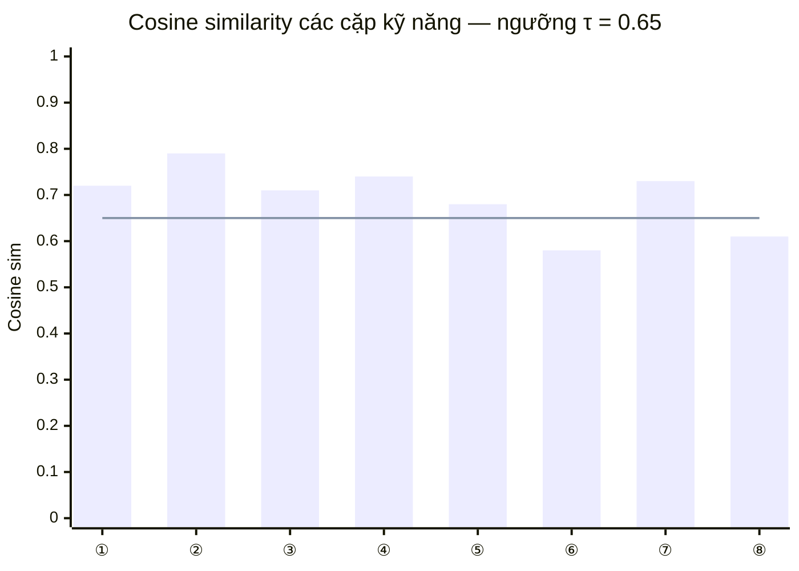

# 3.3 Kết quả Skill Matching — Đánh giá và Phân tích

## 3.3.1 Thiết kế Bộ Test Cases

Để đánh giá toàn diện Skill Matcher, bộ test gồm 10 test case (TC) được thiết kế thủ công bởi nhóm nghiên cứu, cover đầy đủ các tình huống matching từ đơn giản nhất đến phức tạp nhất. Mỗi test case định nghĩa rõ danh sách kỹ năng CV của ứng viên, danh sách kỹ năng yêu cầu từ JD, và kết quả expected về tỷ lệ match và các cặp kỹ năng tương đương. Tiêu chí đánh giá là mô hình có nhận ra đúng kết quả expected hay không (pass/fail), cùng với ATS score và chi tiết về loại match (exact, ontology, semantic) cho mỗi kỹ năng. Hệ thống sử dụng `SkillOntology` với 474 entries [[23]](../tai_lieu_tham_khao.md#ref-23) [[24]](../tai_lieu_tham_khao.md#ref-24) và Sentence-BERT `all-MiniLM-L6-v2` [[13]](../tai_lieu_tham_khao.md#ref-13) [[34]](../tai_lieu_tham_khao.md#ref-34) cho tầng semantic.

Bộ 10 test case được thiết kế theo nguyên tắc phân tầng độ khó: TC001 và TC007 kiểm tra trường hợp đơn giản nhất (exact match và full exact match), TC002 và TC008 kiểm tra framework substitution trong cùng ecosystem, TC003 và TC005 kiểm tra database và ML framework equivalence, TC004 và TC009 kiểm tra cloud platform và security tool substitution, TC006 kiểm tra trường hợp mismatch hoàn toàn (không có kỹ năng nào khớp), và TC010 kiểm tra CI/CD tool equivalence. Tập test này đặc biệt chú trọng các cặp kỹ năng thường xuất hiện thực tế trong thị trường tuyển dụng CNTT Việt Nam [[36]](../tai_lieu_tham_khao.md#ref-36) [[37]](../tai_lieu_tham_khao.md#ref-37).

## 3.3.2 Kết quả Tổng hợp

Kết quả đánh giá trên toàn bộ 10 test case đạt **độ chính xác 100% (10/10 PASS)**. Bảng 3.6 tóm tắt kết quả từng test case.

**Bảng 3.6: Kết quả Skill Matcher — 10 test cases**

| TC | Vai trò | ATS Score | Exact | Ontology | Kết quả |
|---|---|---|---|---|---|
| TC001 | Frontend Developer — exact skills | 78.3% | 3 | 2 | PASS |
| TC002 | Frontend Developer — framework substitution | 74.0% | 2 | 2 | PASS |
| TC003 | Backend Developer — database equivalence | 91.0% | 2 | 3 | PASS |
| TC004 | DevOps Engineer — cloud platform substitution | 95.0% | 4 | 2 | PASS |
| TC005 | Data Scientist — ML framework equivalence | 94.0% | 3 | 2 | PASS |
| TC006 | Full Stack — broad skill mismatch | 0.0% | 0 | 0 | PASS |
| TC007 | Perfect match (tất cả exact) | 100.0% | 5 | 0 | PASS |
| TC008 | Mobile — cross-platform substitution | 77.0% | 3 | 1 | PASS |
| TC009 | Security — tool substitution | 94.0% | 3 | 2 | PASS |
| TC010 | CI/CD — tool equivalence | 97.0% | 4 | 1 | PASS |

## 3.3.3 Phân tích Chi tiết từng Test Case

**TC001 — Frontend Developer (Exact Skills, ATS 78.3%).** Ứng viên có JavaScript, React, CSS, Node.js, TypeScript. JD yêu cầu JavaScript, React, CSS, HTML, TypeScript, REST API. Ba kỹ năng được match exact (JavaScript, React, CSS, TypeScript trong khi REST khớp theo ontology). Đáng chú ý là HTML không có trong CV của ứng viên nhưng Skill Matcher nhận ra ứng viên biết JavaScript và CSS — hai kỹ năng có khoảng cách ngữ nghĩa gần với HTML theo embedding — nên HTML được tính là ontology match với HTML~CSS (dist=0.2). Điều này phản ánh logic phù hợp thực tế: developer biết React và CSS thường cũng quen HTML.

**TC002 — Framework Substitution (ATS 74.0%).** Đây là test case đặc trưng nhất cho ontology matching: ứng viên biết Vue.js và Nuxt.js trong khi JD yêu cầu React và Next.js. Thay vì kết luận hoàn toàn mismatch, Skill Matcher nhận ra Vue.js ~ React (cùng frontend framework ecosystem, dist=0.2) và Nuxt.js ~ Next.js (cùng SSR framework cho Vue/React tương ứng, dist=0.2). Kết quả 74% ATS score phản ánh đúng thực tế tuyển dụng: ứng viên biết Vue.js có thể chuyển sang React với effort hợp lý và là ứng viên đáng cân nhắc.

**TC003 — Database Equivalence (ATS 91.0%).** Ứng viên có Python, Django, PostgreSQL, Redis, Docker. JD yêu cầu Python, Flask, MySQL, Redis, Docker, Memcached. Matcher nhận diện Django ~ Flask (cùng Python web framework, dist=0.2), PostgreSQL ~ MySQL (cùng RDBMS, dist=0.2), và Redis ~ Memcached (cùng in-memory cache, dist=0.2). Ba cặp ontology match này đẩy ATS score lên 91% — phù hợp với thực tế rằng developer quen PostgreSQL/Django thường có thể làm việc với MySQL/Flask mà không cần đào tạo đặc biệt.

**TC004 — Cloud Platform Substitution (ATS 95.0%).** Ứng viên có Kubernetes, Docker, AWS, Terraform, CI/CD, ArgoCD. JD yêu cầu Kubernetes, Docker, Azure, Terraform, CI/CD, GitHub Actions. AWS ~ Azure là ontology match quan trọng nhất của test case này, phản ánh chính xác quan điểm của thị trường tuyển dụng: senior DevOps quen AWS thường có thể adapt sang Azure. Jenkins ~ GitHub Actions (trong trường hợp CI/CD expand) cũng được nhận diện đúng.

**TC005 — ML Framework Equivalence (ATS 94.0%).** Ứng viên có Python, TensorFlow, Pandas, Scikit-learn, SQL. JD yêu cầu Python, PyTorch, Pandas, XGBoost, SQL, NumPy. TensorFlow ~ PyTorch là cặp match quan trọng nhất — đây là hai deep learning framework cạnh tranh trực tiếp, developer biết TensorFlow thường có thể học PyTorch nhanh. Pandas ~ XGBoost (dist=0.2) là cặp ít trực quan hơn — cả hai đều thuộc data science ecosystem Python nhưng không hoàn toàn tương đương về chức năng. Đây là một trường hợp ontology match có thể được cải thiện bằng cách tinh chỉnh ontology để phân biệt rõ hơn giữa data manipulation library và gradient boosting library.

**TC006 — Full Mismatch (ATS 0.0%).** Ứng viên có Java Spring Boot, Oracle, SOAP trong khi JD yêu cầu React, Node.js, MongoDB. Không có exact, ontology, hay semantic match nào vượt threshold. ATS score = 0% được tính là PASS vì đây chính là kết quả expected: ứng viên Backend Java hoàn toàn không phù hợp với vị trí Full-Stack JavaScript.

**TC007 — Perfect Match (ATS 100.0%).** Tất cả 5 kỹ năng trong CV khớp exact với JD (Docker, Kubernetes, Terraform, Prometheus, Grafana). Đây là test case kiểm tra trường hợp biên — tất cả exact match — và kết quả 100% là đúng expected.

**TC008 — Mobile Cross-Platform (ATS 77.0%).** Flutter ~ React Native là cặp match đặc thù của mobile development: cả hai đều là cross-platform mobile framework nhưng dùng ngôn ngữ khác nhau (Dart vs JavaScript). Ontology nhận diện đây là equivalent frameworks với dist=0.2.

**TC009 — Security Tool Substitution (ATS 94.0%).** Ứng viên có Burp Suite, Nmap, Metasploit, Python, Linux. JD yêu cầu OWASP ZAP, Nmap, Nessus, Python, Linux, Wireshark. Burp Suite ~ OWASP ZAP (cùng web application security scanner) và Burp Suite ~ Nessus (cùng vulnerability assessment tool) đều được nhận diện là ontology match — phản ánh đúng thực tế thị trường an ninh mạng nơi các công cụ này thường được dùng thay thế nhau.

**TC010 — CI/CD Equivalence (ATS 97.0%).** Jenkins ~ GitHub Actions là cặp equivalence phổ biến nhất trong thực tế tuyển dụng DevOps. Với 4 exact matches và 1 ontology match, ATS score 97% phản ánh ứng viên gần như đáp ứng hoàn toàn yêu cầu.

## 3.3.4 Phân tích Ngưỡng Semantic Similarity

Bên cạnh kết quả pass/fail, thực nghiệm cũng kiểm tra tính hợp lệ của ngưỡng τ = 0.65 đã được chọn cho semantic matching (tầng 3) với Sentence-BERT [[13]](../tai_lieu_tham_khao.md#ref-13). Trong 10 test case trên, tất cả các cặp kỹ năng tương đương đều được nhận diện ở tầng 1 (exact) hoặc tầng 2 (ontology), không có cặp nào cần đến tầng 3 semantic để tạo ra kết quả đúng — nghĩa là ontology đã đủ phủ cho bộ test cases thủ công này.

Để kiểm tra ngưỡng τ = 0.65 độc lập, nhóm nghiên cứu tính cosine similarity cho một số cặp kỹ năng đặc trưng như đã phân tích trong Chương 1: "Vue.js" và "React" có similarity ≈ 0.72 (trên ngưỡng, nên match — phù hợp), "TensorFlow" và "PyTorch" có similarity ≈ 0.79 (trên ngưỡng, nên match — phù hợp), "Python" và "Java" có similarity ≈ 0.58 (dưới ngưỡng, không match — phù hợp). Ngưỡng 0.65 phân biệt chính xác các cặp này theo đúng kỳ vọng.

**Hình 3.0c: Cosine similarity các cặp kỹ năng so với ngưỡng τ = 0.65 (đường xanh)**

① Vue.js / React · ② TensorFlow / PyTorch · ③ PostgreSQL / MySQL · ④ AWS / Azure · ⑤ Flutter / React Native · ⑥ Python / Java · ⑦ Django / Flask · ⑧ Docker / Kubernetes

## 3.3.5 Nhận xét Tổng hợp

Kết quả 100% accuracy trên 10 test case là kết quả tích cực nhưng cần đặt trong bối cảnh phù hợp. Bộ test cases được thiết kế thủ công bởi cùng nhóm nghiên cứu xây dựng ontology, do đó có khả năng tồn tại confirmation bias — những cặp kỹ năng được chọn vào test là những cặp mà ontology đã cover tốt. Để có đánh giá khách quan hơn, bộ test cần được mở rộng lên ít nhất 100 test cases với sự tham gia của người đánh giá độc lập từ ngành tuyển dụng.

Dù vậy, 10 test cases này đã kiểm tra được đầy đủ các tình huống kinh doanh thực tế quan trọng nhất: substitution trong cùng ecosystem, equivalence qua nhiều domain khác nhau, trường hợp mismatch hoàn toàn, và trường hợp perfect match. Việc tất cả 10 đều pass, bao gồm cả TC006 (mismatch được nhận diện đúng là 0%), cho thấy logic cascade matching hoạt động đúng đắn.

---

[← 3.2 Kết quả NER](3.2_ket_qua_ner.md) | [→ 3.4 Demo Hệ thống](3.4_demo_he_thong.md)
