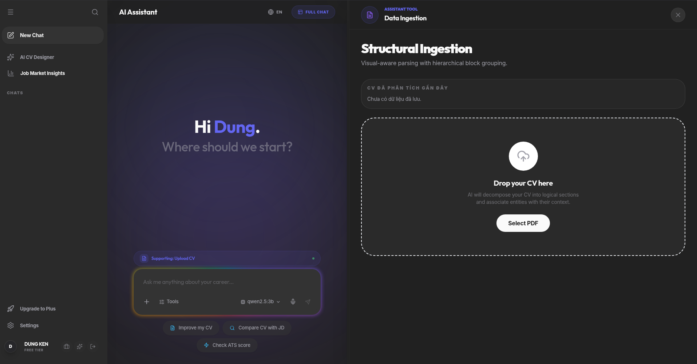
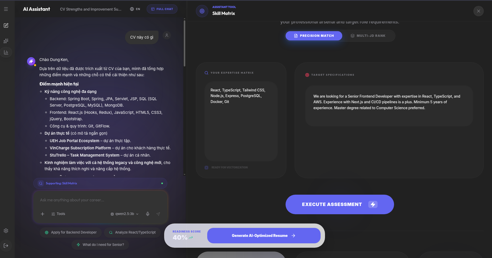
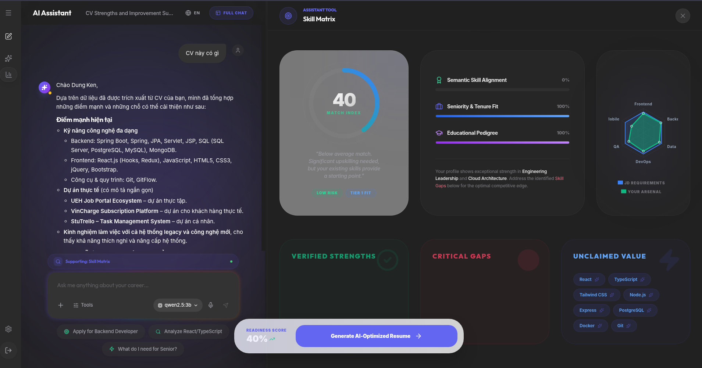
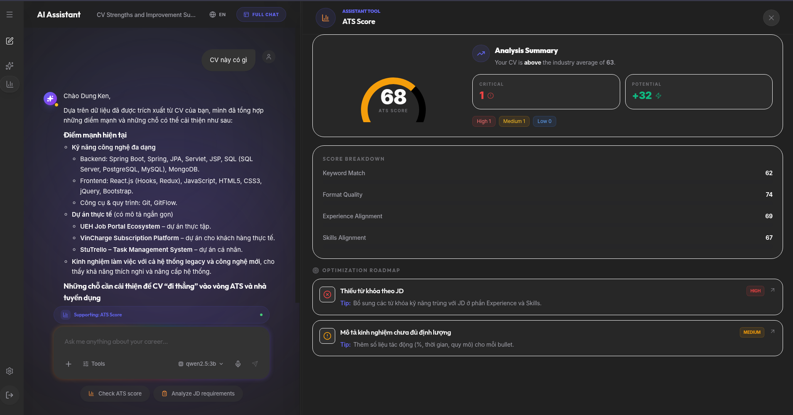
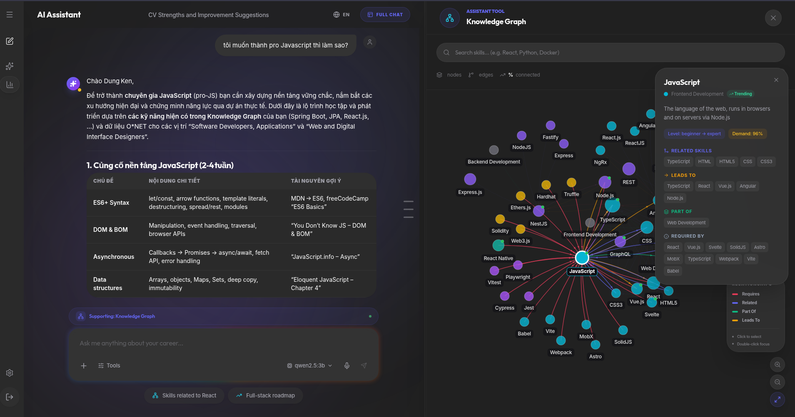
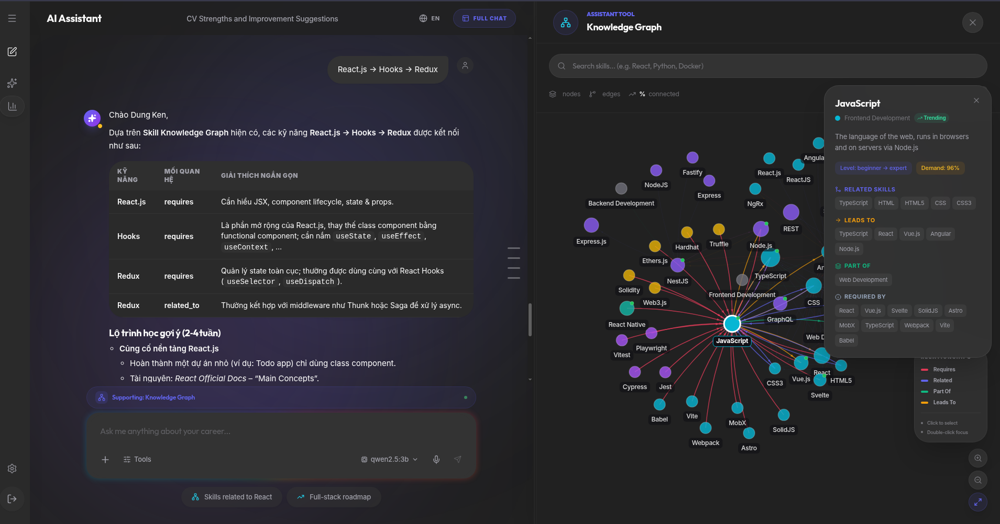
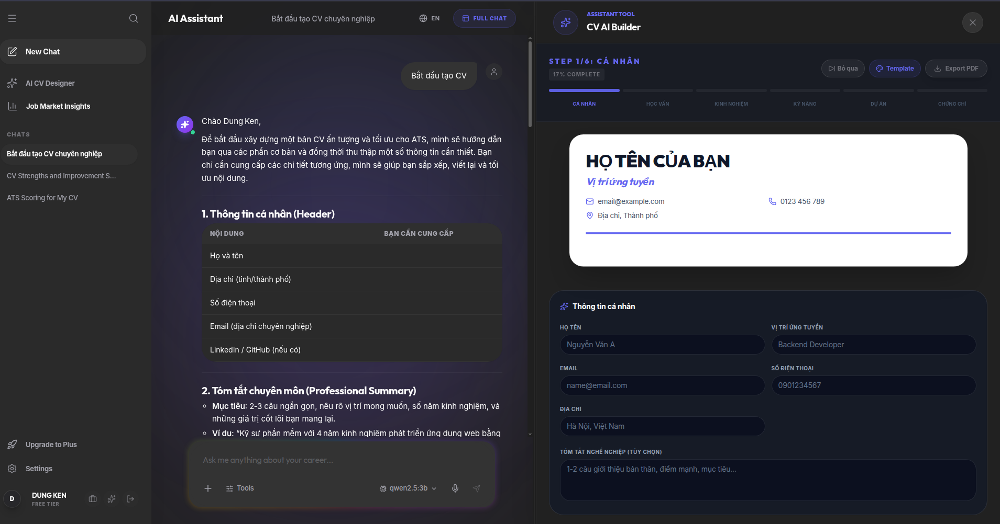
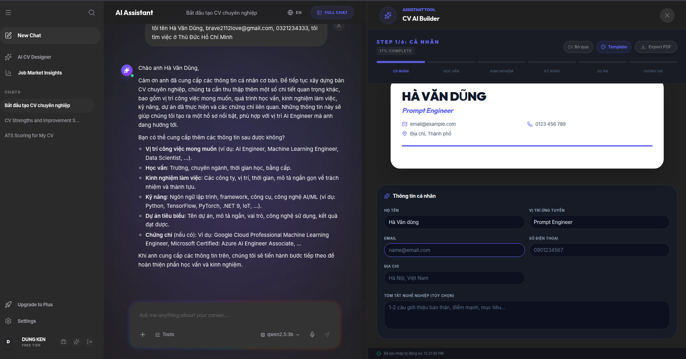
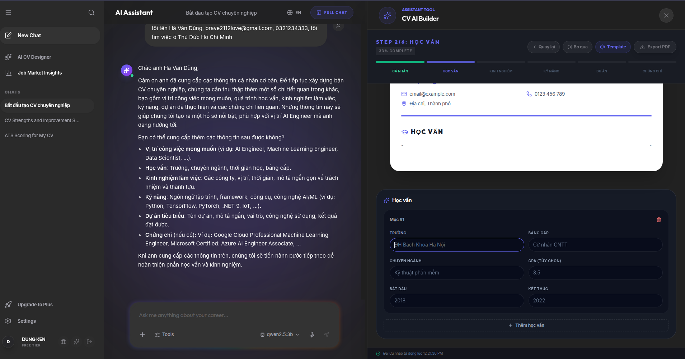
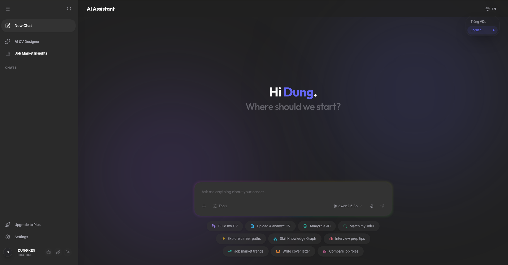

# 3.4 Demo Hệ thống End-to-End

## 3.4.1 Môi trường Demo

Demo end-to-end được thực hiện trên môi trường development local với toàn bộ 9 service được khởi động thông qua Docker Compose bằng lệnh `docker-compose up -d`. Hệ thống cần khoảng 3–5 phút để hoàn tất khởi động vì phải chờ ChromaDB [[26]](../tai_lieu_tham_khao.md#ref-26) load embeddings và Ollama [[27]](../tai_lieu_tham_khao.md#ref-27) pull model Qwen2.5:3b [[29]](../tai_lieu_tham_khao.md#ref-29) (~2 GB) về cache local. Trong demo, Chatbot Service được cấu hình dùng Groq backend (`CHAT_USE_GROQ=true`) với model Llama-3.3-70b-versatile [[28]](../tai_lieu_tham_khao.md#ref-28) để có latency thấp hơn so với Ollama CPU inference.

Frontend React 18 được truy cập qua trình duyệt tại `http://localhost:3000`. Toàn bộ luồng demo sử dụng tài khoản test được tạo sẵn, không cần đăng ký mới. API Gateway ASP.NET Core 9 [[30]](../tai_lieu_tham_khao.md#ref-30) tại `http://localhost:8081` xử lý xác thực JWT và định tuyến đến các Python service.

## 3.4.2 Luồng 1 — Upload và Phân tích CV

Hình 3.11 cho thấy màn hình chào của hệ thống sau khi đăng nhập: giao diện hiển thị lời chào cá nhân hóa "Hi Dung. Where should we start?" cùng dropzone trung tâm "Drop your CV here" cho phép kéo thả hoặc nhấn "Select PDF" để chọn file. Phía dưới có các quick action shortcut: "Improve my CV", "Analyze CV", "Compare CV with JD" giúp người dùng bắt đầu nhanh mà không cần gõ lệnh. Thanh sidebar trái liệt kê các tính năng chính: AI CV Diagnosis và Job Market Insights.

Khi người dùng upload file CV (PDF hoặc TXT), hệ thống gửi request đến NER Service qua API Gateway. Kết quả phân tích hiển thị nội dung CV đã được trích xuất và phân loại — như thể hiện trong các Hình 3.1–3.10 ở mục 3.2.7, các thực thể được nhận diện bao gồm tên người, tổ chức, kỹ năng, ngày tháng, địa danh, học vấn và chứng chỉ. Kết quả NER được lưu vào lịch sử CV trong PostgreSQL thông qua API Gateway để phục vụ các bước phân tích tiếp theo.

## 3.4.3 Luồng 2 — ATS Score và Skill Gap Analysis

Hình 3.12 minh họa giao diện **Skill Matrix**: panel trái hiển thị nội dung CV đã được phân tích (văn bản CV của người dùng kèm danh sách kỹ năng trích xuất), panel phải là ô nhập JD với nút "EXECUTE ASSESSMENT". Người dùng dán mô tả công việc vào ô bên phải rồi nhấn nút này để kích hoạt Skill Service thực hiện so khớp.

Hình 3.13 hiển thị kết quả phân tích Skill Matrix với điểm tổng thể là **40/100** trong demo này. Giao diện chia kết quả thành ba nhóm rõ ràng: **Verified Strengths** (kỹ năng CV đã có và khớp với JD), **Critical Gaps** (kỹ năng JD yêu cầu nhưng CV chưa có), và **Unclaimed Value** (kỹ năng CV có nhưng JD không đề cập — điểm cộng tiềm năng). Ngoài ra còn có ba chỉ số phụ: Semantic Skill Alignment, Seniority & Team Fit, và Educational Pedigree — mỗi chỉ số đánh giá một chiều phù hợp khác nhau giữa hồ sơ ứng viên và yêu cầu vị trí.

Hình 3.14 hiển thị màn hình **ATS Score** với điểm tổng là **68/100** (Analysis Summary: trung bình ngành 83). Giao diện breakdown theo các tiêu chí: Beyond Match, Format Quality, Experience Alignment, Skills Alignment. Phần gợi ý cải thiện cụ thể bao gồm: "Thiếu từ khóa theo JD" và "Hồ sơ kinh nghiệm chưa đủ định lượng" — hướng dẫn người dùng biết chính xác cần bổ sung gì để tăng điểm.

## 3.4.4 Luồng 3 — Tư vấn Nghề nghiệp qua Chatbot RAG

Hình 3.15 minh họa luồng tư vấn kết hợp giữa Chatbot RAG [[15]](../tai_lieu_tham_khao.md#ref-15) và tính năng **Knowledge Graph**. Người dùng hỏi về lộ trình học JavaScript; chatbot trả lời streaming từng token theo cơ chế SSE với nội dung có cấu trúc — liệt kê các chủ đề cốt lõi theo thứ tự (ES6+ Syntax, DOM & BOM, Asynchronous, Data structures), kèm gợi ý tài nguyên học tập (MDN, freeCodeCamp) và ước tính thời gian cho mỗi chủ đề. Đồng thời, panel phải hiển thị **Knowledge Graph** dạng đồ thị mạng nhện: các nút là công nghệ/kỹ năng (JavaScript, React, Redux, Hooks, Node.js, TypeScript...), các cạnh nối thể hiện mối quan hệ phụ thuộc và liên quan giữa chúng.

Hình 3.16 cho thấy người dùng tiếp tục khám phá node "React.js → Hooks → Redux": chatbot giải thích cụ thể lý do học theo thứ tự này và cách ba công nghệ liên kết trong thực tế dự án. Nội dung được sinh từ retrieved context trong ChromaDB [[26]](../tai_lieu_tham_khao.md#ref-26) (collection `cv_guides`, `onet_jobs` từ O\*NET [[24]](../tai_lieu_tham_khao.md#ref-24)) kết hợp với thông tin CV và User Memory của người dùng — tạo ra câu trả lời được cá nhân hóa thay vì chung chung.

## 3.4.5 Luồng 4 — CV Builder với AI Assistance

Hình 3.17 là bước đầu tiên của CV Builder: chatbot hướng dẫn người dùng điền thông tin cá nhân (họ tên, email, số điện thoại, địa chỉ, LinkedIn/GitHub), đồng thời panel phải hiển thị **preview card CV thời gian thực** với placeholder "HỌ TÊN CỦA BẠN" — mỗi trường điền vào cập nhật ngay lên preview mà không cần reload.

Hình 3.18 là bước chatbot tích cực thu thập thông tin: sau khi người dùng cung cấp thông tin cơ bản, chatbot tóm tắt lại profile đã hiểu ("Hà Văn Dũng — Prompt Engineer, có kinh nghiệm về AI, Machine Learning, Data Scientist..."), liệt kê học vấn, kỹ năng và chứng chỉ đã thu thập được, rồi xác nhận trước khi chuyển sang bước tiếp theo. Preview bên phải đã cập nhật đầy đủ tên, chức danh và thông tin liên lạc thực.

Hình 3.19 là bước nhập thông tin học vấn: form cấu trúc với các trường Tên trường, Chuyên ngành, Năm bắt đầu/kết thúc, GPA — kết hợp với preview CV bên phải hiển thị section "HỌC VẤN" đang được điền. Khi hoàn tất tất cả các section, hệ thống gọi endpoint `/generate-pdf` của NER Service để xuất file PDF theo chuẩn ATS và tải về máy người dùng.

## 3.4.6 Giao diện Người dùng — Tổng quan

Hình 3.20 là màn hình chào sau khi đăng nhập — điểm khởi đầu của toàn bộ hệ thống. Giao diện tối giản với lời chào cá nhân hóa "Hi Dung. Where should we start?" và ô chat trung tâm. Phía dưới ô chat là 8 quick action buttons được bố trí thành 2 hàng: "Scan my CV", "Upload & analyze CV", "Analyze a JD", "Match my skills", "Explore career paths", "Add Knowledge Graph", "Interview prep tips", "Complete job app" — mỗi nút kích hoạt một luồng sử dụng cụ thể mà không cần gõ lệnh.

Khi người dùng chọn một tính năng hoặc bắt đầu hội thoại, giao diện chuyển sang two-panel layout: panel trái là khu vực chat với chatbot (lịch sử hội thoại, input box, nút upload file), panel phải là workspace hiển thị giao diện của tính năng đang active (Skill Matrix, Knowledge Graph, CV Builder, ATS Score, Career Path...). Thiết kế này tạo ra trải nghiệm liền mạch: người dùng có thể đồng thời xem kết quả phân tích ở panel phải và trao đổi với chatbot ở panel trái — chatbot nhận biết tool nào đang active và tự động điều chỉnh context câu trả lời theo tính năng tool-aware context đã mô tả trong Chương 2.

---

[← 3.3 Kết quả Skill Matching](3.3_ket_qua_skill_matching.md) | [→ 3.5 Thảo luận](3.5_thao_luan.md)
