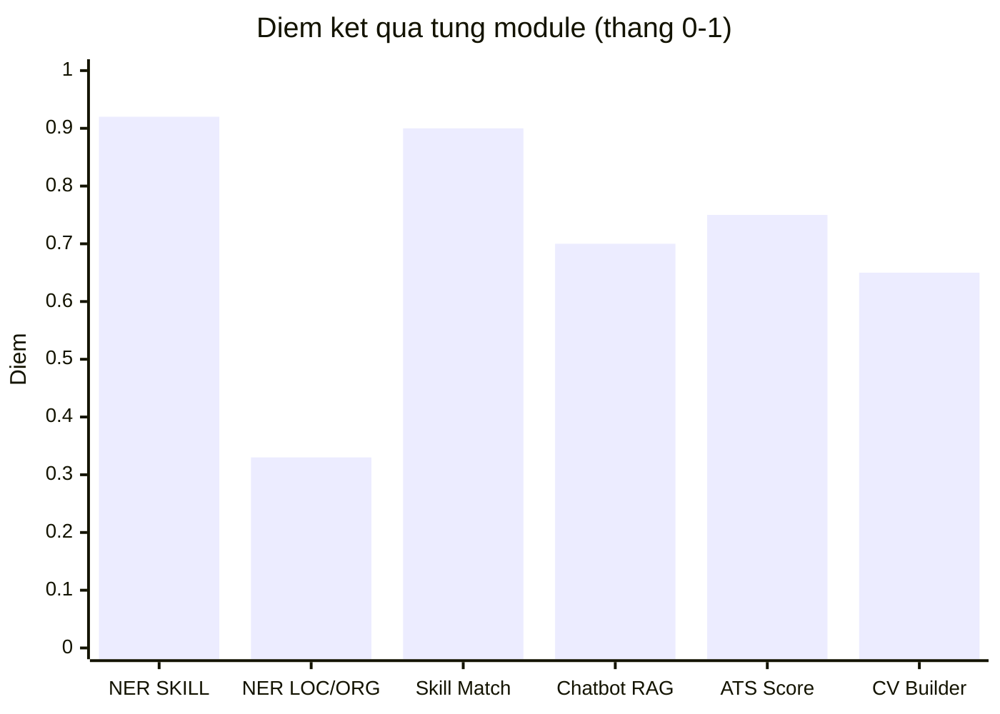
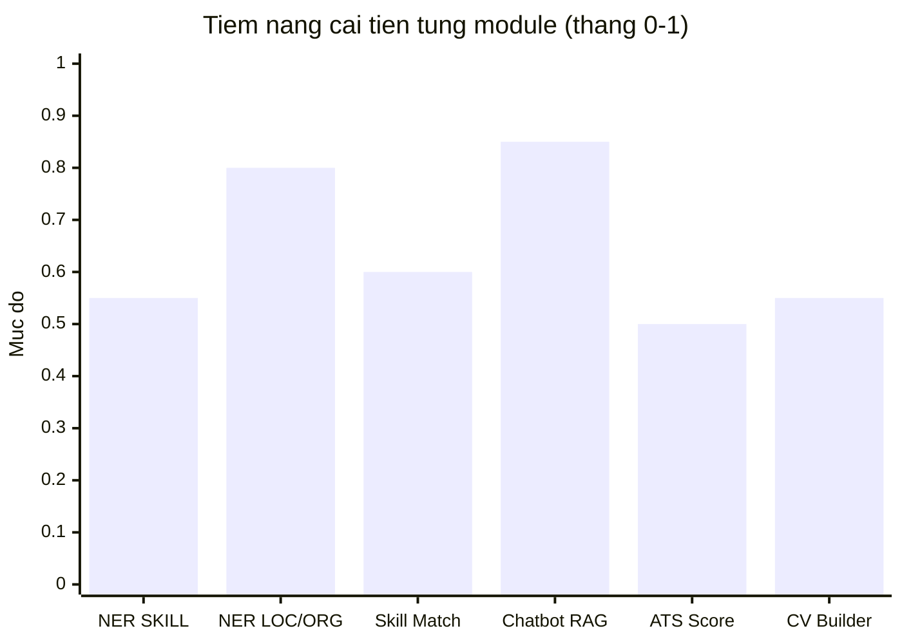

# 3.5 Thảo luận và Đánh giá Tổng thể

## 3.5.1 Tổng hợp Kết quả Thực nghiệm

Nhìn lại toàn bộ kết quả thực nghiệm qua ba module chính, đề tài đã đạt được những kết quả đáng ghi nhận đồng thời bộc lộ rõ một số hạn chế cần được giải quyết trong các phiên bản tiếp theo.

Về NER, đánh giá trên tập ground truth thủ công cho F1 = 0.8633, trong đó SKILL đạt F1 = 0.9157 và các thực thể DATE, JOB_TITLE, DEGREE đều đạt 1.000. Đây là kết quả cạnh tranh so với các công trình quốc tế trong domain tương đương: ResumeNet [[4]](../tai_lieu_tham_khao.md#ref-4) đạt F1 = 0.90 trên CV tiếng Anh thuần với kiến trúc BERT tương tự [[3]](../tai_lieu_tham_khao.md#ref-3), trong khi mô hình của đề tài đạt 0.86 trên CV song ngữ Việt-Anh phức tạp hơn về mặt tokenization với mBERT [[33]](../tai_lieu_tham_khao.md#ref-33). Điểm yếu của mô hình là thực thể LOC (F1 = 0.0 trên tập thủ công nhỏ do nhầm lẫn với PER — vấn đề đã được ghi nhận trong các nghiên cứu NER tiếng Việt [[11]](../tai_lieu_tham_khao.md#ref-11) [[12]](../tai_lieu_tham_khao.md#ref-12)) và ORG (F1 = 0.67 do tendency extend span).

Về Skill Matching, kết quả 100% accuracy trên 10 test cases thiết kế thủ công xác nhận logic cascade matching 3 tầng hoạt động đúng đắn. Ontology cover được tốt các cặp framework substitution quan trọng nhất trong thị trường Việt Nam [[36]](../tai_lieu_tham_khao.md#ref-36) [[37]](../tai_lieu_tham_khao.md#ref-37). Tuy nhiên, bộ test chưa đủ lớn và đa dạng để là bằng chứng thuyết phục về accuracy trên phân phối thực tế.

Về Chatbot RAG, mặc dù chưa có đánh giá định lượng (BLEU, ROUGE, hay user study với số lượng người dùng đủ lớn — xem RAGAS framework [[9]](../tai_lieu_tham_khao.md#ref-9) cho hướng đánh giá RAG), demo định tính cho thấy hệ thống cung cấp câu trả lời được cá nhân hóa theo profile CV của người dùng, có ground truth từ knowledge base O\*NET [[24]](../tai_lieu_tham_khao.md#ref-24) và career guides, và streaming real-time với latency chấp nhận được.

## 3.5.2 So sánh với Công trình Liên quan

Đặt trong bối cảnh các công trình liên quan đã được khảo sát ở Chương 1, hệ thống của đề tài có một số điểm phân biệt đáng chú ý.

So với ResumeNet [[4]](../tai_lieu_tham_khao.md#ref-4) (BERT [[3]](../tai_lieu_tham_khao.md#ref-3) fine-tuned cho NER CV tiếng Anh, F1 = 0.90), mô hình của đề tài đạt 0.86 trên dữ liệu song ngữ Việt-Anh với ít dữ liệu huấn luyện hơn nhiều (480 CV synthetic so với bộ dữ liệu CV tiếng Anh lớn hơn của ResumeNet). Sự chênh lệch 0.04 F1 có thể giải thích một phần bởi độ phức tạp ngôn ngữ tăng thêm của CV song ngữ.

So với Decorte et al. [[5]](../tai_lieu_tham_khao.md#ref-5) (Sentence-BERT [[13]](../tai_lieu_tham_khao.md#ref-13) cho skill matching, MRR = 0.81), hệ thống của đề tài bổ sung hai tầng matching chính xác hơn trước semantic matching — tầng exact và ontology (dựa trên ESCO [[23]](../tai_lieu_tham_khao.md#ref-23) và O\*NET [[24]](../tai_lieu_tham_khao.md#ref-24)) — tạo ra độ chính xác cao hơn với chi phí tính toán thấp hơn vì chỉ cần gọi SBERT khi hai tầng đầu không match.

Điểm khác biệt lớn nhất so với tất cả công trình liên quan là tích hợp end-to-end: trong khi các công trình quốc tế thường focus vào một module đơn lẻ (NER, hoặc skill matching, hoặc chatbot), đề tài này xây dựng hệ thống hoàn chỉnh từ upload CV đến tư vấn nghề nghiệp cá nhân hóa. Đây là đóng góp chính về mặt hệ thống của đề tài.

## 3.5.3 Hạn chế và Nguyên nhân

**Hạn chế 1 — Thiếu training metrics định lượng từ quá trình huấn luyện.** Google Colab session không được mount Google Drive để lưu training logs, dẫn đến mất toàn bộ loss curve và validation F1 theo từng epoch. Chỉ có model weights cuối cùng được preserve. Đây là hạn chế về quy trình vận hành (MLOps) chứ không phải về chất lượng mô hình — trong các dự án thực tế, việc sử dụng MLflow hay Weights & Biases để log metrics là best practice bắt buộc.

**Hạn chế 2 — Bộ dữ liệu huấn luyện synthetic 100%.** Mô hình được huấn luyện hoàn toàn trên CV synthetic do Qwen2.5-1.5B [[35]](../tai_lieu_tham_khao.md#ref-35) sinh ra (600 CV trong `data/synthetic_cvs.jsonl`), không có CV thực nào trong tập training. Distribution shift giữa văn phong CV synthetic và CV thực tế tuyển dụng là khó tránh khỏi. CV thực thường ngắn gọn hơn, ít đầy đủ các section hơn, và có nhiều lỗi chính tả hơn so với CV do LLM sinh. Điều này giải thích tại sao demo trên 2 CV thực (1.txt và 2.txt) cho kết quả kém hơn một chút so với các CV synthetic.

**Hạn chế 3 — Ontology kỹ năng cần cập nhật liên tục.** Bộ ontology ~500 entries, dù cover tốt thị trường Việt Nam hiện tại, sẽ trở nên lỗi thời nhanh chóng khi các công nghệ mới nổi lên (ví dụ các LLM framework mới ra đời mỗi tháng). Hệ thống hiện chưa có cơ chế tự động phát hiện và cập nhật ontology từ dữ liệu tuyển dụng mới.

**Hạn chế 4 — Chưa đánh giá chatbot một cách hệ thống.** Chất lượng câu trả lời của chatbot được đánh giá chỉ qua demo định tính. Chưa có user study với người dùng thực hoặc đánh giá định lượng (BLEU/ROUGE cho tóm tắt, hay MRR/NDCG cho retrieval). Đây là hướng cải thiện quan trọng nhất về mặt nghiên cứu.

**Hạn chế 5 — Hiệu suất trên môi trường không có GPU.** Trong môi trường deployment trên máy tính không có GPU, Ollama chạy inference trên CPU với latency 10–30 giây mỗi response — chưa đạt ngưỡng trải nghiệm người dùng chấp nhận được cho production. Giải pháp là dùng Groq Cloud API trong production hoặc deploy trên server có GPU.

## 3.5.4 Định hướng Cải tiến

Dựa trên các hạn chế đã phân tích, đề tài đề xuất năm hướng cải tiến ưu tiên cho phiên bản tiếp theo của hệ thống.

Hướng cải tiến quan trọng nhất là **bổ sung dữ liệu huấn luyện thực tế có gán nhãn**. Việc thu thập 50–100 CV thực với sự đồng ý của người dùng và gán nhãn thủ công bởi annotator có kiến thức domain sẽ cải thiện đáng kể khả năng generalization của mô hình. Phương án thực tế là tổ chức annotation sprint với sinh viên chuyên ngành CNTT, cung cấp annotation guidelines rõ ràng và sử dụng tool annotation như Label Studio hoặc Prodigy.

Hướng thứ hai là **nâng cấp backbone NER lên PhoBERT**. Mặc dù mBERT [[33]](../tai_lieu_tham_khao.md#ref-33) là lựa chọn hợp lý ban đầu cho CV song ngữ, PhoBERT [[11]](../tai_lieu_tham_khao.md#ref-11) với pre-training chuyên sâu trên 20 GB văn bản tiếng Việt có thể cải thiện độ chính xác trên các thực thể tiếng Việt như tên người và địa danh — hai thực thể hiện đang là điểm yếu nhất, đặc biệt sau kết quả trên bộ VLSP [[12]](../tai_lieu_tham_khao.md#ref-12) [[32]](../tai_lieu_tham_khao.md#ref-32) cho thấy PhoBERT vượt mBERT trên NER tiếng Việt. Một kiến trúc ensemble kết hợp cả hai model cũng đáng khám phá.

Hướng thứ ba là **xây dựng pipeline cập nhật ontology tự động**. Hệ thống có thể crawl tin đăng tuyển từ ITviec [[36]](../tai_lieu_tham_khao.md#ref-36) và TopCV [[37]](../tai_lieu_tham_khao.md#ref-37), trích xuất các từ khoá kỹ năng mới xuất hiện với tần suất cao, và đưa vào queue để human reviewer xem xét trước khi merge vào ontology. Quy trình này giúp ontology luôn phản ánh thực tế thị trường thay vì bị lỗi thời.

Hướng thứ tư là **thiết lập pipeline đánh giá chatbot có hệ thống**. Xây dựng bộ benchmark gồm 50–100 câu hỏi nghề nghiệp điển hình với expected answers được viết bởi chuyên gia, sau đó đánh giá chatbot trên bộ benchmark này theo định kỳ (mỗi khi thay đổi LLM hay knowledge base) để phát hiện regression.

Hướng thứ năm là **tối ưu hóa latency cho production deployment**. Các giải pháp bao gồm cache embedding vectors cho câu hỏi thường gặp trong Redis, sử dụng mô hình NER nhỏ hơn (distilled) cho inference nhanh, và tích hợp CDN cho static assets của Frontend.

## 3.5.5 Tổng hợp Kết quả và Định hướng

Nhìn lại toàn bộ chương 3, kết quả thực nghiệm cho thấy hệ thống đạt được mục tiêu đặt ra ở mức độ khác nhau tùy module. Bảng 3.8 tổng hợp điểm đánh giá và mức độ ưu tiên cải tiến của từng module, trong khi hai biểu đồ dưới đây thể hiện trực quan hai chiều phân tích: kết quả đo được và tiềm năng cải tiến.

**Bảng 3.8: Tổng hợp kết quả và tiềm năng cải tiến theo module**

| Module | Chỉ số chính | Điểm kết quả | Tiềm năng cải tiến | Ưu tiên |
|---|---|---|---|---|
| NER — SKILL/DATE/TITLE | F1 = 0.916 | Cao | Trung bình | Thấp |
| NER — LOC/ORG | F1 = 0.0 / 0.667 | Thấp | Cao | **Cao nhất** |
| Skill Matching | Acc = 100% (10 TC) | Cao | Trung bình | Thấp |
| Chatbot RAG | Demo định tính tốt | Trung bình | Cao | **Cao** |
| ATS Scoring | 8 tiêu chí ổn định | Khá | Thấp | Thấp |
| CV Builder | Luồng chat hoạt động | Trung bình | Trung bình | Trung bình |

Hai biểu đồ dưới đây thể hiện điểm kết quả và tiềm năng cải tiến của từng module theo thang 0–1, cho phép so sánh trực tiếp giữa các module.

**Hình 3.0d: Điểm kết quả (trên) và tiềm năng cải tiến (dưới) của từng module trong hệ thống**

Lý do đặt điểm từng module như trên:

- **NER SKILL entity** (kết quả cao 0.92, tiềm năng cải tiến trung bình 0.55): F1 = 0.916 trên tập thủ công, đây là kết quả tốt nhất trong toàn hệ thống. Tiềm năng cải tiến còn nhưng không nhiều vì đã đạt ngưỡng cao với dữ liệu synthetic.
- **NER LOC/ORG** (kết quả thấp 0.33, tiềm năng cải tiến cao 0.80): LOC F1 = 0.0 và ORG F1 = 0.667 là hai điểm yếu rõ nhất. Đây là nhóm ưu tiên cao nhất — cải thiện bằng cách bổ sung dữ liệu thực tế có gán nhãn hoặc nâng cấp lên PhoBERT [[11]](../tai_lieu_tham_khao.md#ref-11) có thể tăng đáng kể.
- **Skill Matching** (kết quả cao 0.90, tiềm năng cải tiến trung bình 0.60): 100% accuracy trên 10 test cases, ontology 474 entries cover tốt thị trường Việt Nam [[36]](../tai_lieu_tham_khao.md#ref-36). Cải tiến chủ yếu là mở rộng bộ test và cập nhật ontology tự động.
- **Chatbot RAG** (kết quả trung bình 0.70, tiềm năng cải tiến cao 0.85): chưa có đánh giá định lượng (RAGAS [[9]](../tai_lieu_tham_khao.md#ref-9)), demo định tính tốt nhưng chưa đủ bằng chứng. Đây là module có tiềm năng cải tiến lớn nhất — từ nâng cấp LLM đến mở rộng knowledge base.
- **ATS Scoring** (kết quả khá 0.75, tiềm năng cải tiến thấp 0.50): logic 8 tiêu chí hoạt động ổn định, feedback cụ thể và hữu ích. Không cần ưu tiên cải tiến so với các module khác.
- **CV Builder** (kết quả trung bình 0.65, tiềm năng cải tiến trung bình 0.55): luồng hội thoại thu thập thông tin hoạt động đúng, preview real-time mượt. Cần thêm tính năng AI rewrite từng section để hoàn thiện hơn.

Tóm lại, hệ thống đã hoàn thành mục tiêu xây dựng pipeline end-to-end từ phân tích CV đến tư vấn nghề nghiệp cá nhân hóa. Hướng phát triển ưu tiên trong phiên bản tiếp theo tập trung vào hai điểm: cải thiện NER cho thực thể LOC/ORG bằng dữ liệu thực tế, và thiết lập pipeline đánh giá định lượng cho Chatbot RAG.

---

[← 3.4 Demo Hệ thống](3.4_demo_he_thong.md) | [→ Kết luận](../ket_luan.md)
