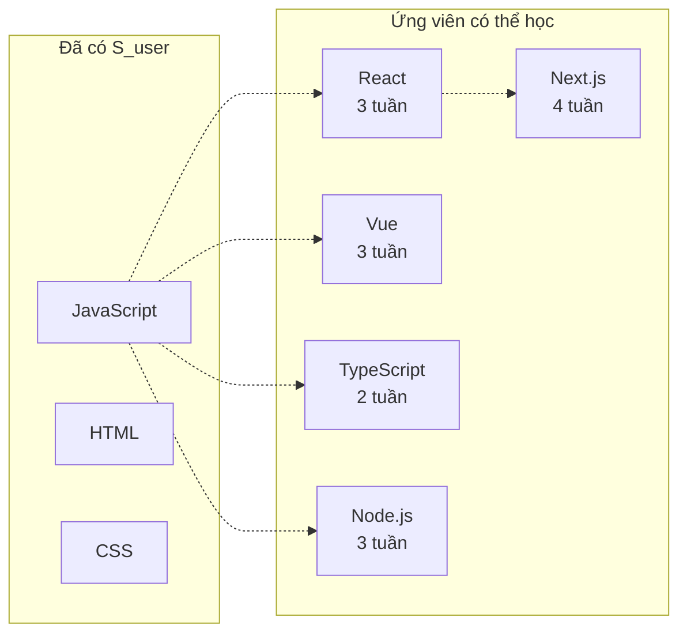
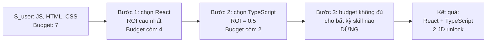
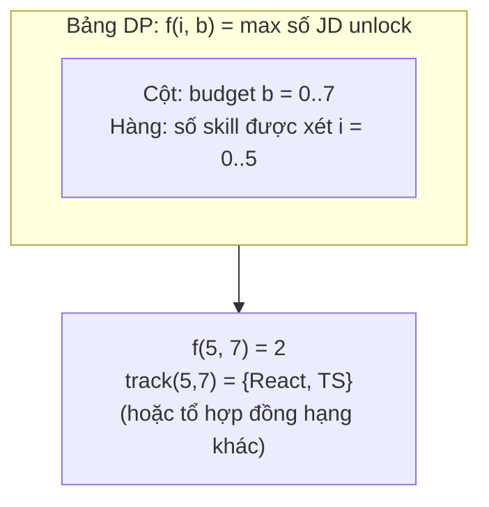
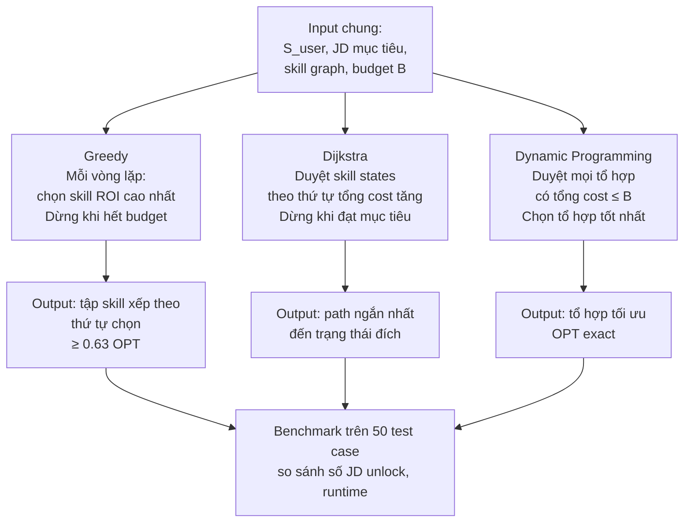

# 2.2 Learning Path Optimization — Cơ sở toán học và thuật toán

## 2.2.1 Hình thức hóa bài toán

Bài toán Learning Path Optimization mà đề tài giải quyết được phát biểu như sau:

**Input:**

- $S_{\text{user}} \subseteq V$: tập kỹ năng hiện tại của ứng viên (subset của tập đỉnh skill graph $V$).
- $J = \{j_1, j_2, ..., j_m\}$: tập JD mục tiêu, mỗi JD $j_k$ có tập kỹ năng yêu cầu $R(j_k) \subseteq V$.
- $\text{cost}: V \to \mathbb{R}^+$: hàm chi phí học tập của mỗi kỹ năng (số tuần học).
- $B \in \mathbb{R}^+$: budget thời gian (số tuần ứng viên có thể đầu tư).
- $G = (V, E)$: skill graph với các cạnh REQUIRES và LEADS_TO.

**Output:**

- $L \subseteq V \setminus S_{\text{user}}$: tập kỹ năng cần học (không trùng với kỹ năng đã có).

**Mục tiêu (objective):**

$$\max_{L} \sum_{j_k \in J} \mathbb{1}\left[ R(j_k) \subseteq (S_{\text{user}} \cup L) \right]$$

trong đó $\mathbb{1}[\cdot]$ là indicator function (= 1 nếu điều kiện đúng, 0 ngược lại). Tổng này đếm số JD mà ứng viên có thể apply sau khi học $L$ (tức là $R(j_k)$ là subset của tập kỹ năng cuối cùng).

**Ràng buộc (constraint):**

- _Budget:_ $\sum_{v \in L} \text{cost}(v) \leq B$.
- _Prerequisite:_ nếu $v \in L$ và $(v, \text{REQUIRES}, u) \in E$ với $u \notin S_{\text{user}}$, thì $u$ cũng phải nằm trong $L$ (học một kỹ năng yêu cầu phải học cả các tiên quyết chưa biết).

Bài toán này là một biến thể của **Budgeted Maximum Coverage Problem** [[8]](../tai_lieu_tham_khao.md#ref-8), được chứng minh là NP-hard. Cụ thể, mỗi JD là một "tập" cần được cover, mỗi kỹ năng là một "phần tử" có chi phí, và mục tiêu là chọn tập kỹ năng để cover tối đa số JD trong giới hạn budget.

### Ví dụ minh họa xuyên suốt

Để giải thích trực quan 3 thuật toán, đề tài dùng một ví dụ nhỏ làm chuẩn so sánh:

- $S_{\text{user}} = \{\text{JavaScript}, \text{HTML}, \text{CSS}\}$ — ứng viên đã biết các kỹ năng frontend cơ bản.
- 5 kỹ năng ứng viên có thể học, với chi phí (số tuần):

| Kỹ năng    | Chi phí (tuần) | Prerequisites |
| ---------- | -------------- | ------------- |
| React      | 3              | JavaScript    |
| Vue        | 3              | JavaScript    |
| TypeScript | 2              | JavaScript    |
| Next.js    | 4              | React         |
| Node.js    | 3              | JavaScript    |

- Tập JD mục tiêu gồm 5 JD:

| JD  | Kỹ năng yêu cầu       |
| --- | --------------------- |
| JD1 | JS, HTML, CSS, React  |
| JD2 | JS, React, TypeScript |
| JD3 | JS, Vue, TypeScript   |
| JD4 | JS, React, Next.js    |
| JD5 | JS, Node.js           |

- Budget: **B = 7 tuần**.

Câu hỏi: ứng viên nên học những kỹ năng nào để mở khóa được nhiều JD nhất trong 7 tuần?

**Hình 2.5: Trạng thái ban đầu — kỹ năng đã có và kỹ năng cần học**



(Đường nét đứt biểu thị quan hệ REQUIRES — ví dụ React yêu cầu JavaScript đã có sẵn.)

## 2.2.2 Thuật toán Greedy — ROI-based

Thuật toán Greedy là cách tiếp cận đơn giản và nhanh nhất. Ý tưởng: tại mỗi bước, chọn kỹ năng có "lợi tức trên chi phí" (Return on Investment, ROI) cao nhất, lặp lại cho đến khi hết budget hoặc không còn cải thiện được nữa.

**ROI của một kỹ năng $v$** được định nghĩa:

$$\text{ROI}(v, L_{\text{current}}) = \frac{\Delta J(v, L_{\text{current}})}{\text{cost}(v)}$$

trong đó $\Delta J(v, L_{\text{current}})$ là số JD bổ sung được unlock nếu thêm $v$ vào tập đang học $L_{\text{current}}$ (so với khi không thêm $v$).

**Mã giả:**

```
hàm Greedy(S_user, J, cost, B, G):
    L = ∅
    remaining_budget = B
    repeat:
        best_v = None
        best_roi = 0
        cho mỗi v trong V \ (S_user ∪ L):
            if cost(v) > remaining_budget: tiếp tục
            roi = compute_ROI(v, S_user ∪ L, J)
            if roi > best_roi:
                best_roi = roi
                best_v = v
        if best_v is None: dừng
        L = L ∪ {best_v}
        remaining_budget -= cost(best_v)
        # Bổ sung prerequisites nếu có
        L = L ∪ prerequisites_of(best_v, S_user, G)
    return L
```

**Tính chất lý thuyết.** Khuller, Moss và Naor (1999) [[8]](../tai_lieu_tham_khao.md#ref-8) chứng minh rằng cho bài toán Budgeted Maximum Coverage, thuật toán Greedy đơn giản (chọn skill có ROI cao nhất) đạt tỷ lệ xấp xỉ:

$$\text{Greedy} \geq \left(1 - \frac{1}{e}\right) \cdot \text{OPT} \approx 0.632 \cdot \text{OPT}$$

Một biến thể nâng cao (Greedy với enumeration) đạt được $(1 - 1/e)$-approximation, là tỷ lệ xấp xỉ tốt nhất có thể đạt được trừ khi P = NP.

**Độ phức tạp.** Mỗi vòng lặp duyệt toàn bộ $|V|$ kỹ năng để tìm best ROI, mỗi tính ROI cần duyệt $|J|$ JD: $O(|V| \cdot |J|)$. Số vòng lặp tối đa là $|V|$. Tổng: $O(|V|^2 \cdot |J|)$. Với $|V| = 500$ và $|J| = 1000$, ước tính khoảng $2.5 \times 10^8$ phép toán — đủ nhanh để chạy trong thời gian thực.

**Áp dụng vào ví dụ.** Với budget 7 tuần, Greedy chạy như sau:

| Bước | Tính ROI mỗi ứng viên                                                                        | Chọn                                                 | Budget còn | JD unlock  |
| ---- | -------------------------------------------------------------------------------------------- | ---------------------------------------------------- | ---------- | ---------- |
| 1    | React (1 JD/3 = 0.33), TS (0/2 = 0), Vue (0/3 = 0), NextJS (0/4 = 0), NodeJS (1 JD/3 = 0.33) | **React** (chọn ngẫu nhiên giữa 2 ROI cao bằng nhau) | 4          | JD1 ✓      |
| 2    | TS (1 JD/2 = 0.5), Vue (0/3), NextJS (1 JD/4 = 0.25), NodeJS (1 JD/3 = 0.33)                 | **TypeScript**                                       | 2          | JD1, JD2 ✓ |
| 3    | Vue (0/3, vượt budget cũng đủ), NextJS (vượt 4>2), NodeJS (vượt 3>2)                         | Không skill nào fit budget còn lại                   | —          | dừng       |

**Kết quả Greedy:** Học `{React, TypeScript}`, tổng 5 tuần, unlock 2 JD (JD1, JD2). Còn dư 2 tuần budget không dùng được vì các skill còn lại vượt budget.

**Hình 2.6: Quá trình Greedy chọn kỹ năng từng bước**



## 2.2.3 Thuật toán Dijkstra trên Skill Graph

Cách tiếp cận thứ hai là mô hình hóa bài toán như tìm đường ngắn nhất (theo tổng chi phí học) từ trạng thái kỹ năng hiện tại đến trạng thái mục tiêu trên một weighted graph.

**Biến đổi sang bài toán shortest path.** Xây dựng đồ thị $G' = (V', E')$:

- $V'$: các tập kỹ năng (skill sets), mỗi tập là một trạng thái. Để tránh bùng nổ tập, đề tài chỉ duy trì các trạng thái có thể đạt được bằng cách mở rộng dần $S_{\text{user}}$.
- $E'$: cạnh từ trạng thái $s$ đến $s \cup \{v\}$ với trọng số $\text{cost}(v)$, với điều kiện $v$ có tất cả prerequisites trong $s$.

**Mục tiêu:** tìm đường đi từ $S_{\text{user}}$ đến một trạng thái đích $s_{\text{goal}}$ thỏa mãn $R(j_k) \subseteq s_{\text{goal}}$ cho một JD $j_k$ nào đó (hoặc tập JD mục tiêu).

**Mã giả (đơn giản hóa):**

```
hàm Dijkstra_LearningPath(S_user, J_target, cost, G):
    queue = priority_queue sắp xếp theo tổng chi phí
    queue.push((0, S_user, []))   # (total_cost, current_state, path)
    visited = set()
    while not queue.empty():
        (c, state, path) = queue.pop()
        if state ∈ visited: tiếp tục
        visited.add(state)
        # Kiểm tra đạt mục tiêu
        for j in J_target:
            if R(j) ⊆ state:
                return path
        # Mở rộng
        for v in V \ state:
            if all prerequisites of v in state:
                new_cost = c + cost(v)
                if new_cost > B: tiếp tục
                queue.push((new_cost, state ∪ {v}, path + [v]))
    return None
```

**Ưu điểm.** Dijkstra cho lời giải tối ưu cho bài toán shortest path nếu trọng số không âm. Khi mục tiêu là "đạt được tập kỹ năng đủ unlock 1 JD cụ thể", Dijkstra tìm được lộ trình có tổng chi phí nhỏ nhất.

**Hạn chế.** Không gian trạng thái có thể bùng nổ theo cấp số mũ (mỗi subset của $V$ là một trạng thái tiềm năng → $2^{|V|}$ trạng thái). Cần các kỹ thuật pruning (giới hạn budget, giới hạn độ sâu, ưu tiên các skill có high importance) để giữ ở mức khả thi.

**Độ phức tạp.** Với pruning tốt, thực tế Dijkstra chạy được trong vài giây với $|V| = 500$ và budget hợp lý (~20 tuần). Không có guarantee về worst case.

**Áp dụng vào ví dụ.** Mỗi trạng thái là một skill set, mỗi cạnh là việc học thêm 1 skill (cost = chi phí của skill đó). Dijkstra duyệt các trạng thái theo thứ tự tổng chi phí tăng dần. Với mục tiêu unlock JD1 (`{JS, HTML, CSS, React}`), Dijkstra tìm được lộ trình ngắn nhất là **học React** (3 tuần) → trạng thái đích đạt được.

**Hình 2.7: Đồ thị trạng thái mà Dijkstra duyệt (rút gọn, chỉ vẽ các trạng thái có tổng chi phí ≤ 7)**

```mermaid
graph LR
    S0["S0<br/>JS,HTML,CSS<br/>cost=0"]
    S0 -->|+React 3| S1["S1<br/>+React<br/>cost=3"]
    S0 -->|+TS 2| S2["S2<br/>+TS<br/>cost=2"]
    S0 -->|+Vue 3| S3["S3<br/>+Vue<br/>cost=3"]
    S0 -->|+NodeJS 3| S4["S4<br/>+NodeJS<br/>cost=3"]
    S1 -->|+TS 2| S5["S5<br/>+React,TS<br/>cost=5"]
    S1 -->|+NextJS 4| S6["S6<br/>+React,NextJS<br/>cost=7"]
    S2 -->|+React 3| S5
    S2 -->|+Vue 3| S7["S7<br/>+TS,Vue<br/>cost=5"]

    style S1 fill:#333
    style S5 fill:#333
    style S6 fill:#333
    style S7 fill:#333
```



(Các trạng thái màu xanh là **trạng thái đích** — unlock được ít nhất 1 JD. Ví dụ S1 unlock JD1, S5 unlock JD1+JD2, S6 unlock JD1+JD4, S7 unlock JD3.)

**Kết quả Dijkstra.** Nếu mục tiêu là unlock đúng 1 JD với chi phí nhỏ nhất → S1 (chỉ học React, 3 tuần). Nếu muốn unlock nhiều JD nhất trong budget 7 tuần → có thể chạy biến thể duyệt tất cả trạng thái có cost ≤ 7 và chọn trạng thái có nhiều JD unlock nhất.

## 2.2.4 Dynamic Programming — Lời giải tối ưu

Để có một tham chiếu "ground truth" so sánh với Greedy và Dijkstra, đề tài cài đặt thuật toán Dynamic Programming giải bài toán Budgeted Maximum Coverage một cách tối ưu.

**Hình thức hóa DP.** Định nghĩa:

$$f(i, b) = \max \sum_{j_k \in J} \mathbb{1}\left[ R(j_k) \subseteq (S_{\text{user}} \cup L) \right]$$

trong đó tối đa hóa trên tất cả các $L \subseteq \{v_1, v_2, ..., v_i\}$ với $\sum_{v \in L} \text{cost}(v) \leq b$.

**Công thức truy hồi:**

$$f(i, b) = \max\big( f(i-1, b),\; f(i-1, b - \text{cost}(v_i)) + \text{gain}(v_i \mid L_{i-1, b - \text{cost}(v_i)}^{\text{opt}}) \big)$$

trong đó $L^{\text{opt}}$ là lời giải tối ưu được lưu lại cho cấu hình con (i-1, b - cost). Do gain phụ thuộc vào toàn bộ tập $L$ đã chọn (không phải chỉ skill cuối thêm vào), DP cần lưu trữ trạng thái là _tập_ các skill đã chọn, không chỉ index và budget — dẫn đến độ phức tạp $O(2^{|V|})$.

**Trong thực tế của đề tài.** Vì $|V| = 500$ là quá lớn cho DP exact, đề tài giới hạn DP chạy trên **các subset thu hẹp** của $V$:

- Chỉ xét các kỹ năng "candidate" — kỹ năng xuất hiện trong tập JD mục tiêu $J$ hoặc là prerequisite của chúng. Ước tính cỡ 30–80 candidates cho một test case điển hình.
- Với $|V_{\text{candidate}}| \leq 30$, DP chạy được trong vài phút mỗi test case.

**Mã giả (bitmask DP):**

```
hàm DP_BudgetedCoverage(V_cand, J, cost, B):
    n = |V_cand|
    best = array kích thước (n+1) × (B+1), khởi tạo 0
    track = array để lưu best subset cho mỗi (i, b)
    for i in 1..n:
        for b in 0..B:
            # Không lấy v_i
            best[i][b] = best[i-1][b]
            track[i][b] = track[i-1][b]
            # Lấy v_i (nếu đủ budget)
            if b >= cost(v_i):
                candidate_subset = track[i-1][b - cost(v_i)] ∪ {v_i}
                candidate_value = count_JDs_covered(S_user ∪ candidate_subset, J)
                if candidate_value > best[i][b]:
                    best[i][b] = candidate_value
                    track[i][b] = candidate_subset
    return track[n][B]
```

**Tính chất.** DP cho **lời giải tối ưu** trên không gian candidates đã chọn, là benchmark vàng để so sánh Greedy và Dijkstra.

**Độ phức tạp.** $O(n \cdot B \cdot |J|)$ với $n = |V_{\text{candidate}}|$. Với $n = 30$, $B = 20$, $|J| = 1000$, ước tính khoảng $6 \times 10^5$ phép toán — chạy trong < 1 giây.

**Áp dụng vào ví dụ.** DP duyệt mọi tổ hợp kỹ năng có tổng chi phí ≤ 7 và chọn tổ hợp unlock nhiều JD nhất:

| Tổ hợp được xét         | Tổng cost | JD unlock                  | Số JD |
| ----------------------- | --------- | -------------------------- | ----- |
| {}                      | 0         | (không)                    | 0     |
| {React}                 | 3         | JD1                        | 1     |
| {Vue}                   | 3         | (không, vì JD3 còn cần TS) | 0     |
| {TS}                    | 2         | (không)                    | 0     |
| {NodeJS}                | 3         | JD5                        | 1     |
| {React, TS}             | 5         | JD1, JD2                   | 2     |
| {React, NodeJS}         | 6         | JD1, JD5                   | 2     |
| {Vue, TS}               | 5         | JD3                        | 1     |
| {Vue, TS, NodeJS}       | 8         | vượt budget                | —     |
| **{React, TS, NodeJS}** | **8**     | **vượt budget**            | —     |
| {React, NextJS}         | 7         | JD1, JD4                   | 2     |
| **{Vue, TS, NodeJS}**   | **8**     | **vượt budget**            | —     |

**Kết quả DP (lời giải tối ưu):** Có 3 tổ hợp đồng hạng unlock 2 JD: `{React, TS}` (5 tuần), `{React, NodeJS}` (6 tuần), `{React, NextJS}` (7 tuần). Chọn tổ hợp nào tùy chiến lược tie-break (ví dụ ưu tiên chi phí thấp).

**Hình 2.8: Bảng DP truy hồi f(i, b) cho ví dụ**



So sánh nhanh: **Greedy unlock 2 JD, Dijkstra (1 đích) unlock 1 JD nhanh nhất, DP unlock 2 JD nhưng đảm bảo là tối ưu**. Trong ví dụ nhỏ này Greedy đạt 100% tối ưu của DP — kết quả benchmark trên 50 test case thực tế sẽ được trình bày trong [Chương 4](#).

## 2.2.5 So sánh ba thuật toán

**Bảng 2.3: So sánh ba thuật toán Learning Path Optimization**

| Tiêu chí         | Greedy (ROI)             | Dijkstra                       | DP (Bitmask)           |
| ---------------- | ------------------------ | ------------------------------ | ---------------------- |
| Tính tối ưu      | Xấp xỉ (≥ 0.63 OPT)      | Tối ưu cho 1 JD đích           | Tối ưu trên candidates |
| Độ phức tạp      | `O(V² · J)`              | `O(2^V)` worst case            | `O(n · B · J)`         |
| Khả năng mở rộng | Cao, chạy nhanh          | Trung bình, cần pruning        | Thấp, chỉ candidates   |
| Giải thích được  | Cao (chọn theo ROI)      | Trung bình (path)              | Trung bình             |
| Use case         | Real-time recommendation | Path hợp lệ nhất theo REQUIRES | Benchmark/upper bound  |

**Lựa chọn cho production.** Greedy là lựa chọn mặc định cho user-facing API vì tốc độ. Dijkstra dùng khi cần đảm bảo tuân theo prerequisites một cách nghiêm ngặt. DP chỉ dùng làm benchmark trong phần đánh giá.

**Hình 2.9: Tổng kết tư duy 3 thuật toán**



Chi tiết kết quả benchmark trên 50 test cases (số JD unlock, runtime, optimality gap) sẽ được trình bày trong [Chương 4](#).

---

[← 2.1 Skill Graph](./2.1_skill_graph_knowledge_graph.md) | [→ 2.3 Temporal Skill Analysis](./2.3_temporal_skill_analysis.md)
