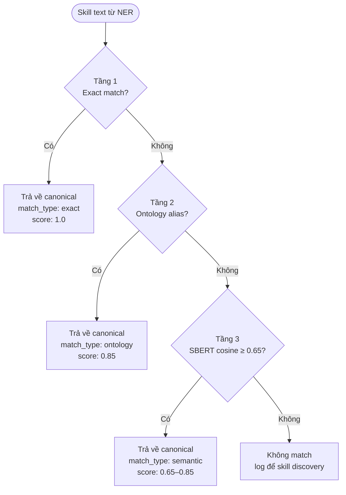

# 2.5 Pipeline tiền xử lý CV/JD: NER bilingual, Ontology, Sentence-BERT cascade

> **Lưu ý:** Mục này mô tả cơ sở lý thuyết cho thành phần **Skill Extraction & Matching Pipeline** — infrastructure tiền xử lý CV/JD cho ba đóng góp khoa học chính của đề tài (Multi-criteria Freshness, Learning Path, Market Intel). Pipeline không phải là đóng góp khoa học chính nhưng là nền tảng kỹ thuật cần thiết, được trình bày đầy đủ ở Chương 3 (thiết kế) và Chương 4 (thực nghiệm).

## 2.5.1 Named Entity Recognition và mô hình BERT đa ngôn ngữ (mBERT)

**Named Entity Recognition (NER)** là bài toán cơ bản trong xử lý ngôn ngữ tự nhiên: cho một chuỗi văn bản, gán nhãn cho từng token để xác định các thực thể có tên (named entities) thuộc về các loại đã định nghĩa trước — như tên người (PERSON), tên tổ chức (ORG), địa danh (LOC), kỹ năng (SKILL), chức danh (JOB_TITLE), bằng cấp (DEGREE), thời gian (DATE).

**Schema BIO.** Phương pháp gán nhãn phổ biến nhất là **BIO tagging scheme** (Beginning-Inside-Outside). Với mỗi loại thực thể $T$, có ba nhãn: `B-T` (token đầu của thực thể), `I-T` (token tiếp theo trong cùng thực thể), `O` (không thuộc thực thể nào). Ví dụ với câu "Senior Python Developer at FPT Software":

| Token | Nhãn BIO |
|---|---|
| Senior | B-JOB_TITLE |
| Python | I-JOB_TITLE |
| Developer | I-JOB_TITLE |
| at | O |
| FPT | B-ORG |
| Software | I-ORG |

Với 7 loại thực thể chính trong CV/JD CNTT (SKILL, JOB_TITLE, ORG, PER, DATE, LOC, DEGREE, MAJOR, CERT), tổng cộng có **21 nhãn BIO** (mỗi loại có 2 nhãn B/I, cộng 1 nhãn O chung).

**BERT — kiến trúc nền tảng.** Devlin và cộng sự (2019) [[4]](../tai_lieu_tham_khao.md#ref-4) giới thiệu **BERT (Bidirectional Encoder Representations from Transformers)** — mô hình ngôn ngữ pre-trained dùng kiến trúc Transformer encoder bidirectional. BERT học được biểu diễn ngữ cảnh sâu của từng token bằng cách chú ý đồng thời đến cả ngữ cảnh bên trái và bên phải, vượt qua hạn chế one-directional của các mô hình trước đó (như RNN, LSTM). BERT là kiến trúc base cho phần lớn các pipeline NER hiện đại.

Cho bài toán NER, kiến trúc BERT được mở rộng bằng cách thêm một **linear classification head** trên top của BERT encoder, output là phân bố xác suất trên các nhãn BIO cho từng token. Fine-tuning trên domain CV/JD cụ thể (với dữ liệu gán nhãn riêng) giúp mô hình thích nghi với phong cách văn bản đặc thù của domain.

**mBERT — phiên bản đa ngôn ngữ.** Mô hình `bert-base-multilingual-cased` (gọi tắt là mBERT) được pre-train trên Wikipedia của **104 ngôn ngữ** bao gồm tiếng Việt và tiếng Anh. Vocabulary chung gồm 119.547 WordPiece tokens, cho phép xử lý tốt văn bản pha trộn nhiều ngôn ngữ. Cho domain CV/JD CNTT Việt Nam — nơi phổ biến hiện tượng code-switching (thuật ngữ kỹ thuật giữ nguyên tiếng Anh, mô tả bằng tiếng Việt) — mBERT là lựa chọn pragmatic phù hợp hơn so với PhoBERT (chỉ tiếng Việt) hay BERT-base-uncased (chỉ tiếng Anh).

**Trade-off so với PhoBERT.** PhoBERT do Nguyen & Nguyen (2020) [[5]](../tai_lieu_tham_khao.md#ref-5) phát triển là mô hình BERT pre-trained trên corpus tiếng Việt quy mô lớn, đạt SOTA trên nhiều tác vụ NLP tiếng Việt thuần. Với CV/JD song ngữ Việt-Anh, trade-off như sau:

| Mô hình | Tiếng Việt thuần | Tiếng Anh thuần | Code-switching Việt-Anh |
|---|---|---|---|
| mBERT | Trung bình | Tốt | Tốt nhất |
| PhoBERT | Tốt nhất | Yếu | Yếu (tokenizer không xử lý English liên tục) |
| BERT-base | Yếu | Tốt nhất | Yếu (không có vocabulary tiếng Việt) |

Với phần lớn CV/JD CNTT Việt Nam có nhiều thuật ngữ tiếng Anh (Python, React, Docker, Kubernetes, ...), mBERT là lựa chọn cân bằng. Hướng phát triển tương lai: ensemble mBERT + PhoBERT để cải thiện entity tiếng Việt thuần như LOC, PER.

## 2.5.2 Skill Ontology và các quan hệ chuẩn hóa kỹ năng

**Khái niệm Ontology.** Trong khoa học máy tính, ontology là một mô hình hình thức biểu diễn tri thức về một domain cụ thể — gồm các khái niệm (concepts), thuộc tính (properties) và quan hệ (relationships) giữa chúng. Khác với taxonomy (chỉ có quan hệ "is-a"), ontology hỗ trợ nhiều loại quan hệ song song và cho phép suy luận có cấu trúc.

**Vai trò của Skill Ontology trong matching.** Ngay cả khi NER nhận diện đúng một đoạn text là kỹ năng, vẫn có vấn đề: cùng một kỹ năng có thể xuất hiện dưới nhiều dạng viết khác nhau (`ReactJS`, `React.js`, `React`, `React Framework`), hoặc các tên gọi tương đương từ ecosystem khác (`Postgres` ↔ `PostgreSQL`, `K8s` ↔ `Kubernetes`). Nếu không chuẩn hóa, hệ thống sẽ coi chúng là các kỹ năng khác nhau, dẫn đến: (i) thống kê thị trường sai; (ii) skill matching giữa CV và JD không bắt được các trường hợp biến thể.

**Skill Ontology** giải quyết vấn đề này bằng cách:

1. **Định nghĩa canonical name** cho mỗi kỹ năng (ví dụ "React" là canonical, "ReactJS"/"React.js" là alias).
2. **Liệt kê các alias** cho mỗi canonical, bao gồm cả viết tắt, ký tự đặc biệt, biến thể spelling.
3. **Mô tả các quan hệ** giữa các kỹ năng (REQUIRES, LEADS_TO, RELATED_TO, PART_OF — đã trình bày trong [mục 2.2.1](./2.2_skill_graph_learning_path.md#221-skill-graph-cấu-trúc-các-loại-quan-hệ-và-metadata)).
4. **Lưu metadata** cho mỗi canonical: domain, category, learning_cost, ...

**Skill Ontology cho thị trường CNTT Việt Nam.** Như đã phân tích ở [mục 2.2.1](./2.2_skill_graph_learning_path.md#221-skill-graph-cấu-trúc-các-loại-quan-hệ-và-metadata), hai bộ ontology quốc tế phổ biến là ESCO [[14]](../tai_lieu_tham_khao.md#ref-14) và O*NET [[15]](../tai_lieu_tham_khao.md#ref-15) đều không hỗ trợ tiếng Việt và không phản ánh đầy đủ thực trạng thị trường CNTT Việt Nam (alias đặc thù, công nghệ cập nhật sau 2022). Đề tài tự xây dựng ontology IT **460 entries thuộc 15 category** cho domain CNTT Việt Nam.

**Hai vai trò song song của Skill Ontology.** Đáng chú ý là skill graph (mục 2.2.1) và skill ontology (mục này) cùng là một artifact dữ liệu (cùng tập 460 entries, cùng 4 quan hệ REQUIRES/LEADS_TO/RELATED_TO/PART_OF), nhưng đóng hai vai trò khác nhau:

- **Vai trò "skill graph"** trong Learning Path Optimization: dùng cạnh REQUIRES và LEADS_TO + trọng số `learning_cost` để chạy thuật toán Greedy/Dijkstra/DP.
- **Vai trò "skill ontology"** trong Skill Matching: dùng tập alias để chuẩn hóa skill text về canonical name.

Việc thiết kế một artifact phục vụ hai mục đích giúp giảm chi phí maintain và đảm bảo tính nhất quán.

## 2.5.3 Sentence-BERT và semantic similarity matching

**Vấn đề với ontology lookup đơn thuần.** Ontology có thể bao phủ các alias đã biết, nhưng không thể list hết mọi cách viết của mọi kỹ năng. Đặc biệt khi xuất hiện kỹ năng mới (framework AI mới ra trong 2026) hoặc các cách viết không chuẩn (typo, abbreviation tự sáng tác), ontology lookup sẽ miss.

**Sentence-BERT — semantic embedding cho similarity matching.** Reimers & Gurevych (2019) [[7]](../tai_lieu_tham_khao.md#ref-7) đề xuất **Sentence-BERT (SBERT)** — biến BERT thành mô hình sinh embedding câu phù hợp cho similarity search. Ý tưởng: thay vì so sánh từng cặp text qua BERT (chậm vì cần forward pass cho từng cặp), SBERT encode mỗi text thành một vector cố định (384 chiều với `all-MiniLM-L6-v2` [[13]](../tai_lieu_tham_khao.md#ref-13)). Sau đó so sánh hai text bằng cosine similarity giữa hai vector — tính cực nhanh.

Cosine similarity giữa hai vector $\mathbf{u}, \mathbf{v}$ định nghĩa:

$$\cos(\mathbf{u}, \mathbf{v}) = \frac{\mathbf{u} \cdot \mathbf{v}}{\|\mathbf{u}\| \cdot \|\mathbf{v}\|} \in [-1, 1]$$

Giá trị càng gần 1, hai vector càng giống nhau về ngữ nghĩa. Trong thực tế NLP, threshold $\tau \in [0.6, 0.8]$ thường được dùng để quyết định hai text có "đủ giống" để coi là match hay không.

**Ưu điểm SBERT cho Skill Matching.**
- Bắt được các trường hợp không có trong ontology nhưng tương đương về ngữ nghĩa.
- Tốc độ nhanh: encode 1 text ~10ms, cosine similarity O(d) với d là chiều vector.
- Hỗ trợ đa ngôn ngữ (model `paraphrase-multilingual-MiniLM` xử lý cả tiếng Việt và tiếng Anh).

**Hạn chế SBERT — false positive.** Đáng chú ý là cosine similarity cao **không đảm bảo hai kỹ năng thực sự tương đương**. Ví dụ thực tế:

- `TensorFlow` ↔ `PyTorch`: cosine similarity ≈ 0.79 (đều là deep learning framework, nhưng là hai framework **khác nhau**).
- `Python` ↔ `Perl`: cosine similarity ≈ 0.72 (đều là scripting language, nhưng khác nhau hoàn toàn).
- `AWS` ↔ `Azure`: cosine similarity ≈ 0.74 (đều là cloud provider, nhưng là hai sản phẩm khác).

Nếu SBERT được dùng làm tầng matching duy nhất, sẽ gây nhiều **false positive** — coi `TensorFlow` và `PyTorch` là cùng kỹ năng, dẫn đến: (i) thống kê thị trường sai; (ii) skill matching CV-JD nhầm. Đây là lý do SBERT chỉ nên dùng làm **fallback** sau khi các tầng matching chính xác hơn (Exact, Ontology) đã thử.

## 2.5.4 Cascade Matching nhiều tầng: thiết kế và trade-off

**Ý tưởng Cascade Matching.** Mỗi phương pháp matching có trade-off riêng:

| Phương pháp | Tốc độ | Precision | Recall | Khi nào dùng |
|---|---|---|---|---|
| Exact match | O(1) | 100% | Thấp | Skill viết giống y hệt |
| Ontology lookup | O(N) | Cao | Trung bình | Skill có trong ontology với alias |
| SBERT semantic | O(N·d) + encode | Trung-cao | Cao | Skill không có trong ontology |

**Cascade matching nhiều tầng** kết hợp ba phương pháp theo thứ tự ưu tiên: thử tầng nhanh-chính-xác trước, chỉ fallback sang tầng chậm hơn khi cần. Ý tưởng này phổ biến trong các hệ thống information retrieval và recommendation, vì cân bằng được giữa precision và recall mà vẫn nhanh.

**Thiết kế Cascade Matching 3 tầng của đề tài.**

**Tầng 1 — Exact match.** So sánh chuỗi sau khi lowercase và strip whitespace. Xử lý các trường hợp đơn giản như "Python" = "python", "JavaScript" = "javascript". Score = 1.0.

**Tầng 2 — Ontology lookup.** Kiểm tra các alias đã định nghĩa trong ontology. Nếu skill text khớp với một alias của entry $v$, trả về canonical name của $v$ với score = 0.85. Ví dụ: "ReactJS" → "React" (vì "ReactJS" là alias của canonical "React"), "Postgres" → "PostgreSQL".

**Tầng 3 — SBERT semantic match.** Encode skill text bằng Sentence-BERT, so sánh cosine similarity với embedding của tất cả canonical skills trong ontology. Nếu max similarity vượt ngưỡng $\tau = 0.65$ (xác định thực nghiệm), trả về skill canonical tương ứng với score = giá trị cosine. Bắt được các trường hợp tinh tế nhưng có thể có false positive.

**Trade-off ngưỡng $\tau$.** Threshold càng cao → precision cao, recall thấp (bỏ sót nhiều match đúng). Threshold càng thấp → recall cao, precision thấp (nhiều false positive). Đề tài chọn $\tau = 0.65$ dựa trên khảo sát thực nghiệm trên test set: với $\tau < 0.6$ xuất hiện nhiều cặp như `Python ↔ Perl` (cùng scripting language nhưng khác), với $\tau > 0.7$ bỏ sót nhiều cặp đúng như `AngularJS ↔ Angular` (cùng framework, version khác).

**Skill discovery — xử lý skill không match.** Nếu cả ba tầng đều không match, log skill text vào bảng `unmatched_skills` để review thủ công định kỳ. Các skill xuất hiện nhiều lần (frequency > 5 trong 2 tuần) được ưu tiên review để bổ sung vào ontology — đây là cơ chế **continuous learning** giúp ontology mở rộng dần theo dữ liệu thị trường.

**Kết luận về vai trò của Cascade Matching.** Cascade Matching là phần cốt lõi của pipeline tiền xử lý, đảm bảo input chất lượng cao cho ba đóng góp khoa học chính: Multi-criteria Freshness (dùng skill canonical để tính Skill dimension), Learning Path Optimizer (dùng skill canonical làm node của skill graph), Market Intel (dùng skill canonical để aggregate thị trường). Pipeline được đánh giá đa tầng — span-level F1 NER per-entity trên 100 CV + end-to-end Cascade Matching trên test suite — chi tiết kết quả thực nghiệm được trình bày trong Chương 4.

---

[← 2.4 Web Crawling](./2.4_web_crawling.md) | [→ 2.6 Công nghệ và công cụ](./2.6_cong_nghe_cong_cu.md)
