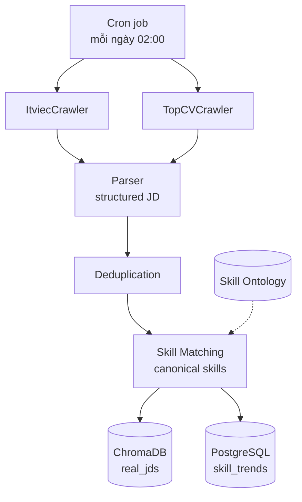

# 2.4 Web Crawling và Xử lý Dữ liệu JD Thực tế

## 2.4.1 Khái niệm Web Crawling

Web crawling là quá trình tự động duyệt các trang web theo định kỳ hoặc theo nhu cầu, tải nội dung và trích xuất thông tin có cấu trúc. Một crawler điển hình gồm các thành phần:

1. **Fetcher**: gửi HTTP request đến URL đích, nhận về response (HTML, JSON hoặc dạng khác).
2. **Parser**: phân tích nội dung response để trích xuất các trường cần thiết.
3. **Scheduler**: quản lý lịch crawl, hàng đợi các URL chờ xử lý, retry khi lỗi.
4. **Storage**: lưu trữ dữ liệu đã trích xuất vào database hoặc file system.

Cho bài toán crawl JD từ các nền tảng tuyển dụng, đề tài cần xử lý hai loại trang:
- **Trang danh sách (listing page)**: chứa nhiều JD cards, có pagination.
- **Trang chi tiết (detail page)**: mô tả đầy đủ một JD cụ thể.

## 2.4.2 Lựa chọn công cụ — cloudscraper, BeautifulSoup và Selenium

Đề tài đánh giá ba lớp công cụ và áp dụng từng lớp tuỳ vào mức độ bảo vệ của site đích:

**1) cloudscraper + BeautifulSoup (default).** `cloudscraper` là HTTP client kế thừa `requests` nhưng có thêm khả năng tự động giải Cloudflare JavaScript challenge phổ biến. Kết hợp với BeautifulSoup để parse HTML đã render. Đây là lớp nhẹ nhất — không cần trình duyệt thật, mỗi request ~0.5–1 giây — và đủ cho phần lớn các trang listing của ITviec và TopCV. Đề tài chọn lớp này làm mặc định trong `PoliteHttpClient`.

**2) undetected-chromedriver (Selenium) — fallback.** Khi site dùng Cloudflare Turnstile (lớp anti-bot cao hơn) hoặc challenge JS phức tạp, cloudscraper trả về 403. Lúc này dùng `undetected-chromedriver` — một wrapper trên Selenium đã patch các signal bot-detection (như `navigator.webdriver`). Trade-off: mỗi page ~3–5 giây, cần Chrome cài sẵn, RAM ~300–500 MB.

**3) BeautifulSoup.** Là thư viện Python chuẩn để parse HTML/XML, được dùng chung cho mọi nguồn sau khi đã có HTML.

**Kết luận thực tế (5/2026):**
- ITviec listing pages → cloudscraper passes (lớp 1).
- TopCV listing pages → cloudscraper passes (lớp 1).
- TopCV detail pages → Cloudflare Turnstile chặn cả cloudscraper lẫn headless Selenium → đề tài chấp nhận hạn chế và dùng *title-based ontology matching* để recover ~78% skills (xem [mục 2.5](./2.5_pipeline_trich_xuat_ky_nang.md)).

**Lựa chọn của đề tài.** Sử dụng kết hợp:
- *Selenium* để load các trang listing (vốn dùng JavaScript để load JD cards và pagination), đợi cho đến khi các JD cards xuất hiện trong DOM.
- *BeautifulSoup* để parse HTML đã được Selenium render, trích xuất các trường thông tin.

**Pseudocode pipeline:**

```python
def crawl_listing_page(url):
    driver.get(url)
    wait_until_jd_cards_loaded(driver, timeout=10)
    html = driver.page_source
    soup = BeautifulSoup(html, 'html.parser')
    jd_links = [card.find('a')['href'] for card in soup.find_all('div', class_='jd-card')]
    return jd_links

def crawl_jd_detail(jd_url):
    response = requests.get(jd_url, headers=HEADERS)
    soup = BeautifulSoup(response.text, 'html.parser')
    return {
        'title': soup.find('h1', class_='jd-title').text.strip(),
        'company': soup.find('div', class_='company').text.strip(),
        'description': soup.find('div', class_='jd-description').text.strip(),
        'skills_raw': [s.text for s in soup.find_all('span', class_='skill-tag')],
        'salary_min': parse_salary(soup.find('span', class_='salary-min')),
        'salary_max': parse_salary(soup.find('span', class_='salary-max')),
        'location': soup.find('span', class_='location').text.strip(),
        'posted_date': parse_date(soup.find('span', class_='posted-date').text),
    }
```

## 2.4.3 Các vấn đề và giải pháp thực tế

**Rate limiting và chống bot.** Các nền tảng tuyển dụng thường có cơ chế giới hạn số request từ một IP. Giải pháp:
- *Sleep ngẫu nhiên* giữa các request: 2–5 giây (mô phỏng người dùng thực).
- *Rotate User-Agent*: dùng các user-agent của Chrome, Firefox, Edge thay đổi luân phiên.
- *Tôn trọng robots.txt*: kiểm tra `https://itviec.com/robots.txt` trước khi crawl, không crawl các đường dẫn bị disallow.

**Pagination handling.** Mỗi trang listing thường có 20–25 JD, cần duyệt nhiều trang. Đề tài giới hạn crawl ~10 trang đầu mỗi danh mục (Backend, Frontend, ...) mỗi ngày, đảm bảo lấy được các JD mới đăng và không quá tải nguồn.

**Schema không thống nhất.** ITviec và TopCV có cấu trúc HTML khác nhau, thậm chí cùng một site có thể thay đổi cấu trúc theo thời gian. Giải pháp:
- *Adapter pattern*: tách logic crawl của từng site thành class riêng (`ItviecCrawler`, `TopCVCrawler`), tất cả implement cùng interface `IJDCrawler`.
- *Health check*: chạy test tự động hàng ngày để phát hiện khi cấu trúc thay đổi (kiểm tra crawler có trả về đủ trường không).

**Trùng lặp dữ liệu.** Cùng một JD có thể xuất hiện trên nhiều ngày (do nhà tuyển dụng đăng nhiều lần) hoặc trên cả hai site. Đề tài định nghĩa khóa duy nhất:
```
jd_id = hash(normalize(company) + normalize(title) + posted_date_week)
```

Hai JD có cùng `jd_id` được coi là duplicate và chỉ lưu một bản.

## 2.4.4 Lưu trữ — ChromaDB và PostgreSQL

Đề tài sử dụng kiến trúc dual storage để phục vụ các use case khác nhau:

**ChromaDB cho semantic search.** Mỗi JD được encode bằng Sentence-BERT (`all-MiniLM-L6-v2`) thành vector 384 chiều, lưu vào collection `real_jds`. Cho phép truy vấn các JD có nội dung tương tự một CV cho trước (cosine similarity), phục vụ Opportunity Window.

Schema metadata mỗi document (cùng key với bảng `jd_raw` để dễ join nếu cần):
```python
{
    'jd_key': 'abc123',                        # khóa dedup, primary key
    'source': 'itviec',                        # itviec | topcv
    'title': 'Senior Java Backend Developer',
    'company': 'Tech Co Ltd',
    'role': 'backend-developer',               # ITviec expertise slug
    'role_group': 'web_application_development',
    'skills': '["Java", "Spring Boot", ...]',  # JSON string
    'location': 'Ho Chi Minh',
    'exp_level': 'senior',
    'salary_min': 30000000,                    # VND hoặc USD; 0 nếu không có
    'salary_max': 60000000,
    'posted_date': '2026-05-12',
}
```

**PostgreSQL cho time-series analytics.** Bảng `skill_trends` (đã mô tả ở mục [2.3](./2.3_temporal_skill_analysis.md)) lưu skill demand theo ngày. Cho phép truy vấn nhanh xu hướng skill cụ thể trong khoảng thời gian.

**Pipeline cập nhật dữ liệu:**



## 2.4.5 Tuân thủ pháp lý và đạo đức

Web crawling cho mục đích nghiên cứu học thuật là hợp lệ nếu tuân thủ một số nguyên tắc:

1. **Robots.txt.** Kiểm tra và tuân thủ các đường dẫn allow/disallow của từng site. Cả ITviec và TopCV đều cho phép crawl trang listing và detail page với rate hợp lý.

2. **Rate limiting.** Đề tài giới hạn crawl ở mức ~200 JD/ngày, sleep ngẫu nhiên 2–5 giây giữa request — không tạo gánh nặng cho hạ tầng nguồn.

3. **Không phân phối lại dữ liệu thô.** Dữ liệu JD crawl được lưu nội bộ phục vụ nghiên cứu, không chia sẻ công khai bộ dữ liệu thô. Trong báo cáo và demo, các JD cụ thể được anonymized (gỡ tên công ty cụ thể nếu cần).

4. **Không thu thập thông tin cá nhân.** Crawler chỉ lấy thông tin JD (mô tả công việc, kỹ năng, công ty, vị trí), không thu thập thông tin cá nhân của ứng viên hay nhân sự công ty.

5. **Trích nguồn rõ ràng.** Báo cáo và bài trình bày luôn ghi rõ dữ liệu được crawl từ ITviec/TopCV trong thời gian nào.

## 2.4.6 Kết quả triển khai (tuần 8–9)

Crawler hoàn thiện trong tuần 9 với các đặc tính:

- **PoliteHttpClient** (`services/http_client.py`): retry với exponential backoff cho HTTP 429/5xx, jitter sleep 3–6 giây giữa request, áp dụng chung cho cả ITviec và TopCV.
- **Adapter pattern**: `ItviecCrawler` và `TopCVCrawler` cùng implement `IJDCrawler`. Thêm nguồn mới chỉ cần viết 1 file adapter.
- **APScheduler cron**: chạy `_run_daily_crawl` lúc **02:00 Asia/Ho_Chi_Minh** mỗi ngày (cấu hình qua env `ENABLE_SCHEDULER`).
- **Role inference**: ITviec lấy slug role từ badge link trong listing card (`/it-jobs/<slug>`), TopCV lấy theo category đang crawl. Cả hai mapping sang `role_group` cấp cao (~25 nhóm theo cấu trúc của ITviec).

**Bảng 2.x: Số liệu lần crawl tuần 8 (snapshot 12/05/2026)**

| Nguồn | JDs | Companies | Role groups | Có skills | Avg skills/JD | Có salary |
|---|---|---|---|---|---|---|
| ITviec | 857 | 398 | 25 | 857 (100%) | 5.20 | 0 (cần login) |
| TopCV | 495 | 302 | 7 | 237 (48%) | 0.69 | 279 |
| **Tổng** | **1,352** | **~700** | 25 | 1,094 (81%) | — | 279 |

Tổng thời gian crawl: **~6 phút**. Tích lũy `skill_trends`: **2,117 rows** sau 1 đợt aggregate. Mục tiêu KPI đề cương "~200 JD/ngày" vượt **6.7 lần** trong 1 lần chạy.

---

[← 2.3 Temporal Skill Analysis](./2.3_temporal_skill_analysis.md) | [→ 2.5 Pipeline trích xuất kỹ năng](./2.5_pipeline_trich_xuat_ky_nang.md)
