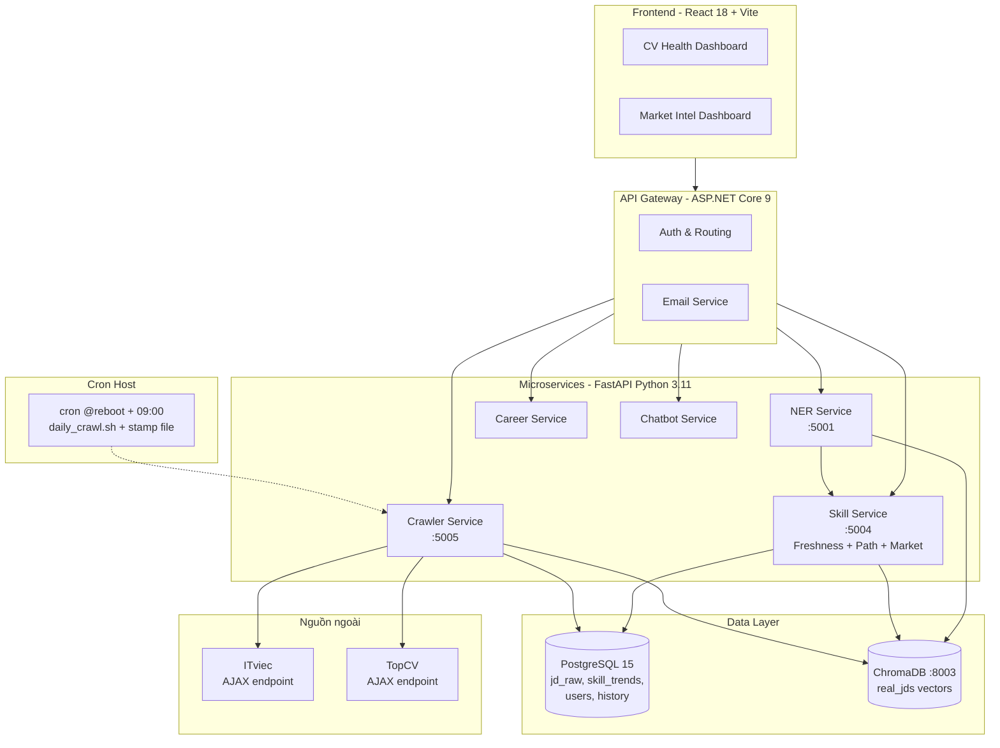

# 2.5 Các công nghệ và công cụ sử dụng

Mục này tổng hợp các công nghệ và công cụ được sử dụng trong đề tài, phân nhóm theo bốn tầng: Backend (data + microservices), NLP/ML, Frontend, và DevOps. Các công nghệ được chọn dựa trên các tiêu chí: trưởng thành (mature), hệ sinh thái phong phú, mã nguồn mở, và phù hợp với quy mô đề tài.

## 2.5.1 Backend: FastAPI, PostgreSQL, ChromaDB

**Python 3.11.** Ngôn ngữ chính cho các service xử lý dữ liệu, NLP, crawl và logic tối ưu hóa. Python được chọn vì hệ sinh thái ML/NLP phong phú (transformers, sentence-transformers, NetworkX), thư viện crawl trưởng thành (cloudscraper, BeautifulSoup, requests), và cộng đồng hỗ trợ lớn.

**FastAPI.** Framework xây dựng REST API hiện đại cho Python với các đặc tính: async/await native, auto-generate OpenAPI documentation, validation qua Pydantic, type hints đầy đủ. FastAPI được dùng cho các microservice của đề tài:

- **Skill Service** (port 5004): cung cấp API cho Multi-criteria Freshness Framework và Market Intelligence Dashboard.
- **Crawler Service** (port 5005): API trigger crawl manual, query trạng thái pipeline, expose endpoints `/crawler/trigger` và `/crawler/aggregate`.
- **NER Service** (port 5001): API trích xuất entity từ CV/JD text, parse PDF CV.
- **Career Service**, **Chatbot Service**: các service hỗ trợ khác.

**BackgroundTasks (FastAPI).** Cơ chế chạy task nền sau khi response đã trả về cho client. Sử dụng để recompute Multi-criteria Freshness Score khi CV người dùng thay đổi, tránh block request HTTP.

**ASP.NET Core 9 (API Gateway).** Framework cho API Gateway — entry point của hệ thống, đảm nhận authentication, routing tới các microservice Python, và một số tính năng business như EmailService cho digest. Việc dùng C# cho gateway cho phép tận dụng các thư viện enterprise của .NET ecosystem.

**PostgreSQL 15.** RDBMS cho dữ liệu có cấu trúc và analytics. Các bảng chính:

- `jd_raw`: dữ liệu JD crawl từ ITviec và TopCV, primary key `jd_key` (SHA1 URL), kèm `job_group_id` cho cross-source dedup, `parse_version` để track phiên bản parse.
- `skill_trends`: aggregate skill demand theo ngày, phục vụ time-series analytics.
- `crawler_log`: log mỗi lần crawl (timestamp, source, JD count, status).
- `user_profile`, `freshness_history`: thông tin người dùng và lịch sử Freshness Score.

PostgreSQL được chọn vì: (i) hỗ trợ tốt JSONB columns cho metadata linh hoạt (skills_canonical, skills_required); (ii) window functions mạnh cho time-series queries; (iii) full-text search built-in; (iv) indexing đầy đủ (B-tree, GIN cho JSONB).

**ChromaDB.** Vector database cho semantic search, chạy ở **HTTP server mode** (port 8003). Collection chính:

- `real_jds`: vector embedding 384 chiều của các JD đã crawl (encode bằng `all-MiniLM-L6-v2`), kèm metadata (title, company, skills, posted_date). Cho phép truy vấn các JD gần nghĩa với CV cụ thể (Opportunity Window).

ChromaDB được chọn vì: nhẹ, dễ tích hợp với Python, hỗ trợ cả embedded và HTTP server mode, và đủ performance cho quy mô đề tài (~10.000–50.000 vectors).

## 2.5.2 NLP/ML: HuggingFace Transformers, Sentence-Transformers

**Hugging Face Transformers.** Thư viện chuẩn de-facto cho các mô hình transformer pre-trained. Đề tài sử dụng:

- **`bert-base-multilingual-cased` (mBERT)**: backbone cho NER song ngữ Việt-Anh, fine-tune cho 21 nhãn BIO domain CV/JD CNTT (xem [mục 2.5.1](./2.4_pipeline_trich_xuat_ky_nang.md#251-named-entity-recognition-và-mô-hình-bert-đa-ngôn-ngữ-mbert)).
- **Pipeline `ner` với `aggregation_strategy="simple"`**: gộp WordPiece subwords thành span entities có ý nghĩa.

**Sentence-Transformers.** Wrapper cấp cao cho việc sinh embedding câu phục vụ similarity search. Đề tài sử dụng `sentence-transformers/all-MiniLM-L6-v2` [[13]](../tai_lieu_tham_khao.md#ref-13) — model 22M parameters, sinh vector 384 chiều, đủ nhẹ để chạy CPU mà vẫn đạt độ chính xác tốt cho semantic matching ngắn (skill names, JD descriptions).

**PyTorch.** Framework deep learning, dùng làm backend cho Transformers (fine-tune mBERT, inference).

**NetworkX.** Thư viện Python cho thao tác trên đồ thị. Đề tài dùng NetworkX để xây dựng và truy vấn skill graph (460 nodes, 418 edges), cài đặt thuật toán Dijkstra. Cho phép tận dụng các thuật toán graph đã được test kỹ thay vì tự cài đặt từ đầu.

**numpy, pandas.** Các thư viện cơ bản cho xử lý dữ liệu số và bảng. Sử dụng trong: phân tích Market Intel, tính cosine similarity vector (numpy), aggregate skill_trends (pandas).

**cloudscraper.** HTTP client kế thừa `requests` với khả năng tự động giải Cloudflare JavaScript challenge. Dùng cho việc crawl ITviec listing pages mà không bị block.

**BeautifulSoup4 + lxml.** Parser HTML/XML mạnh và linh hoạt. Dùng để parse các listing card và detail page sau khi đã fetch HTML.

## 2.5.3 Frontend: React, Recharts, TailwindCSS

**React 18 + TypeScript.** Framework UI chính, TypeScript giúp giảm bug runtime nhờ type checking. Các component chính:

- `CVHealthDashboard.tsx`: tổng quan Freshness 8 chiều và Skill alerts.
- `MarketIntelDashboard.tsx`: 33 insight market analytics với filter switch (ITviec/TopCV/cả hai).
- `LearningPathView.tsx`: visualization lộ trình học (node-link diagram).
- `OpportunityWindow.tsx`: danh sách JD mới phù hợp với CV trong 7 ngày gần nhất.

**Recharts.** Thư viện chart cho React, được chọn vì: (i) hỗ trợ đầy đủ các loại chart cần thiết (line cho time-series, bar cho top skill comparison, pie cho work-mode breakdown, gauge cho Freshness Score); (ii) API declarative dễ tích hợp với React component model; (iii) performance đủ tốt cho dataset hàng nghìn điểm.

**TailwindCSS.** Utility-first CSS framework, cho phép viết style trực tiếp trong JSX qua class names. Tốc độ phát triển UI nhanh hơn so với styled-components hay CSS modules truyền thống.

**Vite.** Build tool cho frontend, thay thế Webpack. Cho hot reload cực nhanh trong dev mode (~100ms), build production nhanh.

## 2.5.4 DevOps: Docker Compose, cron, APScheduler

**Docker và Docker Compose.** Container hóa toàn bộ services. Mỗi service có `Dockerfile` riêng, `docker-compose.yml` orchestrate toàn bộ stack: api_gateway, skill_service, ner_service, crawler_service, career_service, chatbot_service, postgres_main, skill_postgres, skill_chromadb, career_chromadb, chatbot_chromadb, frontend. Mỗi service có policy `restart: unless-stopped` để tự động restart sau reboot hoặc crash.

**Cron Linux (host) + stamp file.** Lịch crawl daily được setup qua cron host:

```cron
0 9 * * * /path/to/scripts/daily_crawl.sh                # 09:00 sáng mỗi ngày
@reboot sleep 300 && /path/to/scripts/daily_crawl.sh     # fallback 5p sau reboot
```

Script `daily_crawl.sh` dùng **stamp file** `/tmp/cv_crawler_last_run` để đảm bảo chỉ crawl 1 lần/ngày kể cả khi máy được reboot nhiều lần. Cách này phù hợp khi máy nghiên cứu không chạy 24/7 — cron `@reboot` đảm bảo crawl chạy được kể cả khi máy tắt qua đêm và bật lại sáng hôm sau.

**APScheduler (in-process).** Ngoài cron host, mỗi `crawler_service` Python cũng có **APScheduler** chạy in-process — cron job lúc 02:00 Asia/Ho_Chi_Minh dùng để trigger crawl khi service được deploy như long-running daemon (use case production). Khi chạy local theo cron host (use case nghiên cứu), APScheduler chỉ là backup.

**Git + GitHub.** Version control cho mã nguồn. Commit message theo Conventional Commits convention.

**pytest.** Framework testing cho Python. Sử dụng cho: unit test các hàm thuần (Freshness formula, ROI calculation, cross-source dedup), integration test cho API endpoints.

## 2.5.5 Tổng kết stack công nghệ

**Bảng 2.6: Tổng kết stack công nghệ của đề tài**

| Tầng | Công nghệ | Vai trò |
|---|---|---|
| Frontend | React 18, TypeScript, Recharts, TailwindCSS, Vite | UI Dashboard, visualization, build |
| API Gateway | ASP.NET Core 9 (C#) | Entry point, auth, routing, EmailService |
| Microservices | FastAPI (Python 3.11) | Logic xử lý chính (Skill, Crawler, NER, Career, Chatbot) |
| NLP/ML | HuggingFace Transformers, Sentence-Transformers, PyTorch | NER mBERT, SBERT semantic embedding |
| Graph | NetworkX | Skill graph, Dijkstra |
| Database | PostgreSQL 15 | JD raw, skill_trends, user data |
| Vector store | ChromaDB (HTTP mode) | Semantic search JD |
| Web Crawling | cloudscraper, BeautifulSoup4, lxml, requests | Thu thập JD ITviec/TopCV qua AJAX endpoint |
| Container | Docker, Docker Compose | Triển khai, isolation |
| Scheduling | cron Linux (`@reboot` + daily), APScheduler | Daily crawl tự động |
| Test | pytest | Unit, integration, benchmark |
| VCS | Git, GitHub | Version control |

**Hình 2.2: Kiến trúc tổng thể hệ thống**



Sơ đồ minh họa 4 tầng kiến trúc: Frontend, API Gateway, Microservices và Data Layer. Crawler chạy theo cron host (với fallback `@reboot`) kết nối với nguồn ngoài (ITviec, TopCV) qua AJAX endpoint. Skill Service là service trung tâm chứa logic cho hai đóng góp khoa học chính (Multi-criteria Freshness, Market Intelligence Dashboard).

---

[← 2.4 Pipeline tiền xử lý CV/JD](./2.4_pipeline_trich_xuat_ky_nang.md) | [→ Chương 3: Phân tích và Thiết kế hệ thống](../chuong3/3.1_phan_tich_yeu_cau.md)
