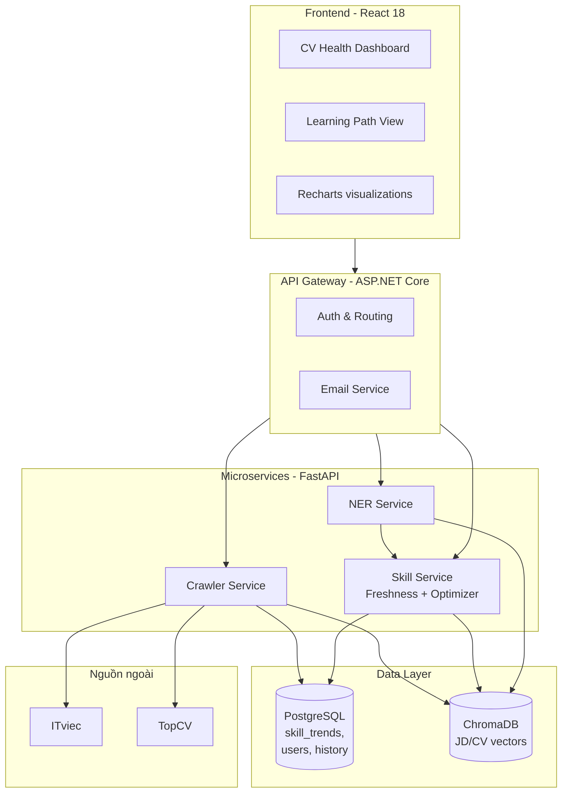

# 2.6 Các Công nghệ và Công cụ Sử dụng

Mục này tổng hợp các công nghệ và công cụ được sử dụng trong đề tài, được phân nhóm theo vai trò trong hệ thống.

## 2.6.1 Backend và Microservices

**Python 3.11.** Ngôn ngữ chính cho các service xử lý dữ liệu, ML/NLP và logic tối ưu hóa. Python được chọn vì hệ sinh thái ML/NLP phong phú (transformers, scikit-learn, NetworkX), thư viện crawl (Selenium, BeautifulSoup) trưởng thành, và cộng đồng hỗ trợ lớn.

**FastAPI.** Framework xây dựng REST API hiện đại cho Python, hỗ trợ async/await, auto-generate OpenAPI docs, type hints. FastAPI được dùng cho các service:
- *Skill Service*: cung cấp các API liên quan đến skill graph, Freshness Score, Learning Path Optimizer.
- *Crawler Service*: API trigger crawl, query trạng thái pipeline.
- *NER Service*: API trích xuất kỹ năng từ text.

**BackgroundTasks (FastAPI).** Cơ chế chạy task nền sau khi response đã trả về cho client. Sử dụng cho:
- Recompute Freshness Score khi CV người dùng thay đổi.
- Update skill_trends sau mỗi đợt crawl.

**ASP.NET Core 9.** Framework cho API Gateway (entry point của hệ thống). Sử dụng C# cho phần này để tận dụng các thư viện như EmailService.cs cho email digest và để hỗ trợ tích hợp với các hệ thống doanh nghiệp Việt Nam (nếu triển khai mở rộng).

## 2.6.2 Database và Storage

**PostgreSQL 15.** RDBMS cho dữ liệu có cấu trúc và time-series analytics. Các bảng chính:
- `skill_trends`: time-series skill demand theo ngày.
- `user_profile`: thông tin người dùng, CV đã upload.
- `freshness_history`: lịch sử Freshness Score của mỗi user.
- `skill_courses`, `skill_bookmarks` (kế thừa từ hệ thống nền): khóa học và bookmark của user.

PostgreSQL được chọn vì hỗ trợ tốt time-series queries (window functions, EXTRACT), JSON columns cho metadata linh hoạt, và indexing mạnh.

**ChromaDB.** Vector database cho semantic search. Hai collection chính:
- `real_jds`: vector embedding 384 chiều (Sentence-BERT) của các JD đã crawl, có metadata kèm theo (title, company, skills, posted_at).
- `cv_embeddings`: embedding CV của người dùng, để tính ATS score với các JD.

ChromaDB được chọn vì nhẹ, dễ tích hợp, không cần server riêng (chạy embedded mode), và đủ performance cho quy mô của đề tài (~10.000–50.000 vector).

## 2.6.3 Machine Learning và NLP

**transformers (Hugging Face).** Thư viện chuẩn cho các mô hình transformer pre-trained. Sử dụng:
- `bert-base-multilingual-cased` (mBERT): backbone cho NER song ngữ.
- `sentence-transformers/all-MiniLM-L6-v2` [[13]](../tai_lieu_tham_khao.md#ref-13): tạo embedding cho semantic matching (384 chiều, nhẹ và đủ tốt).

**PyTorch.** Framework deep learning, dùng để fine-tune mBERT trên dữ liệu CV/JD.

**NetworkX.** Thư viện Python cho thao tác trên đồ thị. Sử dụng để xây dựng và truy vấn skill graph, cài đặt thuật toán Dijkstra. Cho phép tận dụng các thuật toán graph đã được test kỹ thay vì tự cài đặt từ đầu.

**numpy, pandas.** Các thư viện cơ bản cho xử lý dữ liệu số và bảng. Sử dụng trong phân tích time-series, tính các chỉ số MA/growth/volatility.

## 2.6.4 Frontend

**React 18 + TypeScript.** Framework UI chính, TypeScript giúp giảm bug runtime. Các component chính cho CV Health Dashboard:
- `CVHealthDashboard.tsx`: tổng quan Freshness Score và alerts.
- `LearningPathView.tsx`: visualization lộ trình học.
- `SkillTrendChart.tsx`: time-series chart cho từng skill.
- `OpportunityWindow.tsx`: danh sách JD mới phù hợp.

**Recharts.** Thư viện chart cho React, được chọn vì:
- Hỗ trợ đầy đủ các loại chart cần thiết: line chart (time-series), gauge (Freshness Score), bar chart (skill comparison).
- API declarative, dễ tích hợp với React component model.
- Performance đủ tốt cho dataset hàng nghìn điểm.

**Vis.js / React Flow** *(đang đánh giá)*: cho graph visualization của learning path.

## 2.6.5 DevOps và Hạ tầng

**Docker và Docker Compose.** Container hóa tất cả services. Mỗi service có Dockerfile riêng, Docker Compose orchestrate toàn bộ stack (gateway, skill_service, ner_service, postgres, chromadb, frontend).

**Cron jobs (trong container).** Lịch crawl JD hàng ngày được setup trong service crawler. Sử dụng `apscheduler` (Python scheduler) thay vì cron Linux để chạy được trong container một cách dễ kiểm soát.

**Git + GitHub.** Version control cho mã nguồn. Branch chính: `main`. Commit theo Conventional Commits.

## 2.6.6 Công cụ phát triển và đánh giá

**Pytest.** Framework testing cho Python. Sử dụng cho:
- Unit test cho các hàm thuần (Freshness formula, ROI calculation).
- Integration test cho API endpoints.
- Benchmark test cho 3 thuật toán Learning Path Optimization.

**Jupyter Notebook.** Để thực hiện các phân tích exploratory, vẽ chart cho báo cáo, calibrate threshold.

**Google Forms / Typeform** *(cho user study)*: tạo survey thu thập feedback, đo SUS score, usefulness rating.

## 2.6.7 Tổng kết stack công nghệ

**Bảng 2.6: Tổng kết stack công nghệ của đề tài**

| Tầng | Công nghệ | Vai trò |
|---|---|---|
| Frontend | React 18, TypeScript, Recharts | UI Dashboard, visualization |
| API Gateway | ASP.NET Core 9 (C#) | Entry point, auth, routing |
| Microservices | FastAPI (Python) | Logic xử lý chính |
| ML/NLP | transformers, PyTorch, sentence-transformers | NER, semantic embedding |
| Graph | NetworkX | Skill graph, thuật toán đường đi |
| Database | PostgreSQL 15 | Time-series, structured data |
| Vector store | ChromaDB | Semantic search JD/CV |
| Container | Docker, Docker Compose | Triển khai, isolation |
| Crawl | Selenium, BeautifulSoup, requests | Thu thập JD |
| Test | pytest | Unit, integration, benchmark |
| VCS | Git, GitHub | Version control |

Các công nghệ được chọn dựa trên các tiêu chí: trưởng thành (mature), hệ sinh thái phong phú, học phí thấp (open source), và phù hợp với quy mô đề tài cấp tốt nghiệp.

**Hình 2.4: Kiến trúc tổng thể hệ thống**

Sơ đồ minh họa 4 tầng kiến trúc: Frontend, API Gateway, Microservices và Data Layer. Crawler chạy theo cron job kết nối với nguồn ngoài (ITviec, TopCV). Skill Service là service trung tâm chứa logic Freshness Score và Learning Path Optimizer.

---

[← 2.5 Pipeline trích xuất kỹ năng](./2.5_pipeline_trich_xuat_ky_nang.md) | [→ Chương 3: Phân tích và Thiết kế hệ thống](../chuong3/3.1_phan_tich_yeu_cau.md)
