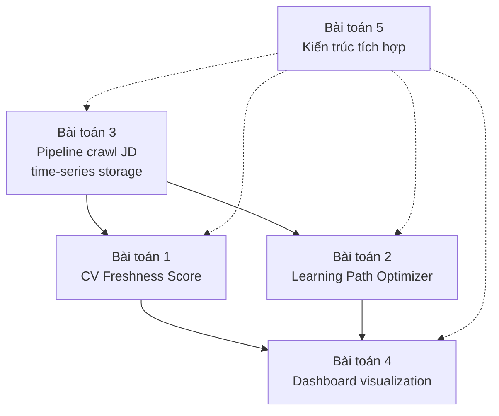

# 3.1 Phân tích Yêu cầu Hệ thống

## 3.1.1 Yêu cầu chức năng

Hệ thống CV Health Intelligence cần hỗ trợ các nhóm chức năng sau, được sắp xếp theo mức độ ưu tiên giảm dần:

**Nhóm A — Quản lý CV và tài khoản người dùng.**

| Mã | Chức năng | Mô tả |
|---|---|---|
| FR-A1 | Đăng ký / đăng nhập | Người dùng tạo tài khoản qua email, đăng nhập để truy cập dashboard cá nhân. |
| FR-A2 | Upload CV | Hỗ trợ file PDF, DOCX, hoặc paste text. Hệ thống tự động trích xuất kỹ năng. |
| FR-A3 | Chỉnh sửa skill list | Người dùng có thể thêm/xóa kỹ năng thủ công nếu pipeline NER không nhận diện đúng. |
| FR-A4 | Chọn vai trò mục tiêu | Người dùng chọn role muốn nhắm tới (Backend, Frontend, Data, ...) để hệ thống cá nhân hóa Freshness và Path. |

**Nhóm B — CV Freshness Score (trọng tâm 1).**

| Mã | Chức năng | Mô tả |
|---|---|---|
| FR-B1 | Tính Freshness Score | Trả về score [0, 100] cho CV của người dùng tại thời điểm hiện tại. |
| FR-B2 | Hiển thị breakdown | Giải thích score: kỹ năng nào đóng góp tích cực/tiêu cực. |
| FR-B3 | Lịch sử Freshness | Lưu và hiển thị time-series score theo tuần/tháng. |
| FR-B4 | Skill alerts | Cảnh báo khi kỹ năng trên CV chuyển trạng thái (Trending Down, Emerging, ...). |
| FR-B5 | Recompute tự động | Khi người dùng cập nhật CV hoặc khi market data thay đổi đáng kể, recompute lại score. |

**Nhóm C — Learning Path Optimizer (trọng tâm 2).**

| Mã | Chức năng | Mô tả |
|---|---|---|
| FR-C1 | Sinh learning path | Đầu vào: budget (số tuần), vai trò mục tiêu. Đầu ra: thứ tự skill cần học. |
| FR-C2 | So sánh các lựa chọn budget | Cho phép người dùng xem path với budget khác nhau (4 tuần, 8 tuần, 12 tuần). |
| FR-C3 | Hiển thị JD unlock | Mỗi path đi kèm số JD ước tính có thể apply sau khi học. |
| FR-C4 | Giải thích lựa chọn | Tại sao gợi ý skill X trước skill Y (do REQUIRES, do trending, ...). |

**Nhóm D — Opportunity Window và Skill Trend.**

| Mã | Chức năng | Mô tả |
|---|---|---|
| FR-D1 | JD mới phù hợp | Hiển thị các JD đăng trong 7 ngày gần nhất có ATS ≥ 70% với CV. |
| FR-D2 | Skill trend chart | Time-series demand của từng skill quan trọng trong CV. |
| FR-D3 | Top trending skills | Top 10 kỹ năng đang lên trong vai trò của người dùng. |

**Nhóm E — Notification.**

| Mã | Chức năng | Mô tả |
|---|---|---|
| FR-E1 | In-app notification | Hiển thị badge khi có alert mới. |
| FR-E2 | Email digest hàng tuần | Tóm tắt thay đổi Freshness Score và JD mới. |

**Nhóm F — Admin/Monitoring (backend).**

| Mã | Chức năng | Mô tả |
|---|---|---|
| FR-F1 | Crawler health check | Theo dõi crawler chạy đúng hàng ngày, alert khi fail. |
| FR-F2 | Skill discovery log | Log các skill text trích xuất được nhưng chưa có trong ontology để review thủ công. |

## 3.1.2 Yêu cầu phi chức năng

**Hiệu năng (Performance).**

- Thời gian tính Freshness Score cho 1 CV: ≤ 2 giây.
- Thời gian sinh learning path (thuật toán Greedy): ≤ 1 giây.
- Thời gian load dashboard lần đầu: ≤ 3 giây (gồm cả gọi API).
- Crawler hoàn thành 1 đợt 200 JD: ≤ 30 phút.

**Độ tin cậy (Reliability).**

- Crawler uptime ≥ 95% trong khoảng thời gian nghiên cứu (chấp nhận 1-2 ngày fail/tháng nếu nguồn đổi cấu trúc).
- Mỗi API endpoint phải có error handling rõ ràng, trả về thông báo lỗi có ngữ nghĩa thay vì 500 Internal Server Error.

**Tính cập nhật dữ liệu (Data Freshness).**

- JD mới được crawl trong 24 giờ kể từ khi đăng trên nguồn.
- Skill trend được tính lại mỗi 24 giờ.
- Freshness Score của user được recompute trong 5 phút khi CV thay đổi (BackgroundTask).

**Khả năng mở rộng (Scalability).**

- Hệ thống hỗ trợ ít nhất 100 người dùng đồng thời trong giai đoạn user study (không phải production).
- Skill ontology có thể mở rộng từ 500 → 1000+ entries mà không phải refactor lớn.
- ChromaDB có thể chứa 50.000+ JD vector mà query vẫn ≤ 500ms.

**Bảo mật và quyền riêng tư.**

- CV người dùng được lưu trên máy chủ local của đề tài, không gửi sang dịch vụ thứ ba.
- Pre-process anonymization: tự động gỡ tên, email, số điện thoại trước khi index CV vào vector store.
- Mã hóa mật khẩu bằng bcrypt.
- HTTPS bắt buộc cho mọi endpoint khi triển khai (kể cả local demo).

**Tính tái lập (Reproducibility).**

- Toàn bộ tham số (ngưỡng cosine, hệ số trong công thức Freshness, learning cost của từng skill) được lưu trong file config có version control.
- Bộ 50 test cases cho Learning Path Optimizer được lưu trong repo dưới dạng JSON, có thể chạy benchmark lại bất cứ lúc nào.
- Mỗi commit code được gắn tag thời gian, cho phép trace lại trạng thái hệ thống tại thời điểm thí nghiệm.

**Tính giải thích (Explainability).**

- Mọi gợi ý (path, alert) phải kèm lý do cụ thể trong UI.
- Mỗi điểm thành phần của Freshness Score đều có thể trace ngược lại được công thức và dữ liệu nguồn.

## 3.1.3 Phân tích các bài toán cần giải quyết

Để đáp ứng các yêu cầu trên, đề tài phải giải quyết các bài toán kỹ thuật chính sau:

**Bài toán 1 — Định lượng "sức khỏe" của CV theo thị trường.** Đây là bài toán mới, chưa có công thức chuẩn trong tài liệu. Cần đề xuất một công thức tường minh, có thể tính được, phản ánh đúng trực giác của recruiter, và có tính chất tốt (thay đổi hợp lý khi CV thay đổi). Chi tiết thiết kế ở [mục 3.2](./3.2_thiet_ke_freshness_score.md).

**Bài toán 2 — Tối ưu lộ trình học kỹ năng.** Cho trạng thái kỹ năng hiện tại của ứng viên và tập JD mục tiêu, tìm thứ tự skill cần học sao cho maximize số JD unlock được trong budget. Đây là biến thể của Budgeted Maximum Coverage Problem, NP-hard. Cần thiết kế cài đặt 3 thuật toán (Greedy, Dijkstra, DP) và benchmark. Chi tiết ở [mục 3.3](./3.3_thiet_ke_learning_path_optimizer.md).

**Bài toán 3 — Thu thập và lưu trữ dữ liệu thị trường theo thời gian.** Cần pipeline crawl ổn định, xử lý duplicates, schema time-series cho phép truy vấn nhanh các chỉ số trend. Chi tiết ở [mục 3.4](./3.4_thiet_ke_pipeline_crawl.md).

**Bài toán 4 — Trực quan hóa dữ liệu phức tạp cho người dùng không chuyên.** Freshness Score, time-series trend, learning path đều là dạng dữ liệu phức tạp. Dashboard phải đơn giản, dễ hiểu, không "ngộp" thông tin. Chi tiết ở [mục 3.5](./3.5_thiet_ke_dashboard.md).

**Bài toán 5 — Tích hợp các thành phần thành hệ thống nhất quán.** Hệ thống có nhiều service (crawler, NER, skill, frontend, gateway), cần kiến trúc cho phép phát triển độc lập, deploy riêng, scale riêng. Chi tiết ở [mục 3.6](./3.6_thiet_ke_kien_truc.md).

**Hình 3.1: Sơ đồ các bài toán và mối liên hệ**

Bài toán 3 cung cấp dữ liệu nền cho cả Bài toán 1 và 2. Bài toán 4 phụ thuộc đầu ra của 1 và 2. Bài toán 5 (kiến trúc) là nền cho toàn bộ.

---

[← Chương 2](../chuong2/2.6_cong_nghe_cong_cu.md) | [→ 3.2 Thiết kế CV Freshness Score](./3.2_thiet_ke_freshness_score.md)
