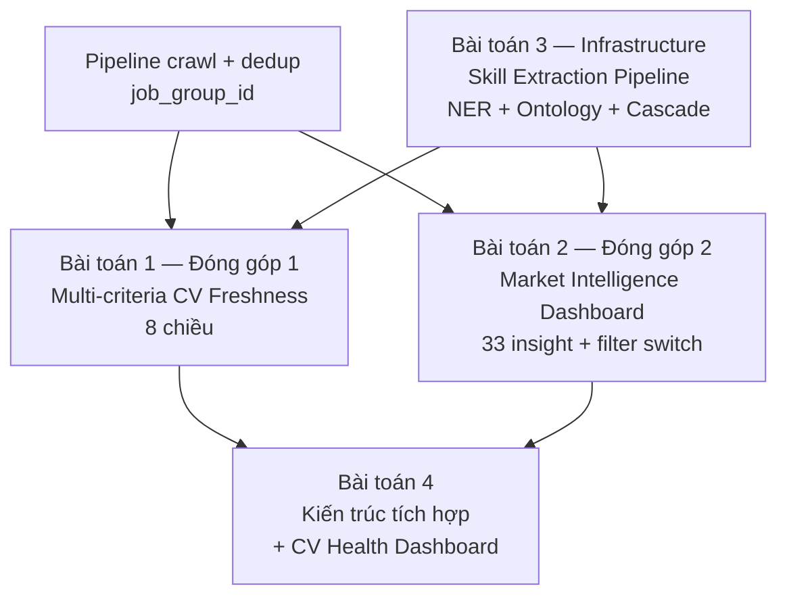

# 3.1 Phân tích Yêu cầu Hệ thống

## 3.1.1 Yêu cầu chức năng

Hệ thống CV Health Intelligence cần hỗ trợ các nhóm chức năng sau, được sắp xếp theo mức độ ưu tiên giảm dần:

**Nhóm A — Quản lý CV và tài khoản người dùng.**

| Mã | Chức năng | Mô tả |
|---|---|---|
| FR-A1 | Đăng ký / đăng nhập | Người dùng tạo tài khoản qua email, đăng nhập để truy cập dashboard cá nhân. |
| FR-A2 | Upload CV | Hỗ trợ file PDF, DOCX, hoặc paste text. Hệ thống tự động chạy NER mBERT để trích xuất kỹ năng. |
| FR-A3 | Xác nhận & Chỉnh sửa (Human-in-the-loop) | Hiển thị bảng review kỹ năng được máy trích xuất. Người dùng có quyền xác nhận, thêm/xóa kỹ năng thủ công trước khi hệ thống tính điểm để đảm bảo độ chính xác. |
| FR-A4 | Chọn vai trò mục tiêu | Người dùng chọn role muốn nhắm tới (Backend, Frontend, Data, ...) để hệ thống cá nhân hóa Freshness và Path. |

**Nhóm B — Multi-criteria CV Freshness Framework (đóng góp 1).**

| Mã | Chức năng | Mô tả |
|---|---|---|
| FR-B1 | Tính Freshness Score 8 chiều | Trả về score [0, 100] cho mỗi chiều (Skill, Experience, Project, Education, Achievement, Language, Completeness, Market Alignment) và score tổng. |
| FR-B2 | Hiển thị breakdown từng chiều | Giải thích score: chiều nào yếu cần cải thiện, chiều nào mạnh giữ vững. |
| FR-B3 | Lịch sử Freshness | Lưu và hiển thị time-series score theo tuần/tháng cho từng chiều. |
| FR-B4 | Skill alerts | Cảnh báo khi kỹ năng trên CV chuyển trạng thái (Trending Down, Emerging, ...). |
| FR-B5 | Recompute tự động | Khi người dùng cập nhật CV hoặc khi market data thay đổi đáng kể, recompute lại score 8 chiều. |

**Nhóm C — Market Intelligence Dashboard (đóng góp 2).**

| Mã | Chức năng | Mô tả |
|---|---|---|
| FR-C1 | 33 insight market analytics | Top skill, salary distribution, work-mode trend, role demand, company-level (qua `COUNT(DISTINCT job_group_id)`). |
| FR-C2 | Filter switch nguồn | Cho phép chọn ITviec / TopCV / cả hai để so sánh thị trường giữa hai nền tảng. |
| FR-C3 | Filter role + seniority | Focus theo nhóm vai trò (Backend, Frontend, ...) và cấp độ kinh nghiệm (junior, mid, senior, lead). |
| FR-C4 | Drill-down vào JD chi tiết | Click vào chart → xem danh sách JD chứa skill / vị trí cụ thể. |

**Nhóm D — Opportunity Window và Skill Trend (CV Health Dashboard).**

| Mã | Chức năng | Mô tả |
|---|---|---|
| FR-D1 | JD mới phù hợp | Hiển thị các JD đăng trong 7 ngày gần nhất có ATS ≥ 70% với CV. |
| FR-D2 | Skill trend chart | Time-series demand của từng skill quan trọng trong CV. |
| FR-D3 | Top trending skills | Top 10 kỹ năng đang lên trong vai trò của người dùng. |
| FR-D4 | What-if Simulation | Chế độ giả lập cho phép người dùng kéo thả kỹ năng mới vào CV để trực tiếp thấy sự thay đổi của Freshness Score và số lượng JD mở khóa được. |

**Nhóm E — Notification.**

| Mã | Chức năng | Mô tả |
|---|---|---|
| FR-E1 | In-app notification | Hiển thị badge khi có alert mới. |
| FR-E2 | Email digest hàng tuần | Tóm tắt thay đổi Freshness Score và JD mới. |

**Nhóm F — Admin/Monitoring (backend).**

| Mã | Chức năng | Mô tả |
|---|---|---|
| FR-F1 | Crawler health check | Theo dõi crawler chạy đúng hàng ngày qua cron `@reboot` + daily 09:00, alert khi fail. |
| FR-F2 | Skill discovery log | Log các skill text trích xuất được nhưng chưa có trong ontology để review thủ công. |

## 3.1.2 Yêu cầu phi chức năng

**Hiệu năng (Performance).**

- Thời gian tính Multi-criteria Freshness Score 8 chiều cho 1 CV: ≤ 2 giây.
- Thời gian load Market Intel Dashboard với 33 insight: ≤ 500ms (đã optimize với aggregation trong PostgreSQL).
- Thời gian load CV Health Dashboard lần đầu: ≤ 3 giây (gồm cả gọi API).
- Crawler hoàn thành 1 đợt full ITviec + TopCV (~1300 JDs): ≤ 75 phút.

**Độ tin cậy (Reliability).**

- Crawler uptime ≥ 95% trong khoảng thời gian nghiên cứu (chấp nhận 1-2 ngày fail/tháng nếu nguồn đổi cấu trúc).
- Mỗi API endpoint phải có error handling rõ ràng, trả về thông báo lỗi có ngữ nghĩa thay vì 500 Internal Server Error.

**Tính cập nhật dữ liệu (Data Freshness).**

- JD mới được crawl trong 24 giờ kể từ khi đăng trên nguồn (cron daily 09:00 + fallback `@reboot`).
- Skill trend được tính lại mỗi 24 giờ sau crawl.
- Multi-criteria Freshness Score của user được recompute trong 5 phút khi CV thay đổi (BackgroundTask).
- Cross-source dedup `job_group_id` được tính trong pipeline build, không cần job riêng.

**Khả năng mở rộng (Scalability).**

- Hệ thống hỗ trợ ít nhất 100 người dùng đồng thời (không phải production).
- Skill ontology có thể mở rộng từ 460 → 1000+ entries mà không phải refactor lớn (chỉ thêm vào `SKILL_ONTOLOGY` và `SKILL_RELATIONSHIPS` dict trong code).
- ChromaDB có thể chứa 50.000+ JD vector mà query vẫn ≤ 500ms.
- Thêm nguồn JD mới (VietnamWorks, Glassdoor) chỉ cần implement 1 class adapter mới theo interface `IJDCrawler`.

**Bảo mật và quyền riêng tư.**

- CV người dùng được lưu trên máy chủ local của đề tài, không gửi sang dịch vụ thứ ba.
- Pre-process anonymization: tự động gỡ tên, email, số điện thoại trước khi index CV vào vector store.
- Mã hóa mật khẩu bằng bcrypt.
- HTTPS bắt buộc cho mọi endpoint khi triển khai (kể cả local demo).

**Tính tái lập (Reproducibility).**

- Toàn bộ tham số (ngưỡng cosine, hệ số trong công thức Freshness, trọng số $\omega_d$ theo seniority) được lưu trong file config có version control.
- Bộ 20 CV validate Multi-criteria được lưu trong repo dưới dạng JSON, có thể chạy validate lại bất cứ lúc nào.
- Mỗi commit code được gắn tag thời gian, cho phép trace lại trạng thái hệ thống tại thời điểm thí nghiệm.

**Tính giải thích (Explainability).**

- Mọi gợi ý (path, alert) phải kèm lý do cụ thể trong UI.
- Mỗi điểm thành phần của Freshness Score đều có thể trace ngược lại được công thức và dữ liệu nguồn.

## 3.1.3 Phân tích các bài toán cần giải quyết

Để đáp ứng các yêu cầu trên, đề tài phải giải quyết các bài toán kỹ thuật, được chia thành **hai đóng góp khoa học chính** và **các bài toán hỗ trợ**:

**Bài toán 1 — Đánh giá CV đa tiêu chí (đóng góp 1).** Đề xuất khung Multi-criteria Freshness Framework với 8 chiều độc lập (Skill, Experience, Project, Education, Achievement, Language, Completeness, Market Alignment). Cần định nghĩa công thức tính từng chiều, áp dụng Weighted Sum Model với trọng số hiệu chỉnh theo seniority, và đảm bảo tính chất tốt (tường minh, thay đổi hợp lý khi CV thay đổi, phản ánh thị trường). Chi tiết thiết kế ở [mục 3.2](./3.2_thiet_ke_freshness_score.md).

**Bài toán 2 — Phân tích thị trường tuyển dụng mở (đóng góp 2).** Xây dựng Market Intelligence Dashboard với 33 insight có cross-source deduplication chặt qua `job_group_id`, hỗ trợ filter switch giữa các nguồn để sinh viên tự khám phá. Chi tiết Market Intel Dashboard ở [mục 3.4](./3.4_thiet_ke_market_intel.md), pipeline crawl + dedup ở [mục 3.3](./3.3_thiet_ke_pipeline_crawl.md).

**Bài toán 3 — Skill Extraction & Matching Pipeline (infrastructure).** Để hai bài toán trên hoạt động end-to-end trên CV/JD song ngữ Việt-Anh, cần pipeline tiền xử lý gồm: NER mBERT fine-tune (21 nhãn BIO), Skill Ontology 460 entries, Cascade Matching 3 tầng. Chi tiết ở [mục 3.5](./3.5_thiet_ke_skill_extraction_pipeline.md).

**Bài toán 4 — Tích hợp các thành phần thành hệ thống nhất quán.** Hệ thống có nhiều service (crawler, NER, skill, frontend, gateway), cần kiến trúc microservices cho phép phát triển độc lập, deploy riêng. Đồng thời cần CV Health Dashboard tích hợp end-user cho hai đóng góp khoa học. Chi tiết ở [mục 3.6](./3.6_thiet_ke_kien_truc.md).

**Hình 3.1: Sơ đồ các bài toán và mối liên hệ**

Sơ đồ thể hiện dependency: (i) **Crawl pipeline** cung cấp dữ liệu thị trường thực cho Multi-criteria Freshness (P1) và Market Intel (P2); (ii) **Skill Extraction Pipeline (P3)** là infrastructure tiền xử lý chung cho cả hai đóng góp; (iii) **Kiến trúc tích hợp (P4)** kết nối tất cả vào hệ thống và CV Health Dashboard end-user.

---

[← Chương 2](../chuong2/2.5_cong_nghe_cong_cu.md) | [→ 3.2 Multi-criteria CV Freshness Framework](./3.2_thiet_ke_freshness_score.md)
