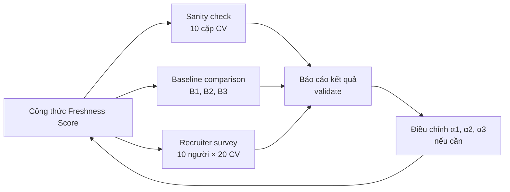
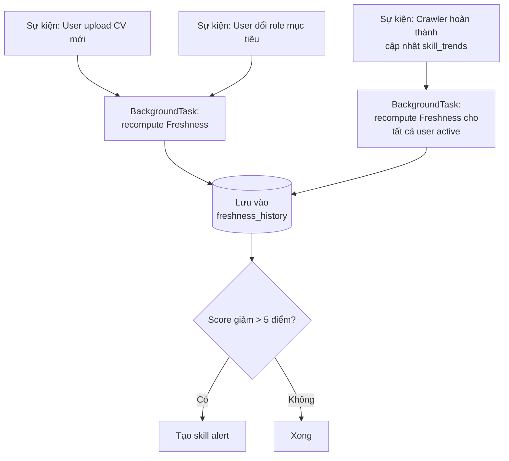

# 3.2 Thiết kế CV Freshness Score

## 3.2.1 Đặc điểm mong muốn của công thức

Trước khi đề xuất công thức, đề tài xác định các đặc điểm mà CV Freshness Score cần có. Các đặc điểm này được coi là "tiên đề" để công thức không lệch ra khỏi trực giác về "sức khỏe CV":

**A1 — Bounded và chuẩn hóa.** Score nằm trong khoảng [0, 100] để dễ giao tiếp với người dùng (thang điểm quen thuộc như điểm thi).

**A2 — Đơn điệu khi thêm skill trending.** Nếu thêm một skill đang trending up vào CV thì Freshness Score phải tăng (hoặc giữ nguyên), không bao giờ giảm.

**A3 — Đơn điệu khi gỡ skill trending down.** Nếu gỡ một skill đang trending down (đã mất giá) khỏi CV thì Freshness Score phải tăng hoặc giữ nguyên.

**A4 — Nhạy với context vai trò.** CV cùng nội dung nhưng nhắm tới Backend vs Data Scientist phải có Freshness Score khác nhau, phản ánh kỹ năng quan trọng khác nhau theo vai trò.

**A5 — Phản ánh recency.** Skill ứng viên dùng gần đây (1 năm gần) đóng góp nhiều hơn skill dùng cách đây 3-5 năm.

**A6 — Tính giải thích được.** Score phải có thể decompose thành đóng góp của từng skill, cho phép breakdown trong dashboard.

## 3.2.2 Công thức đề xuất

Đề tài đề xuất công thức CV Freshness Score như sau. Cho:
- CV của ứng viên có tập kỹ năng $S = \{s_1, s_2, \ldots, s_n\}$.
- Vai trò mục tiêu $r$ (Backend, Frontend, Data, ...).
- Thời điểm hiện tại $t$.

**Công thức tổng:**

$$\text{Freshness}(\text{CV}, r, t) = 100 \cdot \frac{\sum_{s \in S} w_r(s) \cdot \text{trend}(s, t) \cdot \text{recency}(s)}{\sum_{s \in S_r^{\text{ideal}}} w_r(s)}$$

Trong đó các thành phần được định nghĩa cụ thể như sau.

### Thành phần 1 — Importance weight $w_r(s)$

Mức độ quan trọng của skill $s$ đối với vai trò $r$, dựa trên skill ontology:

$$w_r(s) = \alpha_1 \cdot \mathbb{1}[\text{PART\_OF}(s, r)] + \alpha_2 \cdot \text{indegree}_{\text{REQUIRES}}(s) + \alpha_3 \cdot \text{freq}_r(s)$$

trong đó:
- $\mathbb{1}[\text{PART\_OF}(s, r)] = 1$ nếu skill $s$ thuộc domain của vai trò $r$ theo ontology, ngược lại = 0.
- $\text{indegree}_{\text{REQUIRES}}(s)$ là số skill khác yêu cầu $s$ (ví dụ JavaScript có indegree cao vì React, Vue, Node.js đều REQUIRES nó). Đã chuẩn hóa về [0, 1].
- $\text{freq}_r(s)$ là tần suất xuất hiện của $s$ trong JD vai trò $r$ tích lũy 4 tuần gần nhất, chuẩn hóa về [0, 1].
- $\alpha_1, \alpha_2, \alpha_3$ là hằng số trong [0, 1] với $\alpha_1 + \alpha_2 + \alpha_3 = 1$. Mặc định: $\alpha_1 = 0.3, \alpha_2 = 0.2, \alpha_3 = 0.5$ (frequency có trọng lớn nhất vì phản ánh trực tiếp thị trường).

### Thành phần 2 — Trend weight $\text{trend}(s, t)$

Đo độ "nóng" hiện tại của skill so với 4 tuần trước:

$$\text{trend}(s, t) = \min\left(1.5,\; \max\left(0.5,\; \frac{d_t(s)}{\text{MA}_4(s, t-1)}\right)\right)$$

trong đó $d_t(s)$ là demand tuần hiện tại, $\text{MA}_4$ là moving average 4 tuần trước. Clip về [0.5, 1.5] để tránh outlier — một skill bỗng nhiên tăng 10× tuần này không thể đóng góp gấp 10 lần (có thể là nhiễu).

### Thành phần 3 — Recency $\text{recency}(s)$

Đo mức độ "tươi mới" của lần ứng viên dùng skill $s$, tính từ thông tin experience trong CV:

$$\text{recency}(s) = \begin{cases} 1.0 & \text{nếu dùng trong} \leq 1 \text{ năm gần} \\ 0.7 & \text{nếu dùng trong } 1{-}2 \text{ năm} \\ 0.4 & \text{nếu dùng trong } 2{-}5 \text{ năm} \\ 0.1 & \text{nếu } > 5 \text{ năm hoặc không có thông tin} \end{cases}$$

### Mẫu số — chuẩn hóa về [0, 100]

$S_r^{\text{ideal}}$ là tập "kỹ năng lý tưởng" cho vai trò $r$ — bộ kỹ năng cốt lõi mà một ứng viên có kinh nghiệm với role $r$ nên có. Tập này được xây dựng từ:
- Top 15 kỹ năng xuất hiện nhiều nhất trong JD role $r$ trong 4 tuần gần nhất.
- Có thể bổ sung từ ý kiến chuyên gia hoặc đường nghề nghiệp chuẩn (O\*NET, ESCO).

Chia cho mẫu số đảm bảo: CV có đầy đủ kỹ năng "ideal" với trend = 1 và recency = 1 sẽ đạt Freshness = 100. Trong thực tế, ít CV nào đạt được tối đa vì luôn có ít nhất một skill không hoàn hảo về recency hoặc trend.

## 3.2.3 Tính chất công thức

Kiểm tra công thức đề xuất có thỏa mãn các đặc điểm A1–A6 không:

| Đặc điểm | Thỏa mãn? | Giải thích |
|---|---|---|
| A1 — Bounded [0, 100] | Có | Mẫu số đảm bảo, thừa số 100 là yếu tố scale |
| A2 — Đơn điệu thêm skill trending | Có | Thêm skill $s$ với $w_r(s) \cdot \text{trend}(s) \cdot \text{recency}(s) > 0$ chỉ làm tử số tăng, mẫu số không đổi |
| A3 — Đơn điệu gỡ skill trending down | Có (gần đúng) | Gỡ skill có trend < 1 làm giảm tử số, nhưng phần đóng góp âm cũng nhỏ → giữ nguyên hoặc tăng nhẹ |
| A4 — Nhạy với vai trò | Có | $w_r$ thay đổi theo $r$, các skill quan trọng khác nhau |
| A5 — Phản ánh recency | Có | Thành phần `recency(s)` trực tiếp |
| A6 — Giải thích được | Có | Có thể decompose: đóng góp của skill $s$ = $\frac{100 \cdot w_r(s) \cdot \text{trend}(s) \cdot \text{recency}(s)}{\sum_{s' \in S_r^{\text{ideal}}} w_r(s')}$ |

**Ví dụ minh họa.** Một ứng viên Backend có CV với 3 skills:
- Python (dùng năm 2026, trend = 1.1, $w_r = 0.9$)
- Django (dùng năm 2026, trend = 0.95, $w_r = 0.7$)
- PHP (dùng năm 2023, trend = 0.6, $w_r = 0.3$)

Mẫu số (chuẩn hóa 15 skill Backend ideal) = 10.

```
Tử số  = 0.9 · 1.1 · 1.0 + 0.7 · 0.95 · 1.0 + 0.3 · 0.6 · 0.4
       = 0.99 + 0.665 + 0.072
       = 1.727
Freshness = 100 · 1.727 / 10 = 17.3
```

Score thấp vì CV chỉ có 3 skill (ít so với 15 skill ideal). Khi ứng viên thêm các skill quan trọng khác (PostgreSQL, Docker, REST API, ...), tử số tăng dần, score tăng.

## 3.2.4 Phương pháp validate công thức

Vì không có "ground truth" cho Freshness Score (không thể biết CV X "chính xác" nên có score bao nhiêu), việc validate dựa trên ba phương pháp bổ trợ:

**Phương pháp 1 — Kiểm tra tính chất (sanity check).**

Tạo thủ công 10 cặp CV để kiểm tra các tính chất A2–A5:
- 5 cặp (CV cũ, CV mới với +1 skill trending) → kiểm tra A2: score mới ≥ score cũ.
- 5 cặp (CV với skill đã 5 năm, CV cùng nội dung với skill 1 năm) → kiểm tra A5: score CV 1 năm cao hơn.

**Phương pháp 2 — So sánh với baseline.**

Thiết kế 3 baseline để so sánh:

| Baseline | Mô tả |
|---|---|
| B1 — Random score | Score ngẫu nhiên [0, 100] |
| B2 — Số skill thô | Score = min(100, n × 5) với n là số kỹ năng trong CV |
| B3 — ATS-style coverage | % skill yêu cầu của một "JD chuẩn" của role $r$ mà CV có |

Tiêu chí so sánh: ổn định (CV thay đổi nhỏ → score thay đổi nhỏ), phân biệt được CV tốt/xấu (CV người có kinh nghiệm 5 năm phải có score cao hơn CV junior).

**Phương pháp 3 — Khảo sát chuyên gia (recruiter survey).**

Chọn 20 CV mẫu (anonymized) thuộc 4 role (Backend, Frontend, Data, DevOps), tính Freshness Score cho mỗi CV. Sau đó:

1. Gửi 20 CV (không kèm score) cho 10 recruiter, yêu cầu rank theo "mức độ phù hợp với thị trường hiện tại" trên thang 1–5.
2. So sánh ranking của recruiter với ranking theo Freshness Score (Spearman correlation).
3. Thảo luận với recruiter các CV mà có sự khác biệt lớn giữa score và đánh giá của họ — đây là input để điều chỉnh hệ số $\alpha_1, \alpha_2, \alpha_3$ trong $w_r$.

Mục tiêu: Spearman correlation ≥ 0.6 (mức tương quan trung bình–cao trong các nghiên cứu HCI).

**Hình 3.2: Quy trình validate Freshness Score**



### Kết quả validate sơ bộ — Phương pháp 1 (Tuần 11)

Đề tài đã chạy phương pháp 1 (sanity check) trên một bộ fixture mở rộng: 10 CV "fresh" + 10 CV "stale" tự tạo trải đều 5 vai trò (backend, frontend, data, devops, ai_engineer), mỗi vai trò 2 cặp. Mỗi CV "fresh" mô tả ứng viên có kỹ năng cập nhật, dùng trong 12 tháng gần nhất; mỗi CV "stale" mô tả ứng viên có kỹ năng đã lỗi thời (PHP/jQuery/Hadoop/AngularJS/Theano…), không dùng trong 5+ năm. Vì crawler mới chạy từ Tuần 8 nên dữ liệu thật chưa đủ 4 tuần lịch sử để tính `trend(s, t)` ổn định, đề tài dùng một market snapshot tổng hợp (synthetic) hiệu chỉnh từ tín hiệu sơ bộ của ITviec/TopCV để chạy validate này.

**Kết quả** (snapshot 2026-05-10):

| Nhóm | n | Mean | Stdev | Min | Max |
|---|---|---|---|---|---|
| Fresh | 10 | **74.73** | 10.88 | 51.08 | 90.18 |
| Stale | 10 | **1.60** | 0.97 | 0.09 | 3.27 |

- **Khoảng cách Δ(fresh − stale) = +73.13 điểm** — phân tách rõ rệt giữa hai nhóm.
- **Sanity check per role**: với mỗi vai trò trong 5 vai trò, `min(fresh_scores) > max(stale_scores)`. Không có "cross-over" — toàn bộ CV fresh đều xếp trên CV stale của cùng vai trò.
- **Spearman ρ(label, score) = −0.932** — gần như hoàn hảo theo ý nghĩa "CV được gắn nhãn fresh có score cao hơn CV stale".

Kết quả này thỏa mãn các tính chất A1–A5 đã đặt ra ở §3.2.1 và xác nhận công thức làm việc đúng định tính. Phương pháp 2 (baseline comparison) và phương pháp 3 (recruiter survey) sẽ chạy trong Tuần 16 cùng với user study chính thức.

## 3.2.5 Tính các thành phần — Engineering details

**Cache Importance weight $w_r(s)$ — deferred.** Thiết kế ban đầu dự kiến lưu sẵn $w_r(s)$ vào bảng `skill_importance_cache (skill_canonical, role, weight, computed_at)` để tránh tính lại mỗi request. Implementation Tuần 10 chọn cách tính on-demand vì: (1) skill ontology chỉ ~500 nodes nên `indegree_REQUIRES(s)` được precompute một lần khi load engine; (2) `freq_r(s)` chỉ cần 1 query SELECT vào `skill_trends`; (3) tổng thời gian compute < 50 ms cho 1 request, dưới ngưỡng 2 s ở §3.1.2. Cache sẽ được thêm khi số user active vượt ~50 (tham khảo §3.6.3).

**Bảng `skill_trends` lưu time-series.** Đã mô tả trong [mục 2.3](../chuong2/2.3_temporal_skill_analysis.md), được dùng để tính `trend(s, t)`. Engine truy vấn 2 thông tin: (a) demand hiện tại tại `snapshot_date` mới nhất, (b) MA 4 snapshot trước đó cho từng skill cụ thể.

**Recency từ CV.** Trong giai đoạn NER, các entity `EXPERIENCE` đi kèm trường `date_range` (ví dụ "2022 – 2024"). Mỗi skill trong experience block được gán recency tương ứng. Nếu một skill xuất hiện trong nhiều experience, lấy giá trị recency lớn nhất (gần nhất). Trong API hiện tại, client truyền trực tiếp `last_used_year` cho mỗi skill — engine không tự gọi NER để giảm coupling trong giai đoạn nghiên cứu.

**Cập nhật Freshness Score theo thời gian thực.**



Việc recompute sau khi crawler chạy chỉ làm cho user active (đăng nhập trong 30 ngày gần nhất) để tiết kiệm tài nguyên.

## 3.2.6 Hạn chế thừa nhận

**Skill importance phụ thuộc dữ liệu market.** Trong giai đoạn cold-start (< 4 snapshot lịch sử), `trend(s, t)` không có MA 4 tuần để so sánh, và `freq_r(s)` cũng kém tin cậy. Implementation Tuần 11 xử lý bằng cách: (a) gắn cờ `cold_start = True` trong response để dashboard hiển thị disclaimer cho user; (b) khi không có history MA, `trend(s, t) = 1.0` (neutral) để Freshness vẫn tính được, không bị skew. Thiết kế ban đầu dự kiến fallback về O\*NET role-skill mapping cho 4 tuần đầu — đề tài quyết định không triển khai vì O\*NET là dữ liệu thị trường Mỹ, không khớp với thị trường CNTT Việt Nam (kỹ năng và mức demand khác nhau đáng kể). Khi crawler tích lũy đủ 4 tuần, cờ `cold_start` tự tắt và score trở nên ổn định.

**Recency phụ thuộc chất lượng NER.** Nếu NER không trích xuất được trường ngày trong experience, recency mặc định là 0.7 (giá trị trung bình). Cần audit thủ công cho user study.

**Công thức không phải duy nhất.** Đề tài đề xuất một công thức cụ thể được cân nhắc và validate. Có thể có công thức khác cho kết quả tốt hơn — đây là hướng nghiên cứu tiếp theo, không phải đề tài này sẽ giải quyết triệt để.

---

[← 3.1 Phân tích yêu cầu](./3.1_phan_tich_yeu_cau.md) | [→ 3.3 Thiết kế Learning Path Optimizer](./3.3_thiet_ke_learning_path_optimizer.md)
