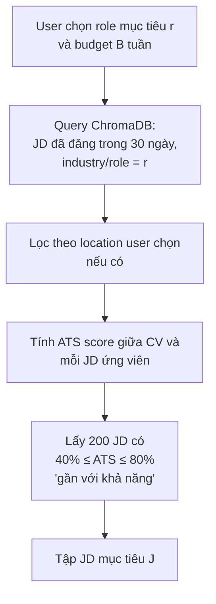
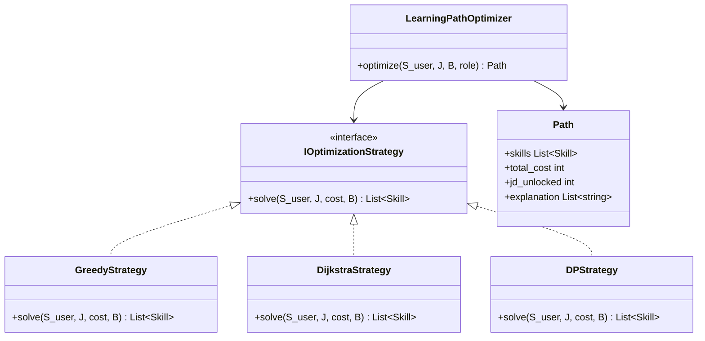
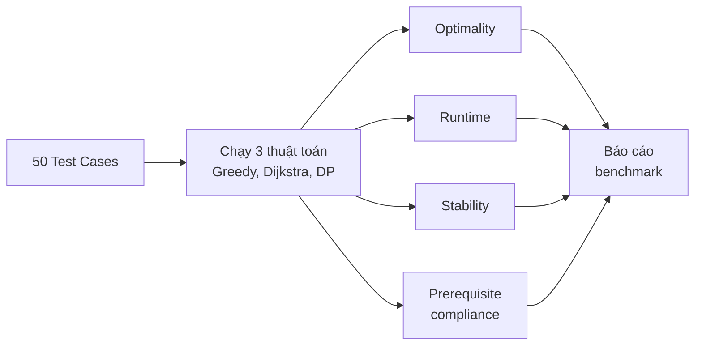

# 3.3 Thiết kế Learning Path Optimizer

Mục này trình bày thiết kế chi tiết cho Learning Path Optimizer — bao gồm việc hình thức hóa bài toán cho bối cảnh CV thật, kiến trúc các thuật toán đã cài đặt, và thiết kế bộ benchmark để đánh giá. Cơ sở toán học của 3 thuật toán đã được trình bày trong [mục 2.2](../chuong2/2.2_learning_path_optimization.md); mục này tập trung vào phần thiết kế cài đặt và đánh giá.

## 3.3.1 Định nghĩa bài toán trong bối cảnh CV thực tế

Bài toán đã được hình thức hóa tổng quát trong mục 2.2.1. Khi đưa vào hệ thống thực tế, một số yếu tố cần được làm rõ thêm:

**Xác định tập JD mục tiêu $J$.** Khi người dùng yêu cầu sinh learning path, tập $J$ được xây dựng tự động theo các bước:



Các JD có ATS quá thấp (< 40%) bị loại vì cần học quá nhiều skill, không khả thi trong budget. Các JD có ATS quá cao (> 80%) cũng bị loại vì user đã sẵn sàng apply, không cần học thêm.

**Xác định learning cost mỗi skill.** Đề tài gắn trường `cost` (số tuần học) vào mỗi entry trong skill ontology. Giá trị này được ước tính dựa trên:
- Thời gian học các khóa MOOC tương ứng (Coursera, Udemy) — lấy median.
- Tham khảo các "roadmap" cộng đồng (roadmap.sh, freecodecamp).
- Phân loại theo độ khó: skill cơ bản (HTML, CSS) ~ 1-2 tuần, framework trung cấp (React, Django) ~ 3-4 tuần, công nghệ nâng cao (Kubernetes, ML systems) ~ 6-8 tuần.

Cost là ước lượng, có sai số. Đề tài chấp nhận điều này và mô tả rõ trong báo cáo. Đây cũng là một hạn chế thừa nhận.

**Xử lý prerequisites tự động.** Khi thuật toán chọn skill $v$ mà $v$ có prerequisites $u$ chưa nằm trong $S_{\text{user}}$, hệ thống tự động thêm $u$ vào path. Cost của $u$ được tính vào tổng. Logic này dùng cho cả 3 thuật toán.

## 3.3.2 Kiến trúc module LearningPathOptimizer

Module được thiết kế theo nguyên tắc strategy pattern — interface chung, 3 thuật toán implement khác nhau:



**Lý do dùng strategy pattern:**
- Dễ A/B test các thuật toán trong production.
- Dễ thêm thuật toán mới sau này (ví dụ A*, Beam Search).
- Test isolation: mỗi strategy có test riêng.

**Default strategy trong production:** Greedy (nhanh, đủ tốt). Dijkstra và DP chỉ dùng trong benchmark hoặc khi user yêu cầu "lộ trình tối ưu" (chấp nhận chờ lâu hơn).

## 3.3.3 Thiết kế cài đặt từng thuật toán

### Greedy

Cài đặt theo pseudocode trong [mục 2.2.2](../chuong2/2.2_learning_path_optimization.md), với các tối ưu engineering:

- **Cache ROI computation.** Tính $\Delta J(v, L)$ tốn $O(|J|)$. Thay vì tính lại mỗi vòng lặp, lưu cache: với mỗi skill $v$, lưu set các JD mà $v$ "chưa cover được" (tức là $R(j) \setminus (S_{\text{user}} \cup L)$ chứa $v$). Khi thêm skill mới, chỉ update cache cho các skill liên quan.

- **Tie-break.** Khi nhiều skill có cùng ROI, ưu tiên theo: (1) số JD unlock tuyệt đối (lớn hơn), (2) trend_weight (cao hơn), (3) thứ tự alphabet (deterministic).

### Dijkstra

Cài đặt bằng `heapq` trong Python. Để tránh bùng nổ trạng thái:

- **Pruning by budget.** Bỏ qua state có tổng cost > B.
- **Pruning by relevance.** Chỉ mở rộng các skill xuất hiện trong $\bigcup_{j \in J} R(j)$ — skill không liên quan đến JD mục tiêu không cần xét.
- **State encoding.** Mỗi state là `frozenset` của skill canonical, để hash và so sánh nhanh.
- **Goal condition.** Trả về ngay state đầu tiên unlock ≥ 1 JD nếu mục tiêu là "đủ apply 1 JD". Trả về best state (nhiều JD unlock nhất) trong toàn bộ duyệt nếu mục tiêu là maximize coverage.

### Dynamic Programming

Cài đặt theo công thức trong [mục 2.2.4](../chuong2/2.2_learning_path_optimization.md):

- **Giới hạn candidates.** Chỉ chạy DP trên `candidates = ∪{R(j) | j ∈ J} ∖ S_user`. Trong các test case thực, $|candidates| \leq 30$.
- **Lưu track của subset tối ưu.** Lưu `track[i][b]` là `frozenset` của lời giải tốt nhất tại trạng thái $(i, b)$ thay vì chỉ lưu giá trị $f(i, b)$. Trade-off: tốn memory hơn nhưng truy ngược path dễ.
- **Early termination.** Nếu $f(i, b) = |J|$ (đã unlock hết JD) thì dừng sớm.

## 3.3.4 Thiết kế bộ benchmark

Mục tiêu: so sánh 3 thuật toán trên các test case có **đặc điểm đa dạng** để đánh giá toàn diện.

### Cấu trúc test case

Mỗi test case là một JSON với schema:

```json
{
  "test_id": "tc_001",
  "description": "Frontend junior, budget hạn chế",
  "S_user": ["HTML", "CSS", "JavaScript"],
  "role": "frontend",
  "JDs": [
    {"id": "jd_1", "required": ["JavaScript", "React", "TypeScript"]},
    {"id": "jd_2", "required": ["JavaScript", "Vue", "Vuex"]}
    // ...
  ],
  "budget": 6,
  "expected_optimal": {
    "skills": ["React", "TypeScript"],
    "jd_unlocked": 3,
    "total_cost": 5
  }
}
```

Trường `expected_optimal` được điền thủ công cho các test case nhỏ ($|candidates| \leq 8$, có thể duyệt brute-force), hoặc bằng kết quả DP cho test case lớn (coi DP là ground truth).

### Phân bố 50 test cases

| Nhóm | Số TC | Đặc điểm |
|---|---|---|
| Nhóm 1 — Test nhỏ | 10 | Ít skill (≤ 3) và ít JD (≤ 5), budget ≤ 5 — kiểm thử correctness |
| Nhóm 2 — Test budget chặt | 10 | Budget chỉ đủ học 2-3 skill, kiểm tra ưu tiên |
| Nhóm 3 — Test budget rộng | 10 | Budget có thể học 8-10 skill, JD nhiều và đa dạng |
| Nhóm 4 — Test prerequisites sâu | 10 | Skill có chain REQUIRES dài (3-4 cấp), kiểm tra xử lý prerequisites |
| Nhóm 5 — Test thực tế | 10 | Lấy từ user study thật: CV thực, JD thực |

### Metrics đánh giá



**Metric 1 — Optimality ratio.** $\text{opt\_ratio} = \text{JD\_unlock\_alg} / \text{JD\_unlock\_DP}$. Kỳ vọng: Greedy ≥ 0.8, Dijkstra (cho mục tiêu đơn JD) = 1.0.

**Metric 2 — Runtime wall-clock.** Đo trên cùng máy (laptop dev của sinh viên), trung bình 5 lần chạy. Kỳ vọng: Greedy < 1s, Dijkstra < 10s, DP < 60s cho mọi test case.

**Metric 3 — Stability.** Chạy Greedy với 5 random seed khác nhau (cho phần tie-break ngẫu nhiên), đo variance của output. Greedy cần ổn định: cùng input → cùng output hoặc output chất lượng tương đương.

**Metric 4 — Prerequisite compliance.** Kiểm tra path đầu ra có vi phạm REQUIRES không (ví dụ học React trước khi học JavaScript). Tất cả thuật toán phải đạt 100%.

## 3.3.5 Output cho người dùng

Kết quả Learning Path Optimizer trả về cho frontend không chỉ là danh sách skill mà còn có giải thích:

```json
{
  "path": [
    {
      "order": 1,
      "skill": "TypeScript",
      "cost_weeks": 2,
      "reason": "Mở khóa 3 JD ngay, ROI cao nhất (1.5 JD/tuần)",
      "jd_unlocked_after_this": ["jd_42", "jd_88", "jd_103"]
    },
    {
      "order": 2,
      "skill": "React",
      "cost_weeks": 3,
      "reason": "Yêu cầu trong 80% JD frontend; là prerequisite cho Next.js",
      "jd_unlocked_after_this": ["jd_42", "jd_88", "jd_103", "jd_15", "jd_67"]
    }
  ],
  "summary": {
    "total_weeks": 5,
    "jd_unlocked_count": 5,
    "jd_unlocked_total": 200,
    "coverage_percent": 2.5
  },
  "algorithm": "greedy",
  "computed_at": "2026-05-15T10:30:00Z"
}
```

Trường `reason` giúp user hiểu vì sao skill này được gợi ý, đáp ứng yêu cầu **FR-C4** (Giải thích lựa chọn) trong [mục 3.1](./3.1_phan_tich_yeu_cau.md).

---

[← 3.2 Thiết kế Freshness Score](./3.2_thiet_ke_freshness_score.md) | [→ 3.4 Thiết kế pipeline crawl JD](./3.4_thiet_ke_pipeline_crawl.md)
