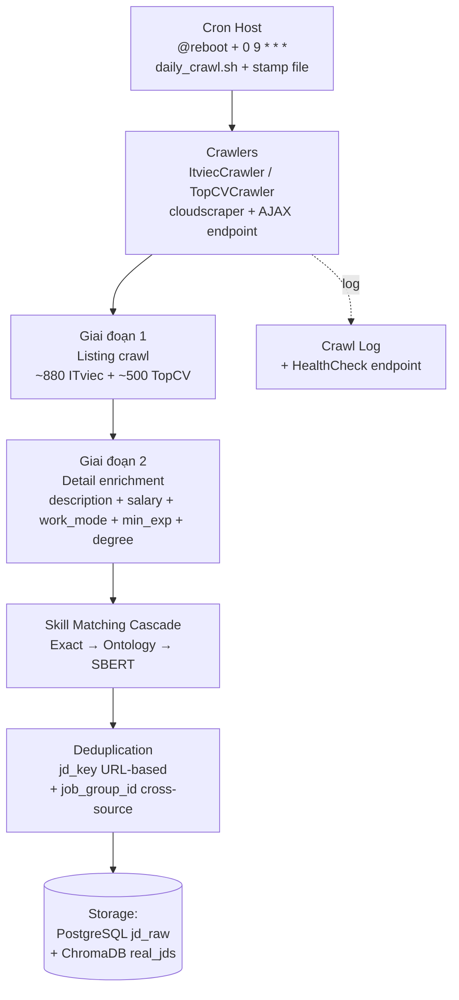

# 3.3 Thiết kế Pipeline Crawl JD và Time-series Database

Pipeline crawl JD là nền dữ liệu cho cả Multi-criteria Freshness Score (chiều Skill + Market Alignment) và Market Intelligence Dashboard. Đã trình bày phần lý thuyết web crawling trong [mục 2.3](../chuong2/2.3_web_crawling.md); mục này tập trung vào thiết kế cụ thể.

## 3.3.1 Kiến trúc Crawler Service



Pipeline gồm các bước tuyến tính: **Cron trigger → Crawl listing → Detail enrichment → Skill Matching → Deduplication → Lưu trữ**. Crawl Log ghi nhận trạng thái mỗi đợt crawl phục vụ monitoring. Lịch chạy daily qua cron host với fallback `@reboot` (5 phút sau khi máy bật), stamp file `/tmp/cv_crawler_last_run` đảm bảo chỉ crawl 1 lần/ngày kể cả khi máy được reboot nhiều lần — phù hợp khi máy nghiên cứu không chạy 24/7.

## 3.3.2 Thiết kế Adapter Pattern cho các nguồn

Mỗi nguồn JD có cấu trúc HTML khác nhau, dễ thay đổi theo thời gian. Adapter pattern tách logic riêng:

```python
class IJDCrawler(ABC):
    """Interface chung cho mọi nguồn JD."""

    @abstractmethod
    def crawl_listing(self, category: str, max_pages: int = 10) -> List[str]:
        """Trả về danh sách URL detail của JD."""

    @abstractmethod
    def crawl_detail(self, url: str) -> Optional[RawJD]:
        """Crawl chi tiết 1 JD, trả về dict theo schema chuẩn."""

    @abstractmethod
    def health_check(self) -> bool:
        """Kiểm tra crawler còn chạy được không (HTML đã đổi cấu trúc chưa)."""


class ItviecCrawler(IJDCrawler):
    BASE = "https://itviec.com/it-jobs"
    CATEGORY_PATHS = {
        "backend": "/backend-developer",
        "frontend": "/frontend-developer",
        # ...
    }

    def crawl_listing(self, category, max_pages=10):
        # Selenium load page, parse JD card links
        ...

    def crawl_detail(self, url):
        # Parse từng trường: title, company, skills, salary, location
        ...

    def health_check(self):
        # Crawl 1 URL mẫu, kiểm tra có đủ field bắt buộc
        ...
```

**Mỗi nguồn 1 file riêng.** `itviec_crawler.py`, `topcv_crawler.py`, ... Có thể test cô lập.

**Schema RawJD chuẩn hóa.**

```python
@dataclass
class RawJD:
    source: str             # 'itviec', 'topcv'
    source_id: str          # ID gốc trên trang nguồn
    title: str
    company: str
    description: str
    skills_text: List[str]  # skill text chưa chuẩn hóa
    salary_min: Optional[int]
    salary_max: Optional[int]
    salary_currency: str    # 'USD', 'VND'
    location: str
    exp_level: str          # 'junior', 'mid', 'senior'
    posted_date: date
    url: str
```

## 3.3.3 Deduplication — hai tầng `jd_key` và `job_group_id`

Trong dữ liệu JD crawl, có ba mức trùng lặp cần phân biệt và xử lý khác nhau (đã phân tích trong [mục 2.3.2](../chuong2/2.2_market_intelligence.md#232-cross-source-deduplication-bài-toán-và-giải-pháp-hash-based)):

1. **Intra-source duplicate**: cùng 1 nguồn nhưng cùng JD bị crawl 2 lần (do re-post hoặc crawl repeat).
2. **Cross-source duplicate**: cùng vị trí thực tế, đăng trên 2 nguồn khác nhau với URL khác nhau.
3. **Same-company different-role**: cùng công ty nhưng vị trí khác — không phải duplicate.

Đề tài dùng **hai tầng dedup** với hai khóa khác nhau, mỗi khóa giải quyết một loại duplicate:

### Tầng 1 — `jd_key` (URL-based) cho intra-source dedup

```python
def compute_jd_key(jd: RawJD) -> str:
    """Stable per-URL identifier. Cùng URL → cùng jd_key."""
    canonical_url = (jd.url or "").split("?")[0].rstrip("/")
    if canonical_url:
        payload = canonical_url
    else:
        payload = "|".join([jd.source, normalize_company(jd.company), normalize_title(jd.title)])
    return hashlib.sha1(payload.encode("utf-8")).hexdigest()[:16]
```

`jd_key` là primary key của bảng `jd_raw`. Strip query string khỏi URL (`?click_source=...`) để cùng JD truy cập từ link tracking khác nhau vẫn có cùng key. Khi crawl lại JD đã có, dùng PostgreSQL `INSERT ... ON CONFLICT DO UPDATE` — chỉ update `last_seen` + các field enrichment khi có `parsed_at`. Cách này đảm bảo: (i) không insert duplicate; (ii) data enrichment cũ không bị overwrite bởi run mới chỉ có data listing.

### Tầng 2 — `job_group_id` (company + title hash) cho cross-source dedup

```python
def compute_job_group_id(company: str, title: str) -> str:
    """Strict hash — chỉ match khi (company, title) sau lowercase khớp chính xác."""
    if not company or not title:
        return ""
    norm_co = " ".join(company.lower().split())
    norm_title = " ".join(title.lower().split())
    payload = f"{norm_co}|{norm_title}"
    return hashlib.sha1(payload.encode("utf-8")).hexdigest()[:16]
```

`job_group_id` là index riêng (không phải primary key) — nhiều `jd_raw` records có thể chia sẻ cùng `job_group_id` nếu là cùng vị trí từ các nguồn khác nhau. Khi query company-level analytics, dùng `COUNT(DISTINCT job_group_id)` thay vì `COUNT(*)` để tránh đếm trùng cross-source.

**Lý do chọn strict matching (không fuzzy).** Đề tài cố ý dùng strict normalization (chỉ lowercase + collapse whitespace) thay vì fuzzy matching (Levenshtein distance, soundex, hoặc strip "Co. Ltd"/"Software"). Fuzzy có thể nhầm các entity khác nhau thành cùng nhóm — ví dụ:

- "**FPT Software**" vs "**FPT Digital**" — hai công ty con khác nhau của FPT Group, nếu strip "Software"/"Digital" sẽ merge sai.
- "**VNG Corporation**" vs "**VNG Game Studio**" — VNG có nhiều subsidiary, merge sẽ làm sai analytics.

Strict matching đảm bảo: hai JD chỉ vào cùng `job_group_id` khi (company sau lowercase) **và** (title sau lowercase) khớp **chính xác** — chấp nhận false negative (bỏ sót một số duplicate có chính tả khác nhau) để tránh false positive (gộp nhầm).

### Trade-off và metric thực

Trên snapshot 1309 JDs (ITviec 809 + TopCV 500) sau crawl đầu tiên: phát hiện **5 cross-source duplicates** (cùng company + title xuất hiện trên cả 2 nguồn). Số này phù hợp thực tế: các công ty lớn thường ưu tiên đăng trên 1 nền tảng để tập trung quản lý CV ứng viên, chỉ một số ít công ty đăng song song.

## 3.3.4 Schema lưu trữ

### PostgreSQL — `jd_raw` (chi tiết) và `skill_trends` (aggregate)

```sql
-- Bảng JD đã crawl
CREATE TABLE jd_raw (
    jd_key          VARCHAR(16) PRIMARY KEY,
    source          VARCHAR(32) NOT NULL,
    source_id       VARCHAR(64),
    title           VARCHAR(255) NOT NULL,
    company         VARCHAR(255),
    description     TEXT,
    skills_canonical JSONB NOT NULL,   -- list canonical skills sau matching
    salary_min      INT,
    salary_max      INT,
    salary_currency VARCHAR(8),
    location        VARCHAR(64),
    exp_level       VARCHAR(16),
    role            VARCHAR(32),       -- backend/frontend/...
    posted_date     DATE NOT NULL,
    first_seen      TIMESTAMP NOT NULL,
    last_seen       TIMESTAMP NOT NULL,
    url             TEXT
);
CREATE INDEX idx_jd_posted ON jd_raw(posted_date);
CREATE INDEX idx_jd_role ON jd_raw(role);
CREATE INDEX idx_jd_skills ON jd_raw USING GIN (skills_canonical);

-- Bảng aggregate skill demand theo ngày
CREATE TABLE skill_trends (
    id              SERIAL PRIMARY KEY,
    skill_canonical VARCHAR(255) NOT NULL,
    snapshot_date   DATE NOT NULL,
    window_days     INT DEFAULT 7,
    role            VARCHAR(32),       -- nullable: tính cho tất cả role nếu NULL
    location        VARCHAR(64),       -- nullable
    demand_count    INT NOT NULL,
    UNIQUE (skill_canonical, snapshot_date, window_days, role, location)
);
CREATE INDEX idx_trends_skill_date ON skill_trends(skill_canonical, snapshot_date DESC);
```

### ChromaDB — collection `real_jds`

Mỗi document chứa vector embedding 384 chiều (từ Sentence-BERT), metadata kèm theo:

```python
collection.add(
    documents=[jd.description],
    embeddings=[sbert.encode(jd.description)],
    metadatas=[{
        "jd_key": jd.jd_key,
        "title": jd.title,
        "company": jd.company,
        "role": jd.role,
        "skills": json.dumps(jd.skills_canonical),
        "salary_min": jd.salary_min,
        "salary_max": jd.salary_max,
        "location": jd.location,
        "exp_level": jd.exp_level,
        "posted_date": jd.posted_date.isoformat(),
        "source": jd.source,
    }],
    ids=[jd.jd_key]
)
```

Sử dụng ChromaDB để:
- Tìm JD tương tự với CV (cho Opportunity Window).
- Tìm JD đại diện cho 1 role (lấy top JD cosine với "ideal CV" của role).

## 3.3.5 Job tính aggregate skill_trends hằng ngày

Sau mỗi đợt crawl, chạy aggregate job để cập nhật `skill_trends`:

```python
def aggregate_daily_skill_trends(snapshot_date: date, window_days: int = 7):
    """Tính demand_count cho mỗi skill trong cửa sổ [snapshot_date - window_days, snapshot_date]."""
    end_date = snapshot_date
    start_date = snapshot_date - timedelta(days=window_days)

    # Query JD đăng trong cửa sổ
    sql = """
        SELECT skill, role, location, COUNT(*) AS cnt
        FROM (
            SELECT jsonb_array_elements_text(skills_canonical) AS skill,
                   role, location
            FROM jd_raw
            WHERE posted_date >= %s AND posted_date <= %s
        ) AS s
        GROUP BY skill, role, location
    """
    rows = db.execute(sql, [start_date, end_date])

    # Upsert vào skill_trends
    for row in rows:
        upsert_skill_trend(
            skill_canonical=row['skill'],
            snapshot_date=snapshot_date,
            window_days=window_days,
            role=row['role'],
            location=row['location'],
            demand_count=row['cnt']
        )
```

Job này chạy ngay sau crawler, đảm bảo dashboard luôn có dữ liệu trend mới nhất.

## 3.3.6 Xử lý sự cố (Failure Modes)

| Sự cố | Phát hiện | Xử lý |
|---|---|---|
| Site đổi HTML structure | Health check fail (thiếu trường) | Log alert, fallback sang backup crawler, người vận hành review trong 1-2 ngày |
| Bị rate-limited (HTTP 429) | Detection trong response | Tăng sleep, retry sau 1 giờ. Nếu vẫn fail → dừng đợt crawl ngày đó |
| Cloudflare challenge | Selenium không pass được | Dùng `undetected-chromedriver` trong lần retry |
| DB connection error | Exception khi insert | Lưu batch vào file JSON tạm, retry insert sau 5 phút |
| Memory leak (Selenium) | Process > 2GB | Kill và restart browser mỗi 50 JD |

Tất cả sự cố và xử lý đều được log vào `crawler_log` table để audit, không silent fail.

## 3.3.7 Tuân thủ ToS và đạo đức

Đã trình bày trong [mục 2.4.5](../chuong2/2.3_web_crawling.md). Trong giai đoạn cài đặt, đề tài thêm các biện pháp:

- **Rate limiting nghiêm ngặt:** sleep ngẫu nhiên 3–6s giữa các request detail page (cao hơn lý thuyết).
- **User-Agent thông báo:** dùng UA có chú thích `... (academic research; contact: <student_email>)` để admin nguồn có thể liên hệ nếu có vấn đề.
- **Không crawl thông tin liên hệ ứng viên:** chỉ crawl trang công khai về job, không crawl trang ứng viên (vốn cần đăng nhập).
- **Không phân phối lại dữ liệu thô.** Bộ dữ liệu chỉ tồn tại trong môi trường nội bộ, được anonymize trước khi đưa vào báo cáo.

---

[← 3.2 Multi-criteria CV Freshness](./3.2_thiet_ke_freshness_score.md) | [→ 3.4 Thiết kế Market Intelligence Dashboard](./3.4_thiet_ke_market_intel.md)
