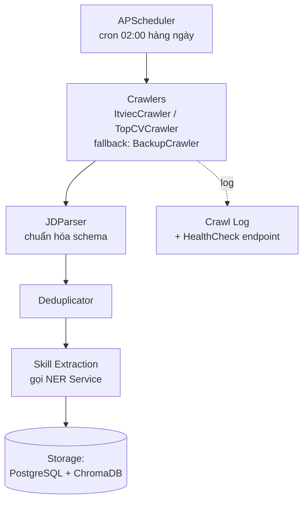

# 3.4 Thiết kế Pipeline Crawl JD và Time-series Database

Pipeline crawl JD là nền dữ liệu cho cả Freshness Score và Learning Path Optimizer. Đã trình bày phần lý thuyết web crawling trong [mục 2.4](../chuong2/2.4_web_crawling.md); mục này tập trung vào thiết kế cụ thể.

## 3.4.1 Kiến trúc Crawler Service



Pipeline gồm 5 bước tuyến tính: **Lịch chạy → Crawl → Parse → Deduplicate → Trích xuất skill → Lưu trữ**. Crawl Log ghi nhận trạng thái của mỗi đợt crawl phục vụ monitoring.

## 3.4.2 Thiết kế Adapter Pattern cho các nguồn

Mỗi nguồn JD có cấu trúc HTML khác nhau, dễ thay đổi theo thời gian. Adapter pattern tách logic riêng:

```python
class IJDCrawler(ABC):
    """Interface chung cho mọi nguồn JD."""

    @abstractmethod
    def crawl_listing(self, category: str, max_pages: int = 10) -> List[str]:
        """Trả về danh sách URL detail của JD."""

    @abstractmethod
    def crawl_detail(self, url: str) -> Optional[RawJD]:
        """Crawl chi tiết 1 JD, trả về dict theo schema chuẩn."""

    @abstractmethod
    def health_check(self) -> bool:
        """Kiểm tra crawler còn chạy được không (HTML đã đổi cấu trúc chưa)."""


class ItviecCrawler(IJDCrawler):
    BASE = "https://itviec.com/it-jobs"
    CATEGORY_PATHS = {
        "backend": "/backend-developer",
        "frontend": "/frontend-developer",
        # ...
    }

    def crawl_listing(self, category, max_pages=10):
        # Selenium load page, parse JD card links
        ...

    def crawl_detail(self, url):
        # Parse từng trường: title, company, skills, salary, location
        ...

    def health_check(self):
        # Crawl 1 URL mẫu, kiểm tra có đủ field bắt buộc
        ...
```

**Mỗi nguồn 1 file riêng.** `itviec_crawler.py`, `topcv_crawler.py`, ... Có thể test cô lập.

**Schema RawJD chuẩn hóa.**

```python
@dataclass
class RawJD:
    source: str             # 'itviec', 'topcv'
    source_id: str          # ID gốc trên trang nguồn
    title: str
    company: str
    description: str
    skills_text: List[str]  # skill text chưa chuẩn hóa
    salary_min: Optional[int]
    salary_max: Optional[int]
    salary_currency: str    # 'USD', 'VND'
    location: str
    exp_level: str          # 'junior', 'mid', 'senior'
    posted_date: date
    url: str
```

## 3.4.3 Deduplication

Cùng một JD có thể xuất hiện trên nhiều ngày (do tuyển dụng dài ngày) hoặc trên nhiều nguồn (company đăng cả ITviec và TopCV). Đề tài dùng khóa duy nhất:

```python
def compute_jd_key(jd: RawJD) -> str:
    parts = [
        normalize_company(jd.company),       # lowercase, remove "Co. Ltd", etc.
        normalize_title(jd.title),           # lowercase, remove level suffixes
        jd.posted_date.isocalendar()[:2]     # (year, week_number)
    ]
    return hashlib.sha1("|".join(map(str, parts)).encode()).hexdigest()[:16]
```

**Lý do dùng tuần thay vì ngày:** một JD đăng nhiều ngày liên tiếp được coi là 1 entry duy nhất trong tuần đó.

**Lý do dùng company + title:** company-title combo thường unique. Nếu cùng company tuyển 2 vị trí Backend cùng tuần (hiếm) → coi là 1, chấp nhận sai số nhỏ.

Trước khi insert vào DB, check `jd_key` đã tồn tại chưa. Nếu rồi, chỉ update trường `last_seen_date` (để biết JD vẫn active).

## 3.4.4 Schema lưu trữ

### PostgreSQL — `jd_raw` (chi tiết) và `skill_trends` (aggregate)

```sql
-- Bảng JD đã crawl
CREATE TABLE jd_raw (
    jd_key          VARCHAR(16) PRIMARY KEY,
    source          VARCHAR(32) NOT NULL,
    source_id       VARCHAR(64),
    title           VARCHAR(255) NOT NULL,
    company         VARCHAR(255),
    description     TEXT,
    skills_canonical JSONB NOT NULL,   -- list canonical skills sau matching
    salary_min      INT,
    salary_max      INT,
    salary_currency VARCHAR(8),
    location        VARCHAR(64),
    exp_level       VARCHAR(16),
    role            VARCHAR(32),       -- backend/frontend/...
    posted_date     DATE NOT NULL,
    first_seen      TIMESTAMP NOT NULL,
    last_seen       TIMESTAMP NOT NULL,
    url             TEXT
);
CREATE INDEX idx_jd_posted ON jd_raw(posted_date);
CREATE INDEX idx_jd_role ON jd_raw(role);
CREATE INDEX idx_jd_skills ON jd_raw USING GIN (skills_canonical);

-- Bảng aggregate skill demand theo ngày
CREATE TABLE skill_trends (
    id              SERIAL PRIMARY KEY,
    skill_canonical VARCHAR(255) NOT NULL,
    snapshot_date   DATE NOT NULL,
    window_days     INT DEFAULT 7,
    role            VARCHAR(32),       -- nullable: tính cho tất cả role nếu NULL
    location        VARCHAR(64),       -- nullable
    demand_count    INT NOT NULL,
    UNIQUE (skill_canonical, snapshot_date, window_days, role, location)
);
CREATE INDEX idx_trends_skill_date ON skill_trends(skill_canonical, snapshot_date DESC);
```

### ChromaDB — collection `real_jds`

Mỗi document chứa vector embedding 384 chiều (từ Sentence-BERT), metadata kèm theo:

```python
collection.add(
    documents=[jd.description],
    embeddings=[sbert.encode(jd.description)],
    metadatas=[{
        "jd_key": jd.jd_key,
        "title": jd.title,
        "company": jd.company,
        "role": jd.role,
        "skills": json.dumps(jd.skills_canonical),
        "salary_min": jd.salary_min,
        "salary_max": jd.salary_max,
        "location": jd.location,
        "exp_level": jd.exp_level,
        "posted_date": jd.posted_date.isoformat(),
        "source": jd.source,
    }],
    ids=[jd.jd_key]
)
```

Sử dụng ChromaDB để:
- Tìm JD tương tự với CV (cho Opportunity Window).
- Tìm JD đại diện cho 1 role (lấy top JD cosine với "ideal CV" của role).

## 3.4.5 Job tính aggregate skill_trends hằng ngày

Sau mỗi đợt crawl, chạy aggregate job để cập nhật `skill_trends`:

```python
def aggregate_daily_skill_trends(snapshot_date: date, window_days: int = 7):
    """Tính demand_count cho mỗi skill trong cửa sổ [snapshot_date - window_days, snapshot_date]."""
    end_date = snapshot_date
    start_date = snapshot_date - timedelta(days=window_days)

    # Query JD đăng trong cửa sổ
    sql = """
        SELECT skill, role, location, COUNT(*) AS cnt
        FROM (
            SELECT jsonb_array_elements_text(skills_canonical) AS skill,
                   role, location
            FROM jd_raw
            WHERE posted_date >= %s AND posted_date <= %s
        ) AS s
        GROUP BY skill, role, location
    """
    rows = db.execute(sql, [start_date, end_date])

    # Upsert vào skill_trends
    for row in rows:
        upsert_skill_trend(
            skill_canonical=row['skill'],
            snapshot_date=snapshot_date,
            window_days=window_days,
            role=row['role'],
            location=row['location'],
            demand_count=row['cnt']
        )
```

Job này chạy ngay sau crawler, đảm bảo dashboard luôn có dữ liệu trend mới nhất.

## 3.4.6 Xử lý sự cố (Failure Modes)

| Sự cố | Phát hiện | Xử lý |
|---|---|---|
| Site đổi HTML structure | Health check fail (thiếu trường) | Log alert, fallback sang backup crawler, người vận hành review trong 1-2 ngày |
| Bị rate-limited (HTTP 429) | Detection trong response | Tăng sleep, retry sau 1 giờ. Nếu vẫn fail → dừng đợt crawl ngày đó |
| Cloudflare challenge | Selenium không pass được | Dùng `undetected-chromedriver` trong lần retry |
| DB connection error | Exception khi insert | Lưu batch vào file JSON tạm, retry insert sau 5 phút |
| Memory leak (Selenium) | Process > 2GB | Kill và restart browser mỗi 50 JD |

Tất cả sự cố và xử lý đều được log vào `crawler_log` table để audit, không silent fail.

## 3.4.7 Tuân thủ ToS và đạo đức

Đã trình bày trong [mục 2.4.5](../chuong2/2.4_web_crawling.md). Trong giai đoạn cài đặt, đề tài thêm các biện pháp:

- **Rate limiting nghiêm ngặt:** sleep ngẫu nhiên 3–6s giữa các request detail page (cao hơn lý thuyết).
- **User-Agent thông báo:** dùng UA có chú thích `... (academic research; contact: <student_email>)` để admin nguồn có thể liên hệ nếu có vấn đề.
- **Không crawl thông tin liên hệ ứng viên:** chỉ crawl trang công khai về job, không crawl trang ứng viên (vốn cần đăng nhập).
- **Không phân phối lại dữ liệu thô.** Bộ dữ liệu chỉ tồn tại trong môi trường nội bộ, được anonymize trước khi đưa vào báo cáo.

---

[← 3.3 Thiết kế Learning Path Optimizer](./3.3_thiet_ke_learning_path_optimizer.md) | [→ 3.5 Thiết kế CV Health Dashboard](./3.5_thiet_ke_dashboard.md)
