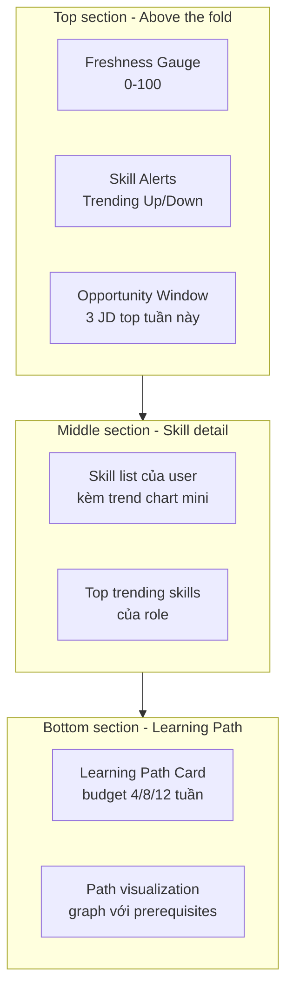
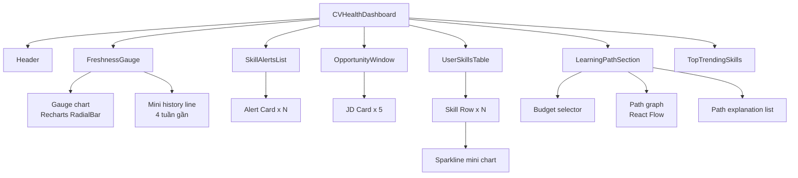
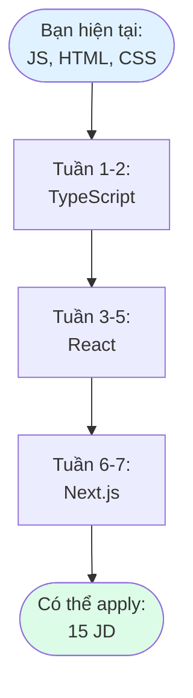
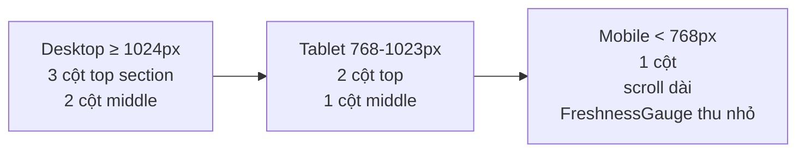

# 3.5 Thiết kế CV Health Dashboard

## 3.5.1 Nguyên tắc thiết kế UI

Dashboard hiển thị nhiều loại thông tin phức tạp: Freshness Score, time-series trends, learning path, JD list. Việc thiết kế tuân theo các nguyên tắc của Few (2006) [[9]](../tai_lieu_tham_khao.md#ref-9):

**Nguyên tắc 1 — Above the fold đầy đủ thông tin chính.** Người dùng load dashboard nhìn thấy ngay 3 thứ quan trọng nhất: (1) Freshness Score hiện tại, (2) Skill alerts mới, (3) Top JD phù hợp tuần này. Không cần scroll mới thấy giá trị.

**Nguyên tắc 2 — Tránh chart junk.** Không dùng 3D, gradient phức tạp, animation thừa. Mọi yếu tố visual phải có lý do.

**Nguyên tắc 3 — Highlight cái khác biệt.** Skill alerts (skill đang trending) được highlight màu, các skill bình thường để màu nhạt. Người dùng quét mắt phát hiện ngay.

**Nguyên tắc 4 — Cho phép drill-down.** Số liệu tổng (Freshness Score) phải click được để xem breakdown chi tiết.

**Nguyên tắc 5 — Cung cấp context.** Mỗi số liệu kèm so sánh: "Freshness 72/100, tăng 5 điểm so với tuần trước", "ATS với JD này 78%, top 20% so với ứng viên khác".

## 3.5.2 Bố cục Dashboard



**Wireframe text mô tả:**

```
┌────────────────────────────────────────────────────────────┐
│ Logo  |  Dashboard  Career  Settings    [User Avatar]      │
├────────────────────────────────────────────────────────────┤
│                                                            │
│  ┌──────────────┐  ┌──────────────────┐  ┌──────────────┐  │
│  │              │  │ Skill Alerts (3) │  │ Opportunity  │  │
│  │  Freshness   │  │ • TS trending up │  │ Window (5)   │  │
│  │     72       │  │ • PHP trending dn│  │ • Backend Dev│  │
│  │   /100       │  │ • Rust emerging  │  │   Cty X, 82% │  │
│  │              │  │                  │  │ • Frontend...│  │
│  │  ▲ +5 tuần   │  │   [Xem chi tiết] │  │              │  │
│  │   trước      │  │                  │  │  [Xem tất cả]│  │
│  └──────────────┘  └──────────────────┘  └──────────────┘  │
│                                                            │
│  ─────────  Skills của bạn  ─────────────────────────────  │
│  Python        ●●●●●●○○○○  trend 1.05  ▁▃▅▇  [Detail]      │
│  Django        ●●●●●○○○○○  trend 0.95  ▆▅▅▄  [Detail]      │
│  PHP           ●●○○○○○○○○  trend 0.60  ▇▅▃▁  ⚠️ Dropping   │
│  ...                                                       │
│                                                            │
│  ─────────  Learning Path  ──────────────────────────────  │
│  [Budget: 4 tuần ▼]   [Generate Path]                      │
│                                                            │
│   1. TypeScript (2 tuần) → unlock 3 JD                     │
│   2. PostgreSQL (2 tuần) → unlock 2 JD                     │
│   ───────────────────────                                  │
│   Tổng: 4 tuần, +5 JD có thể apply                         │
│                                                            │
│   [Xem path visualization]  [So sánh budget khác]          │
└────────────────────────────────────────────────────────────┘
```

## 3.5.3 Component breakdown

Dashboard được tách thành các React component riêng biệt, mỗi component có một trách nhiệm:



**Chi tiết các component quan trọng:**

**FreshnessGauge.** Vòng tròn gauge từ 0–100, màu sắc:
- 0–40: đỏ (CV cần cải thiện)
- 41–70: vàng (CV trung bình)
- 71–100: xanh (CV ổn)

Click vào gauge mở modal Breakdown:
- Skill nào đóng góp tích cực (top 5).
- Skill nào kéo score xuống (top 5).
- Gợi ý cải thiện ("Thêm TypeScript có thể tăng score +8 điểm").

**SkillAlertsList.** Mỗi alert là card có:
- Tên skill và status badge (Trending Up/Down/Emerging).
- Lý do alert: "Demand tăng 25% trong 4 tuần qua".
- CTA button: "Xem trend chart" / "Thêm vào learning path".

**LearningPathSection.** Phần quan trọng nhất, có 2 chế độ:
- *Compact:* danh sách 3-5 skill xếp theo thứ tự học, kèm cost và JD unlock.
- *Expanded:* graph visualization (React Flow) cho thấy prerequisites và thứ tự.

**Hình 3.5: Mockup Learning Path Graph (Expanded view)**



## 3.5.4 Tương tác với Backend

Mỗi component gọi API riêng, sử dụng React Query để cache và auto-refetch:

| Component | API | Cache TTL | Re-fetch trigger |
|---|---|---|---|
| FreshnessGauge | `GET /api/freshness/me` | 5 phút | CV update, manual refresh |
| SkillAlertsList | `GET /api/alerts/me` | 1 giờ | Daily, manual refresh |
| OpportunityWindow | `GET /api/opportunities/me?limit=5` | 1 giờ | Daily |
| UserSkillsTable | `GET /api/cv/skills` + `GET /api/trends?skills=...` | 30 phút | CV update |
| LearningPathSection | `POST /api/learning-path` | Không cache | User thay budget |
| TopTrendingSkills | `GET /api/trends/top?role=...` | 1 giờ | Daily |

Tách API rõ ràng cho phép:
- Mỗi component fail độc lập (FreshnessGauge fail không ảnh hưởng Alerts).
- Lazy load component không nhìn thấy (TopTrendingSkills load sau khi user scroll).
- Cache hợp lý theo tốc độ thay đổi của data.

## 3.5.5 Responsive design

Dashboard cần hoạt động trên cả desktop và mobile (sinh viên thường mở trên điện thoại):



Sử dụng Tailwind CSS với breakpoints `sm`, `md`, `lg`. Component nào không thiết yếu trên mobile (ví dụ Path Graph expanded view) ẩn đi, chỉ giữ compact list.

## 3.5.6 Accessibility (A11y)

- **Contrast ratio ≥ 4.5:1** cho mọi text trên background (WCAG AA).
- **Keyboard navigation:** Tab xuyên qua các component theo thứ tự logic.
- **Screen reader:** mỗi gauge, chart có `aria-label` mô tả số liệu chính.
- **Color không phải tín hiệu duy nhất:** Skill alert dùng cả màu và icon (▲▼) để người mù màu vẫn phân biệt được.

## 3.5.7 Hành vi khi không có dữ liệu (Empty states)

| Trạng thái | Behavior |
|---|---|
| Chưa upload CV | Hiển thị wizard "Upload CV để bắt đầu" thay vì dashboard trống |
| CV đã upload nhưng < 4 tuần dữ liệu market | Skill alerts hiển thị "Đang thu thập dữ liệu..., quay lại sau X ngày" |
| Không có JD phù hợp tuần này | Opportunity Window hiển thị "Chưa có JD mới phù hợp, thử mở rộng vai trò mục tiêu" |
| Learning Path không sinh được (skill set đã đủ rồi) | "CV của bạn đã đủ kỹ năng cho hầu hết JD, chỉ cần luyện thêm kinh nghiệm thực tế!" |

Empty states quan trọng vì giai đoạn đầu của user study, nhiều người dùng sẽ ở các trạng thái này.

---

[← 3.4 Thiết kế pipeline crawl JD](./3.4_thiet_ke_pipeline_crawl.md) | [→ 3.6 Thiết kế kiến trúc tổng thể](./3.6_thiet_ke_kien_truc.md)
