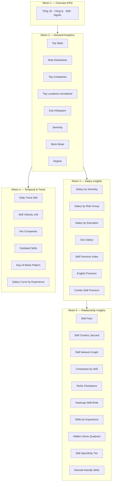

# 3.7 Thiết kế Market Intelligence Dashboard

## 3.7.1 Vai trò trong hệ thống

Market Intelligence Dashboard (gọi tắt **Market Intel**) là tầng trình bày dữ liệu thị trường tuyển dụng IT Việt Nam. Khác với CV Health Dashboard (3.5) tập trung vào trạng thái cá nhân của người dùng, Market Intel cung cấp **bức tranh vĩ mô** giúp người dùng đối chiếu CV của mình với mặt bằng chung của thị trường:

- Skill nào đang được tuyển nhiều nhất?
- Skill nào trả lương cao hơn trung bình?
- Stack công nghệ nào hay đi cùng nhau?
- Công ty nào đang scale tuyển dụng?

Trong kiến trúc tổng thể, Market Intel là thành phần thứ ba bổ trợ cho ba thành phần lõi của đề tài:


Market Intel **không cá nhân hóa** — mọi người dùng truy cập đều thấy cùng dữ liệu. Việc cá nhân hóa thuộc về CV Health (Section 3.5).

## 3.7.2 Nguồn dữ liệu

Dữ liệu được tổng hợp từ bảng `jd_raw` (xem Section 3.4), tích lũy từ hai nguồn:

| Nguồn | Số JD | Đặc điểm |
|---|---|---|
| **ITviec** | ~970 | JD chuyên IT, có salary chip rõ ràng (USD), enrichment qua LLM đầy đủ |
| **TopCV** | ~600 | JD đa ngành nghề (lọc IT), salary VND, location đầy đủ nhưng ít enrichment |

Tổng cộng ~1,500 JD đảm bảo các aggregation thống kê có ý nghĩa (most insight cần ≥30 mẫu/bucket để tránh nhiễu).

> **Lưu ý phạm vi:** Đề tài thử nghiệm hai nguồn bổ sung (UIT forum, HCMUS FIT) trong giai đoạn prototype nhưng tạm thời tắt vì: (1) tỷ lệ "event post" (Career Tour, Job Fair) lẫn vào JD thật chiếm tới 60%, (2) chưa có filter heuristic đủ tin cậy. Code crawler giữ lại để mở rộng trong tương lai.

## 3.7.3 Nguyên tắc thiết kế

Market Intel áp dụng các nguyên tắc dashboard của Few (2006) [[9]](../tai_lieu_tham_khao.md#ref-9) tương tự CV Health (Section 3.5.1), bổ sung thêm ba nguyên tắc riêng cho **analytics dashboard**:

**Nguyên tắc 6 — Insight trước, biểu đồ sau.** Mỗi widget phải trả lời một câu hỏi cụ thể của người dùng. Ví dụ: thay vì "Top Skills Chart", widget được đặt tên "Top kỹ năng được tuyển nhiều nhất" để định hướng người đọc.

**Nguyên tắc 7 — Cao cấp hóa dần (progressive disclosure).** Mặt trước trình bày KPI tổng (số JD, công ty, skills). Người dùng cuộn xuống mới thấy chi tiết: skill premium, cluster, network graph. Tránh quá tải nhận thức ngay từ trên xuống.

**Nguyên tắc 8 — Cho phép so sánh (compare mode).** Filter Bar có dropdown "So sánh với role" cho phép xếp chồng đường xu hướng của hai role group → người dùng tự rút ra insight thay vì hệ thống áp đặt.

## 3.7.4 Kiến trúc 33 insights

Hệ thống cung cấp 33 widget chia thành 5 nhóm chức năng:



### Nhóm 1 — Overview KPIs (4 chỉ số tổng)
Card đầu trang: **Tổng JD · Công ty · Kỹ năng độc lập · Nguồn**, kèm sparkline 30 ngày để thấy đà tăng trưởng và animated counter cho cảm giác "data đang sống".

### Nhóm 2 — Demand Analytics (8 widget)
Trả lời câu hỏi *"Thị trường đang cần gì?"*:

| Widget | Câu hỏi trả lời |
|---|---|
| Top Skills (custom gradient bars) | Skill nào đang HOT |
| Role Distribution (donut + legend) | Cơ cấu nhóm vai trò |
| Top Companies | Cty nào tuyển nhiều nhất |
| Top Locations | Thành phố nào nhiều JD (đã normalize HCM/HN/ĐN) |
| Exp Histogram | Bao nhiêu JD nhận fresher |
| Seniority Distribution | Junior vs Senior tỉ lệ ra sao |
| Work Mode | Onsite vs Hybrid vs Remote |
| Degree Required | Bằng cấp yêu cầu phổ biến |

### Nhóm 3 — Salary Insights (7 widget)
Trọng tâm phân tích lương — đây là nhóm có giá trị thực tiễn cao nhất cho sinh viên:

- **Salary by Seniority**: median min/max theo cấp độ
- **Salary by Role Group**: box-style chart với median + P25-P75
- **Salary by Education**: bằng cấp ảnh hưởng lương ra sao
- **Geo Salary**: so sánh lương HCM vs HN vs ĐN, có dải P25-P75
- **Skill Premium Index ⭐**: skill nào trả lương cao hơn / thấp hơn median toàn thị trường (%)
- **English Premium ⭐**: KPI hero — chứng minh số tiền cụ thể tiếng Anh đem lại
- **Combo Skill Premium**: kết hợp 2 skill (Java + Spring) lương vs từng skill riêng

### Nhóm 4 — Temporal & Trend (6 widget)
Trả lời câu hỏi *"Thị trường đang thay đổi như thế nào?"*:

- **Daily Trend 30 ngày**: line chart, overlay role để so sánh
- **Skill Velocity 14d/14d**: trending up vs trending down (delta tuyệt đối + %)
- **Hot Companies**: cty velocity, biết cty nào đang scale
- **Outdated Skills**: skill giảm 4 tuần liên tiếp, sparkline 4 cột
- **Day-of-Week Pattern**: thứ mấy đăng JD nhiều nhất (cho SV biết khi nào check job board)
- **Salary Curve by Experience**: multi-line median salary qua các bucket exp × top 4 roles

### Nhóm 5 — Relationship Insights (10 widget)
Phân tích mối liên hệ giữa skills, công ty, role:

- **Skill Pairs**: top 12 cặp skill hay đi cùng
- **Skill Clusters** (Jaccard ≥ 0.15): community detection bằng Union-Find
- **Skill Network Graph ⭐**: SVG radial 30 nodes + 110 edges, hover highlight
- **Companies by Skill**: chip selector tương tác — click skill xem 3 cty tuyển nhiều nhất
- **Niche Champions**: cty tuyển nhiều skill hiếm (3-25 JD/skill)
- **Heatmap Skill × Role**: ma trận top 10 × top 6 với màu intensity
- **Skills by Experience**: chip cloud theo bucket fresher/junior/mid/senior
- **Hidden Gems Quadrant ⭐**: scatter X=demand, Y=salary, highlight quadrant low-demand × high-salary
- **Skill Specificity Tier**: core (>30% JD) / common / specialized
- **Remote-friendly Skills**: % JD remote+hybrid cho top 15 skills

## 3.7.5 Thuật toán & xử lý dữ liệu

### a) Skill Clustering (Jaccard + Union-Find)

Để phát hiện các "stack" mà thị trường tuyển kèm nhau (ví dụ Frontend stack = React + Node + TS), hệ thống sử dụng:

1. **Top 30 skills** theo frequency (giới hạn để tránh O(n²) cross-join nổ).
2. **Pair count**: SQL self-join trên `jsonb_array_elements_text(skills_canonical)` để đếm số JD chứa cả skill A và skill B.
3. **Jaccard threshold**: chỉ giữ edge khi $J(A, B) = \frac{|A \cap B|}{|A \cup B|} \geq 0.15$ — đảm bảo cặp skill thực sự đi cùng chứ không chỉ vì đều phổ biến.
4. **Union-Find** (Disjoint Set Union) để gom các skill liên thông thành cluster.
5. **Label cluster** bằng top-3 skill có tổng edge weight cao nhất.

Kết quả thực nghiệm (data 1,566 JD, tháng 5/2026):
- Cluster 1: **React + Node + JavaScript + TypeScript** (Frontend stack)
- Cluster 2: **Agile + Project Management + Business Analysis + Team Management** (PM stack)
- Cluster 3: **Python + AI + SQL** (Data/AI stack)
- Cluster 4: **QA QC + Tester + Automation Test** (QA stack)

### b) Skill Premium Index

Đo lường skill nào trả lương cao hơn / thấp hơn median toàn thị trường:

$$\text{Premium}(s) = \left( \frac{\text{median\_salary}(s)}{\text{median\_salary}(\text{all})} - 1 \right) \times 100\%$$

Chỉ tính với JD có `salary_currency = 'USD'` để loại nhiễu đa đơn vị. Yêu cầu mỗi skill có ≥5 JD để đủ mẫu cho percentile.

### c) Skill Velocity (14d vs 14d)

So sánh số lần xuất hiện skill trong JD đăng 14 ngày gần nhất với 14 ngày trước đó:

$$\Delta_{\text{abs}}(s) = N_{[-14, 0]}(s) - N_{[-28, -14]}(s)$$
$$\Delta_{\text{pct}}(s) = \frac{N_{[-14, 0]}(s)}{N_{[-28, -14]}(s)} - 1$$

Filter: tổng 2 cửa sổ ≥ 8 để loại noise. Sắp xếp theo $\Delta_{\text{abs}}$ thay vì $\Delta_{\text{pct}}$ vì skill nhỏ dễ có % growth ảo.

### d) Hidden Gems Quadrant

Skill được gán `is_gem = True` khi cùng lúc:
- **Low demand**: số JD < 30 (tránh bị overshadow bởi skill phổ biến)
- **High salary**: median salary > median tổng thể

Trực quan hóa: SVG scatter chart, trục X là số JD, trục Y là median salary. Bubble size theo log(cnt). Skill gem màu xanh emerald, còn lại màu indigo. Hover bubble → highlight liên kết với danh sách bên phải.

### e) Cache layer

Toàn bộ aggregation phía backend được cache TTL 5 phút trong RAM:

```python
_CACHE: dict[tuple, tuple[float, dict]] = {}
_CACHE_TTL_SEC = 300
```

Cache key bao gồm `(source, role_group, seniority)` — request lặp lại với cùng filter trả về < 1ms. Dashboard sinh ra ~25KB JSON/request (đã gzip còn ~6KB).

## 3.7.6 API thiết kế

**Single endpoint** `GET /market-intel/dashboard?source=&role_group=&seniority=` trả toàn bộ payload trong một call. Lý do gộp:
- Tránh 33 round-trip HTTP, mỗi cái 30-50ms qua gateway.
- Đảm bảo các widget consistent với cùng filter snapshot.
- Payload nhỏ (25KB) — gửi một lần vẫn nhanh hơn 33 fetches.

Response schema gồm 22 trường lớn (mỗi trường = 1 widget hoặc 1 nhóm widget). Định nghĩa đầy đủ tại `services/skill_service/services/market_intel.py`.

## 3.7.7 Tổng kết

Market Intel Dashboard cung cấp **bối cảnh thị trường** mà CV Health Dashboard cần để đưa ra recommendation có ý nghĩa thực tế. Việc tổng hợp 33 insight trên cùng một trang, kết hợp các thuật toán phi-trivial (Jaccard clustering, Premium Index, Velocity, Hidden Gems quadrant), tạo ra **lớp giá trị** mà các báo cáo thị trường thường niên (TopDev, VietnamWorks) hiện chưa có:

- Báo cáo truyền thống = top skills + lương trung bình (đã có ở 2-3 widget đầu)
- Market Intel = bổ sung thêm cluster, premium, velocity, hidden gems, network, drill-down theo skill

Đây cũng là tầng dữ liệu cho phép mở rộng hệ thống về sau: gợi ý JD theo CV, gợi ý course theo skill gap, hoặc xây model dự báo lương — đều có thể tái sử dụng các aggregation hiện có mà không cần re-crawl.
