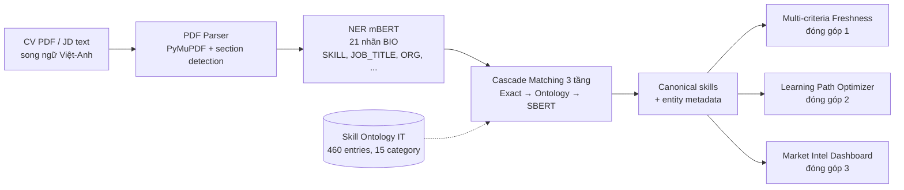
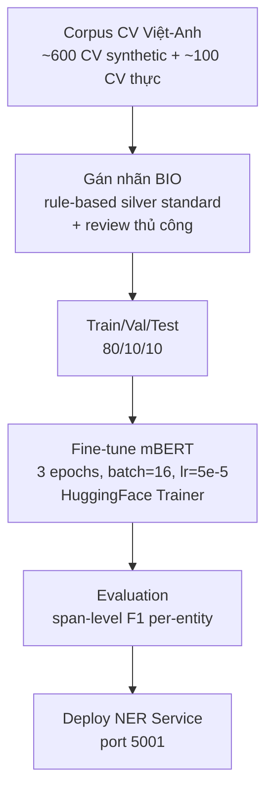
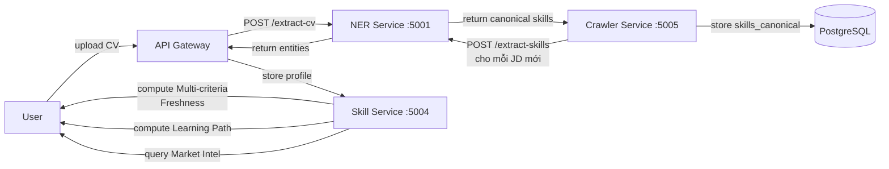

# 3.6 Thiết kế Skill Extraction & Matching Pipeline

> **Lưu ý:** Mục này trình bày thiết kế cho **Bilingual Skill Extraction & Matching Pipeline** — thành phần infrastructure tiền xử lý CV/JD cho ba đóng góp khoa học chính của đề tài (Multi-criteria Freshness, Learning Path, Market Intel). Pipeline này không phải là đóng góp khoa học chính nhưng là nền tảng kỹ thuật cần thiết. Cơ sở lý thuyết của NER, Ontology, SBERT, Cascade Matching đã được trình bày trong [mục 2.5](../chuong2/2.5_pipeline_trich_xuat_ky_nang.md); mục này tập trung vào phần thiết kế cài đặt cụ thể.

## 3.6.1 Tổng quan kiến trúc pipeline

Pipeline tiền xử lý CV/JD gồm ba thành phần chính, được tổ chức theo flow tuần tự:



Mỗi thành phần được đóng gói thành module độc lập trong service `ner_service` (Python FastAPI, port 5001), giao tiếp qua REST API:

- `POST /extract-cv` — trích entity từ CV upload (PDF/DOCX/text), trả về structured data.
- `POST /extract-skills` — trích skill từ text (CV hoặc JD).
- `POST /normalize-skill` — chuẩn hóa skill text về canonical name qua Cascade Matching.

## 3.6.2 NER mBERT fine-tune cho CV/JD song ngữ Việt-Anh

### Lựa chọn mô hình base

Đề tài chọn `bert-base-multilingual-cased` (mBERT) làm backbone NER với các lý do đã phân tích trong [mục 2.5.1](../chuong2/2.5_pipeline_trich_xuat_ky_nang.md#251-named-entity-recognition-và-mô-hình-bert-đa-ngôn-ngữ-mbert) — phù hợp nhất với CV/JD CNTT Việt Nam có hiện tượng code-switching Việt-Anh. mBERT có 178M parameters, hỗ trợ 104 ngôn ngữ với vocabulary chung 119.547 WordPiece tokens.

### Schema 21 nhãn BIO

Đề tài định nghĩa **10 loại thực thể** quan trọng cho domain CV/JD CNTT, mỗi loại có 2 nhãn B/I (tổng 20 nhãn + 1 nhãn O = 21 nhãn BIO):

**Bảng 3.4: 10 loại thực thể trong NER pipeline**

| # | Entity | Mô tả | Ví dụ |
|---|---|---|---|
| 1 | SKILL | Kỹ năng kỹ thuật | Python, React, Docker, Kubernetes |
| 2 | JOB_TITLE | Chức danh công việc | Senior Backend Developer, AI Engineer |
| 3 | ORG | Tên công ty/tổ chức | FPT Software, VNG, Shopee, MIT |
| 4 | PER | Tên người | Nguyễn Văn A, John Smith |
| 5 | DATE | Thời gian | 2020-2023, 5 năm, January 2025 |
| 6 | LOC | Địa danh | Hà Nội, Ho Chi Minh City, Da Nang |
| 7 | DEGREE | Bằng cấp | Bachelor, Master, Cử nhân, Thạc sĩ |
| 8 | MAJOR | Chuyên ngành | Computer Science, CNTT, Software Engineering |
| 9 | CERT | Chứng chỉ | AWS Certified, TOEIC 800, IELTS 7.0 |
| 10 | EMAIL/PHONE | Thông tin liên hệ | abc@gmail.com, +84... |

Schema BIO cho phép xử lý các thực thể multi-token (ví dụ "Senior Python Developer" = `B-JOB_TITLE I-JOB_TITLE I-JOB_TITLE`).

### Quy trình fine-tune



**Hyperparameter chính**:
- Max sequence length: 256 tokens
- Batch size: 16
- Learning rate: 5e-5 với linear warmup
- Epochs: 3 (early stopping nếu val loss tăng)
- Optimizer: AdamW
- Aggregation strategy: `simple` (gộp WordPiece thành span entities)

### Inference và post-processing

Pipeline inference qua HuggingFace pipeline:

```python
from transformers import pipeline

ner_pipeline = pipeline(
    "ner",
    model="./models/ner/final",
    aggregation_strategy="simple",
    device=0 if torch.cuda.is_available() else -1
)

entities = ner_pipeline(cv_text)
# entities = [{"entity_group": "SKILL", "word": "Python", "score": 0.99, ...}, ...]
```

Post-processing gồm:
- **Filter low-confidence**: bỏ entities có `score < 0.5`.
- **Deduplicate**: gộp entities trùng nhau theo (entity_group, normalized_text).
- **Section-aware**: parse CV thành các section (Skills, Experience, Education) bằng `SmartCVParser`, gán entity vào section tương ứng — giúp Multi-criteria Framework tính từng chiều chính xác hơn.

## 3.6.3 Skill Ontology IT 460 entries (REQUIRES, LEADS_TO, RELATED_TO, PART_OF)

### Cấu trúc Ontology

Skill Ontology được implement dưới dạng Python dict trong `services/skill_service/services/ontology.py`. Tổng cộng **460 skill entries** thuộc **15 category**, với **418 relationships**.

```python
SKILL_ONTOLOGY: dict[str, dict[str, list[str]]] = {
    "frontend": {
        "framework": ["React", "Vue.js", "Angular", "Next.js", "Svelte", ...],
        "language": ["JavaScript", "TypeScript", "HTML", "CSS", ...],
        "ui_library": ["TailwindCSS", "Material UI", "Ant Design", ...],
    },
    "backend": {
        "language": ["Python", "Java", "Go", "Node.js", ...],
        "framework": ["Django", "FastAPI", "Spring Boot", "Express", ...],
    },
    "data": { ... },
    "ai_ml": { ... },
    "devops": { ... },
    # ... 15 categories total
}

SKILL_RELATIONSHIPS: list[tuple[str, str, str]] = [
    ("React", "REQUIRES", "JavaScript"),
    ("JavaScript", "LEADS_TO", "React"),
    ("React", "RELATED_TO", "Vue.js"),
    ("React", "PART_OF", "Frontend Development"),
    # ... 418 relationships total
]

SKILL_METADATA: dict[str, dict] = {
    "React": {
        "aliases": ["ReactJS", "React.js", "react.js"],
        "learning_cost": 3,  # tuần
        "domain": "frontend",
    },
    # ...
}
```

### 15 category tổ chức theo domain

**Bảng 3.5: 15 category trong Skill Ontology**

| # | Category | Mô tả | Số skill (xấp xỉ) |
|---|---|---|---|
| 1-3 | frontend, backend, mobile | Web/Mobile dev | ~150 |
| 4-5 | data, ai_ml | Data Science / Machine Learning | ~80 |
| 6-7 | devops, cloud | Infrastructure | ~70 |
| 8 | database | RDBMS + NoSQL | ~30 |
| 9 | testing | QA + Test automation | ~20 |
| 10-11 | security, blockchain | Specialized domains | ~30 |
| 12-13 | language, soft_skills | Programming languages + soft skills | ~40 |
| 14-15 | tools, methodology | IDE, Git, Agile, Scrum, ... | ~40 |
| **Tổng** | **15 categories** | | **~460** |

### Quy trình build và maintain

Ontology được build qua quy trình bán thủ công:

1. **Seed list**: import từ ESCO/O*NET những skill phổ biến, dịch sang context Việt Nam.
2. **Expansion từ JD market**: phân tích `skills_raw` từ snapshot JD crawl, bổ sung những skill xuất hiện ≥ 5 lần mà chưa có trong ontology.
3. **Relationships annotation**: thủ công gán 4 loại quan hệ dựa trên kinh nghiệm domain (ví dụ "React REQUIRES JavaScript" hiển nhiên).
4. **Metadata enrichment**: gán `learning_cost` từ benchmark Coursera/Udemy + roadmap cộng đồng (đã trình bày trong [mục 3.3.1](./3.3_thiet_ke_learning_path_optimizer.md#331-định-nghĩa-bài-toán-trong-bối-cảnh-cv-thực-tế)).
5. **Continuous learning**: log các skill được trích xuất nhưng không match (`unmatched_skills`), review mỗi 2 tuần để bổ sung.

## 3.6.4 Cascade Matching: Exact → Ontology → Sentence-BERT cosine

### Thiết kế 3 tầng

Cascade Matching được implement trong `services/skill_service/services/matcher.py` với class `SkillMatcher.match()`:

```python
def match(self, cv_skills: List[str], jd_skills: List[str]) -> Dict:
    """Ontology-enhanced matching với 3 tầng cascade."""
    matched_jd = set()
    
    # --- Tier 1: Exact matches ---
    cv_lower = [s.lower() for s in cv_skills]
    jd_lower = [s.lower() for s in jd_skills]
    exact_matches = list(set(cv_lower) & set(jd_lower))
    matched_jd.update(exact_matches)
    
    # --- Tier 2: Ontology matches (cùng subcategory) ---
    ontology_matches = []
    for jd_skill in [s for s in jd_lower if s not in matched_jd]:
        best_cv, best_dist = None, 1.0
        for cv_skill in cv_lower:
            dist = self.ontology.skill_distance(cv_skill, jd_skill)
            if dist < best_dist:
                best_cv, best_dist = cv_skill, dist
        if best_dist <= 0.2 and best_cv:
            ontology_matches.append(OntologyMatch(
                cv_skill=best_cv, jd_skill=jd_skill, distance=best_dist,
            ))
            matched_jd.add(jd_skill)
    
    # --- Tier 3: Semantic matches (SBERT cosine) ---
    semantic_matches = []
    unmatched = [s for s in jd_lower if s not in matched_jd]
    if unmatched and cv_lower:
        jd_emb = self.model.encode(unmatched)
        cv_emb = self.model.encode(cv_lower)
        for i, jd_skill in enumerate(unmatched):
            sims = (cv_emb @ jd_emb[i]) / (norm(cv_emb, axis=1) * norm(jd_emb[i]) + 1e-9)
            if sims.max() > 0.65:
                semantic_matches.append(SemanticMatch(
                    cv_skill=cv_lower[sims.argmax()], jd_skill=jd_skill,
                    similarity=float(sims.max()),
                ))
                matched_jd.add(jd_skill)
    
    return {
        "exact_matches": exact_matches,
        "ontology_matches": ontology_matches,
        "semantic_matches": semantic_matches,
        "missing_skills": [s for s in jd_lower if s not in matched_jd],
        "overall_score": min(100, round(
            (len(exact_matches) * 1.0 + len(ontology_matches) * 0.85 + len(semantic_matches) * 0.7) 
            / max(1, len(jd_skills)) * 100, 1)
        ),
    }
```

### Trọng số score theo tầng

Mỗi tầng matching đóng góp khác nhau vào điểm tổng:

| Tầng | Weight | Lý do |
|---|---|---|
| Exact | 1.0 | Match 100% chính xác — score đầy đủ |
| Ontology | 0.85 | Match qua alias hoặc cùng subcategory — score giảm nhẹ |
| SBERT semantic | 0.7 | Match qua cosine similarity — có rủi ro false positive, score thấp hơn |

### Phương pháp đánh giá pipeline

Đề tài đánh giá pipeline **đa tầng** thay vì chỉ đánh giá NER raw:

1. **Span-level F1 NER**: đánh giá NER component trên 100 CV với so khớp `(entity_type, normalized_text)` — tránh tokenization mismatch của token-level seqeval. Báo cáo F1 per-entity (SKILL, JOB_TITLE, ORG, DEGREE, MAJOR, DATE, LOC, CERT) + micro avg.

2. **End-to-end Cascade Matching accuracy**: test suite với các trường hợp quan trọng (skill biến thể "ReactJS"/"React.js", synonym "FastAPI"/"Flask", semantic match qua cosine). Verify cả 3 tầng hoạt động đúng đắn.

Kết quả thực nghiệm được trình bày trong Chương 4.

## 3.6.5 API thiết kế

NER Service expose REST API cho các service khác gọi:

```
POST /extract-cv
    body: { "file": <PDF/DOCX upload> }
    response: {
        "sections": {
            "summary": "...",
            "experience": [...],
            "education": [...],
            "skills": ["Python", "Django", "PostgreSQL"]
        },
        "entities": {
            "SKILL": ["Python", "Django", ...],
            "JOB_TITLE": ["Senior Backend Developer"],
            "DEGREE": ["Bachelor"],
            "MAJOR": ["Computer Science"],
            "DATE": ["2020-2023"],
            ...
        }
    }

POST /extract-skills
    body: { "text": "<CV hoặc JD text>" }
    response: {
        "skills": ["Python", "Django", "PostgreSQL"],
        "raw_extractions": [
            {"text": "Python", "score": 0.99},
            ...
        ]
    }

POST /normalize-skill
    body: { "skill_text": "ReactJS" }
    response: {
        "canonical": "React",
        "match_type": "ontology",  # exact | ontology | semantic | none
        "score": 1.0
    }
```

### Tích hợp với các service khác



Pipeline NER được gọi ở 2 thời điểm:
- **Khi crawler thu thập JD mới**: NER trích `skills_raw` → Cascade chuẩn hóa thành `skills_canonical` → lưu vào `jd_raw`.
- **Khi user upload CV**: NER trích toàn bộ entity (SKILL + JOB_TITLE + DEGREE + ...) → lưu vào user profile → trigger BackgroundTask recompute Multi-criteria Freshness.

---

[← 3.5 Thiết kế Market Intelligence Dashboard](./3.5_thiet_ke_market_intel.md) | [→ 3.7 Thiết kế kiến trúc tổng thể + CV Health Dashboard](./3.7_thiet_ke_kien_truc.md)
