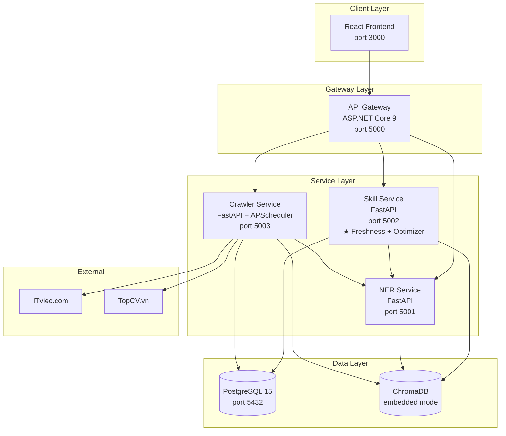
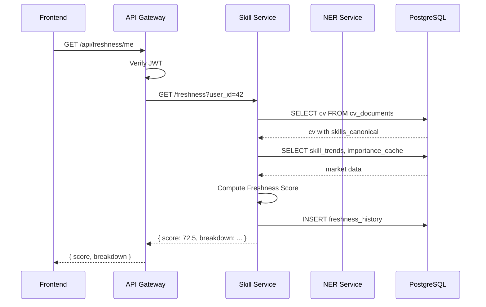

# 3.6 Thiết kế Kiến trúc Tổng thể và Cơ sở Dữ liệu

## 3.6.1 Kiến trúc microservices

Hệ thống được tổ chức thành nhiều service độc lập, giao tiếp qua HTTP REST API. Mỗi service có một trách nhiệm rõ ràng (Single Responsibility):



**Lý do chọn microservices thay vì monolith:**

| Tiêu chí | Monolith | Microservices |
|---|---|---|
| Cài đặt ban đầu | Nhanh hơn | Phức tạp hơn |
| Scale từng phần | Khó | Dễ (chỉ scale crawler khi cần) |
| Tách team phát triển | Khó | Dễ (mỗi người 1 service) |
| Test isolation | Phức tạp | Dễ (mỗi service có suite riêng) |
| Replace tech stack | Phải refactor lớn | Thay 1 service không ảnh hưởng khác |

Đề tài cấp tốt nghiệp chọn microservices vì các lý do "tách độc lập" và "scale từng phần" — quan trọng cho việc demo và benchmark.

## 3.6.2 Vai trò của từng service

### API Gateway (ASP.NET Core 9)

- **Entry point** duy nhất cho frontend.
- **Authentication**: JWT-based, kiểm tra token ở mỗi request.
- **Routing**: chuyển request đến đúng service backend.
- **Email service** (sử dụng `EmailService.cs`): gửi email digest weekly.
- **Rate limiting**: chống abuse, max 100 request/phút mỗi user.

### NER Service (FastAPI)

- **Endpoint chính**: `POST /extract-skills` nhận text, trả về list skill canonical đã chuẩn hóa.
- **Endpoint phụ**: `POST /normalize-skill` (cho 1 skill text), `POST /encode` (sinh SBERT embedding cho text).
- **Stateless**: không lưu state, có thể scale horizontally.
- **Model loaded once**: mBERT + sentence-transformers load vào memory khi start up.

### Skill Service (FastAPI) — service trọng tâm

Chứa logic chính của đề tài:

- `GET /freshness/me` — tính/trả Freshness Score hiện tại.
- `GET /freshness/history` — lịch sử score theo tuần.
- `POST /learning-path` — sinh learning path.
- `GET /alerts` — skill alerts của user.
- `GET /opportunities` — JD mới phù hợp.
- `GET /trends?skill=X` — time-series trend của 1 skill.
- `GET /trends/top?role=Y` — top trending skills của role.

Service này phụ thuộc NER Service (gọi extract-skills cho CV) và truy cập trực tiếp DB.

### Crawler Service (FastAPI + APScheduler)

- **Background scheduler**: APScheduler chạy cron job mỗi 24h.
- **API endpoints** cho debug/manual trigger:
  - `POST /crawler/trigger?source=itviec` — chạy crawler thủ công.
  - `GET /crawler/health` — trạng thái crawl gần nhất.
  - `GET /crawler/log?date=...` — log của một đợt crawl.
- **Internal jobs**: aggregate `skill_trends` sau crawl, recompute Freshness cho user active.

## 3.6.3 Schema cơ sở dữ liệu hoàn chỉnh

### PostgreSQL

```sql
-- ============ User & CV ============
CREATE TABLE users (
    id              SERIAL PRIMARY KEY,
    email           VARCHAR(255) UNIQUE NOT NULL,
    password_hash   VARCHAR(255) NOT NULL,
    target_role     VARCHAR(32),
    target_location VARCHAR(64),
    created_at      TIMESTAMP DEFAULT NOW(),
    last_login      TIMESTAMP
);

CREATE TABLE cv_documents (
    id              SERIAL PRIMARY KEY,
    user_id         INT REFERENCES users(id),
    raw_text        TEXT,
    skills_canonical JSONB NOT NULL,    -- list skill đã chuẩn hóa
    experiences     JSONB,              -- list experience với date_range để tính recency
    uploaded_at     TIMESTAMP DEFAULT NOW(),
    is_active       BOOLEAN DEFAULT TRUE
);

-- ============ JD & Market data ============
CREATE TABLE jd_raw (
    jd_key          VARCHAR(16) PRIMARY KEY,
    source          VARCHAR(32) NOT NULL,
    -- ... (đã mô tả trong mục 3.4.4)
);

CREATE TABLE skill_trends (
    -- (đã mô tả trong mục 3.4.4)
);

-- ============ Freshness ============
CREATE TABLE freshness_history (
    id              SERIAL PRIMARY KEY,
    user_id         INT REFERENCES users(id),
    score           NUMERIC(5,2) NOT NULL,
    breakdown       JSONB,              -- đóng góp của từng skill
    role            VARCHAR(32),
    computed_at     TIMESTAMP NOT NULL,
    UNIQUE (user_id, computed_at)
);
CREATE INDEX idx_freshness_user ON freshness_history(user_id, computed_at DESC);

CREATE TABLE skill_importance_cache (
    skill_canonical VARCHAR(255),
    role            VARCHAR(32),
    weight          NUMERIC(5,4) NOT NULL,
    computed_at     TIMESTAMP NOT NULL,
    PRIMARY KEY (skill_canonical, role)
);

-- ============ Alerts & Notifications ============
CREATE TABLE skill_alerts (
    id              SERIAL PRIMARY KEY,
    user_id         INT REFERENCES users(id),
    skill_canonical VARCHAR(255),
    alert_type      VARCHAR(32),        -- 'trending_up', 'trending_down', 'emerging'
    detail          TEXT,
    is_read         BOOLEAN DEFAULT FALSE,
    created_at      TIMESTAMP DEFAULT NOW()
);

-- ============ Crawler operation ============
CREATE TABLE crawler_log (
    id              SERIAL PRIMARY KEY,
    run_id          UUID NOT NULL,
    source          VARCHAR(32) NOT NULL,
    started_at      TIMESTAMP NOT NULL,
    finished_at     TIMESTAMP,
    status          VARCHAR(16),        -- 'success', 'failed', 'partial'
    jd_count        INT,
    error_message   TEXT
);
```

### ChromaDB

Hai collection chính:

- `real_jds`: vector của JD đã crawl (mô tả trong [mục 3.4.4](./3.4_thiet_ke_pipeline_crawl.md)).
- `cv_embeddings`: vector của CV người dùng, để tính ATS score nhanh.

## 3.6.4 Communication patterns

### Synchronous — HTTP REST

Default cho hầu hết tương tác giữa các service:



### Asynchronous — Background tasks

Dùng `BackgroundTasks` của FastAPI cho các task không cần response ngay:


### Scheduled — Cron jobs

Crawler service dùng APScheduler:

| Job | Lịch | Mô tả |
|---|---|---|
| `crawl_daily` | 02:00 hàng ngày | Crawl ITviec, TopCV |
| `aggregate_trends` | Sau crawl_daily | Tính skill_trends cho ngày |
| `recompute_active_users` | 04:00 hàng ngày | Recompute Freshness cho user active 30 ngày |
| `cleanup_old_jd` | Chủ nhật 03:00 | Xóa JD cũ > 90 ngày |

## 3.6.5 Triển khai bằng Docker Compose

Cấu trúc `docker-compose.yml`:

```yaml
services:
  postgres:
    image: postgres:15
    volumes: ["./pgdata:/var/lib/postgresql/data"]
    environment: [POSTGRES_USER, POSTGRES_PASSWORD]

  ner-service:
    build: ./services/ner_service
    ports: ["5001:5001"]
    depends_on: [postgres]
    environment: [DATABASE_URL]

  skill-service:
    build: ./services/skill_service
    ports: ["5002:5002"]
    depends_on: [postgres, ner-service]
    volumes: ["./chromadb:/data/chroma"]

  crawler-service:
    build: ./services/crawler_service
    ports: ["5003:5003"]
    depends_on: [postgres, ner-service, skill-service]

  api-gateway:
    build: ./gateway
    ports: ["5000:5000"]
    depends_on: [skill-service, ner-service]

  frontend:
    build: ./frontend
    ports: ["3000:3000"]
    depends_on: [api-gateway]
```

Toàn bộ stack được start bằng một lệnh `docker compose up`. Đây cũng là cách demo trong báo cáo và bảo vệ.

## 3.6.6 Quản lý cấu hình

Mỗi service có file `config.yaml` (hoặc `.env`) với các tham số:

```yaml
# skill_service/config.yaml
freshness:
  alpha_1: 0.3   # PART_OF weight
  alpha_2: 0.2   # REQUIRES indegree weight
  alpha_3: 0.5   # frequency weight
  trend_clip_min: 0.5
  trend_clip_max: 1.5

learning_path:
  default_algorithm: "greedy"
  greedy_tie_break_strategy: "max_jd_unlock"
  max_path_length: 15

skill_matching:
  semantic_threshold: 0.65
  cache_ttl_minutes: 60
```

Tất cả tham số trong báo cáo (ví dụ ngưỡng 0.65, hệ số α) đều có thể trace lại từ config files. Đây là một phần của yêu cầu phi chức năng về **Tính tái lập** trong [mục 3.1.2](./3.1_phan_tich_yeu_cau.md).

## 3.6.7 Tổng kết Chương 3

Chương 3 đã trình bày:

1. **Yêu cầu hệ thống** ([3.1](./3.1_phan_tich_yeu_cau.md)): 6 nhóm chức năng (FR-A đến FR-F), các yêu cầu phi chức năng, và 5 bài toán kỹ thuật cần giải quyết.

2. **Thiết kế CV Freshness Score** ([3.2](./3.2_thiet_ke_freshness_score.md)): Công thức tường minh với 3 thành phần (importance, trend, recency), 6 đặc điểm mong muốn được kiểm tra, 3 phương pháp validate.

3. **Thiết kế Learning Path Optimizer** ([3.3](./3.3_thiet_ke_learning_path_optimizer.md)): Cài đặt 3 thuật toán theo strategy pattern, thiết kế 50 test cases benchmark theo 5 nhóm đặc điểm.

4. **Thiết kế Pipeline crawl JD** ([3.4](./3.4_thiet_ke_pipeline_crawl.md)): Adapter pattern cho 2+ nguồn, deduplication, schema time-series, xử lý failure modes.

5. **Thiết kế Dashboard** ([3.5](./3.5_thiet_ke_dashboard.md)): Bố cục theo nguyên tắc Few (2006), 7 component chính, responsive design, empty states.

6. **Kiến trúc tổng thể** (mục này): 4 service microservices, schema DB hoàn chỉnh, communication patterns (sync/async/scheduled), triển khai bằng Docker Compose.

Chương 4 sẽ trình bày kết quả thực hiện thực tế: triển khai, kết quả benchmark thuật toán, validate Freshness Score, và user study.

---

[← 3.5 Thiết kế Dashboard](./3.5_thiet_ke_dashboard.md) | [→ Chương 4: Xây dựng và Thực nghiệm](#) *(viết từ tuần 17)*
