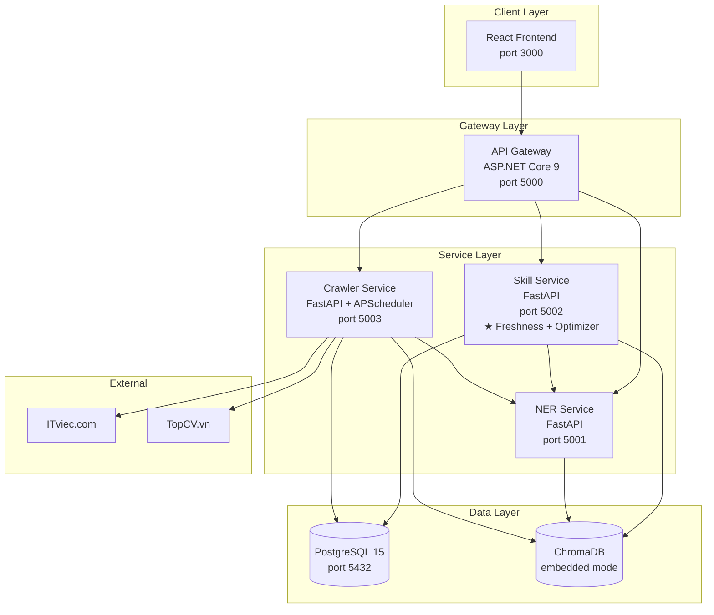
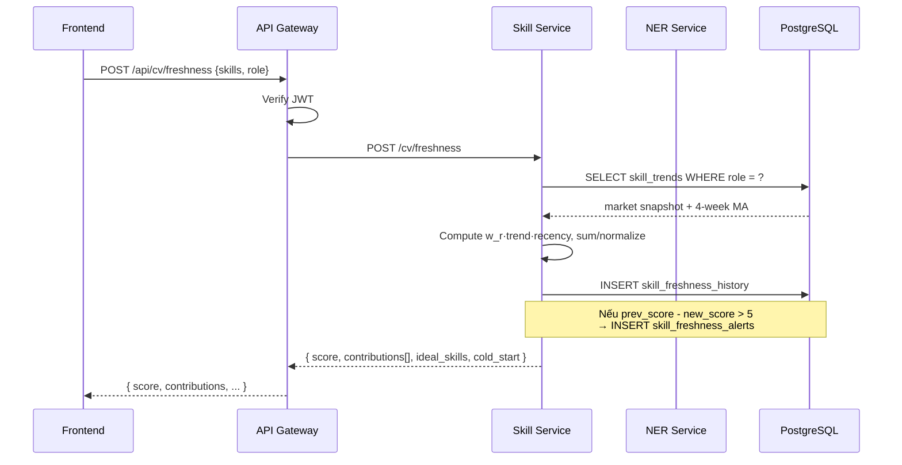
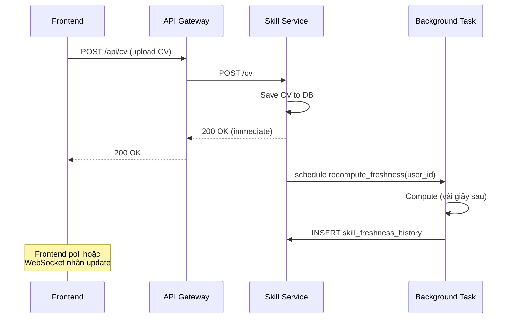
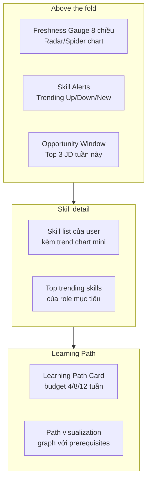
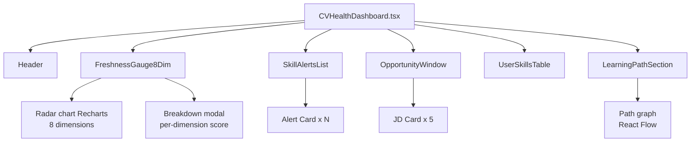

# 3.7 Thiết kế Kiến trúc Tổng thể và CV Health Dashboard

## 3.7.1 Kiến trúc microservices

Hệ thống được tổ chức thành nhiều service độc lập, giao tiếp qua HTTP REST API. Mỗi service có một trách nhiệm rõ ràng (Single Responsibility):



**Lý do chọn microservices thay vì monolith:**

| Tiêu chí | Monolith | Microservices |
|---|---|---|
| Cài đặt ban đầu | Nhanh hơn | Phức tạp hơn |
| Scale từng phần | Khó | Dễ (chỉ scale crawler khi cần) |
| Tách team phát triển | Khó | Dễ (mỗi người 1 service) |
| Test isolation | Phức tạp | Dễ (mỗi service có suite riêng) |
| Replace tech stack | Phải refactor lớn | Thay 1 service không ảnh hưởng khác |

Đề tài cấp tốt nghiệp chọn microservices vì các lý do "tách độc lập" và "scale từng phần" — quan trọng cho việc demo và benchmark.

## 3.7.2 Vai trò của từng service

### API Gateway (ASP.NET Core 9)

- **Entry point** duy nhất cho frontend.
- **Authentication**: JWT-based, kiểm tra token ở mỗi request.
- **Routing**: chuyển request đến đúng service backend.
- **Email service** (sử dụng `EmailService.cs`): gửi email digest weekly.
- **Rate limiting**: chống abuse, max 100 request/phút mỗi user.

### NER Service (FastAPI)

- **Endpoint chính**: `POST /extract-skills` nhận text, trả về list skill canonical đã chuẩn hóa.
- **Endpoint phụ**: `POST /normalize-skill` (cho 1 skill text), `POST /encode` (sinh SBERT embedding cho text).
- **Stateless**: không lưu state, có thể scale horizontally.
- **Model loaded once**: mBERT + sentence-transformers load vào memory khi start up.

### Skill Service (FastAPI) — service trọng tâm

Chứa logic chính của đề tài. Bảng dưới liệt kê các endpoint cùng trạng thái triển khai tính đến Tuần 13:

| Endpoint | Mục đích | Trạng thái |
|---|---|---|
| `POST /cv/freshness` | Tính Freshness Score cho CV (input: skills + role + snapshot_date) | Đã triển khai (Tuần 10) |
| `POST /learning-path` | Sinh learning path bằng Greedy/Dijkstra/DP | Đã triển khai (Tuần 12–13) |
| `GET /ontology/skill/{name}` | Trả node skill (gồm `cost_weeks` cho LP Optimizer) | Đã triển khai (Tuần 10) |
| `GET /ontology/graph` / `/ontology/search` / `/ontology/categories` | Truy vấn skill graph | Đã có sẵn |
| `POST /cv/ats-score` | ATS scoring (US-18) | Đã có sẵn |
| `GET /market/overview` | Market dashboard data (US-19) | Đã có sẵn |
| `GET /freshness/history?user_id=...` | Lịch sử Freshness Score theo tuần | Tuần 14 |
| `GET /alerts?user_id=...` | Score-drop alerts của user | Tuần 14 |
| `GET /opportunities?user_id=...` | JD mới phù hợp trong 7 ngày | Tuần 14 |
| `GET /trends?skill=X` / `/trends/top?role=Y` | Time-series trend từ `skill_trends` | Tuần 14–15 |

Service này phụ thuộc NER Service (gọi extract-skills cho CV) và truy cập trực tiếp DB. Note: endpoint `POST /cv/freshness` nhận trực tiếp danh sách skill thay vì lấy từ `cv_documents` bằng `user_id` để giảm coupling trong giai đoạn nghiên cứu; phiên bản gắn với user (`GET /freshness/me`) sẽ được thêm khi tích hợp authentication ở Tuần 14.

### Crawler Service (FastAPI + APScheduler)

- **Background scheduler**: APScheduler chạy cron job mỗi 24h.
- **API endpoints** cho debug/manual trigger:
  - `POST /crawler/trigger?source=itviec` — chạy crawler thủ công.
  - `GET /crawler/health` — trạng thái crawl gần nhất.
  - `GET /crawler/log?date=...` — log của một đợt crawl.
- **Internal jobs**: aggregate `skill_trends` sau crawl, recompute Freshness cho user active.

## 3.7.3 Schema cơ sở dữ liệu hoàn chỉnh

### PostgreSQL

```sql
-- ============ User & CV ============
CREATE TABLE users (
    id              SERIAL PRIMARY KEY,
    email           VARCHAR(255) UNIQUE NOT NULL,
    password_hash   VARCHAR(255) NOT NULL,
    target_role     VARCHAR(32),
    target_location VARCHAR(64),
    created_at      TIMESTAMP DEFAULT NOW(),
    last_login      TIMESTAMP
);

CREATE TABLE cv_documents (
    id              SERIAL PRIMARY KEY,
    user_id         INT REFERENCES users(id),
    raw_text        TEXT,
    skills_canonical JSONB NOT NULL,    -- list skill đã chuẩn hóa
    experiences     JSONB,              -- list experience với date_range để tính recency
    uploaded_at     TIMESTAMP DEFAULT NOW(),
    is_active       BOOLEAN DEFAULT TRUE
);

-- ============ JD & Market data ============
CREATE TABLE jd_raw (
    jd_key          VARCHAR(16) PRIMARY KEY,
    source          VARCHAR(32) NOT NULL,
    -- ... (đã mô tả trong mục 3.4.4)
);

CREATE TABLE skill_trends (
    -- (đã mô tả trong mục 3.4.4)
);

-- ============ Freshness ============
-- Append-only time-series of Freshness Score per (user, role).
-- Triển khai bằng SQLAlchemy ở services/skill_service/models/database.py (Tuần 11).
CREATE TABLE skill_freshness_history (
    id              SERIAL PRIMARY KEY,
    user_id         VARCHAR(64) NOT NULL,
    role            VARCHAR(32) NOT NULL,
    snapshot_date   TIMESTAMP NOT NULL DEFAULT NOW(),
    score           DOUBLE PRECISION NOT NULL,
    contributions   JSONB,              -- list[SkillContribution] đã serialize
    cold_start      INTEGER DEFAULT 0   -- 1 = thiếu lịch sử ≥ 4 tuần
);
CREATE INDEX idx_fresh_user_date ON skill_freshness_history(user_id, snapshot_date);

-- Score-drop alert: bắn khi Freshness giảm > 5 điểm so với snapshot trước đó
-- của cùng (user, role). Khác với mô hình per-skill trending_up/down trong
-- thiết kế gốc — đề tài chọn mô hình per-score-drop vì gọn hơn và có
-- semantics rõ ràng hơn cho dashboard (xem §3.2.5).
CREATE TABLE skill_freshness_alerts (
    id              SERIAL PRIMARY KEY,
    user_id         VARCHAR(64) NOT NULL,
    role            VARCHAR(32) NOT NULL,
    fired_at        TIMESTAMP NOT NULL DEFAULT NOW(),
    prev_score      DOUBLE PRECISION NOT NULL,
    new_score       DOUBLE PRECISION NOT NULL,
    delta           DOUBLE PRECISION NOT NULL,
    reason          VARCHAR(512)        -- "Freshness dropped … cause: '<skill>' trend=…"
);

-- skill_importance_cache (skill_canonical, role, weight, computed_at):
-- chưa triển khai ở giai đoạn Tuần 13. Engine hiện tính w_r(s) on-demand
-- cho mỗi request — vẫn dưới ngưỡng 2 s ở §3.1.2 nhờ ontology in-memory và
-- query skill_trends rất nhẹ. Sẽ thêm cache khi số user active vượt ~50.

-- ============ Crawler operation ============
CREATE TABLE crawler_log (
    id              SERIAL PRIMARY KEY,
    run_id          UUID NOT NULL,
    source          VARCHAR(32) NOT NULL,
    started_at      TIMESTAMP NOT NULL,
    finished_at     TIMESTAMP,
    status          VARCHAR(16),        -- 'success', 'failed', 'partial'
    jd_count        INTEGER,
    error_message   TEXT
);
```

### ChromaDB

Hai collection chính:

- `real_jds`: vector của JD đã crawl (mô tả trong [mục 3.4.4](./3.4_thiet_ke_pipeline_crawl.md)).
- `cv_embeddings`: vector của CV người dùng, để tính ATS score nhanh.

## 3.7.4 Communication patterns

### Synchronous — HTTP REST

Default cho hầu hết tương tác giữa các service:



### Asynchronous — Background tasks

Dùng `BackgroundTasks` của FastAPI cho các task không cần response ngay:



### Scheduled — Cron jobs

Crawler service dùng APScheduler:

| Job | Lịch | Mô tả |
|---|---|---|
| `crawl_daily` | 02:00 hàng ngày | Crawl ITviec, TopCV |
| `aggregate_trends` | Sau crawl_daily | Tính skill_trends cho ngày |
| `recompute_active_users` | 04:00 hàng ngày | Recompute Freshness cho user active 30 ngày |
| `cleanup_old_jd` | Chủ nhật 03:00 | Xóa JD cũ > 90 ngày |

## 3.7.5 Triển khai bằng Docker Compose

Cấu trúc `docker-compose.yml`:

```yaml
services:
  postgres:
    image: postgres:15
    volumes: ["./pgdata:/var/lib/postgresql/data"]
    environment: [POSTGRES_USER, POSTGRES_PASSWORD]

  ner-service:
    build: ./services/ner_service
    ports: ["5001:5001"]
    depends_on: [postgres]
    environment: [DATABASE_URL]

  skill-service:
    build: ./services/skill_service
    ports: ["5002:5002"]
    depends_on: [postgres, ner-service]
    volumes: ["./chromadb:/data/chroma"]

  crawler-service:
    build: ./services/crawler_service
    ports: ["5003:5003"]
    depends_on: [postgres, ner-service, skill-service]

  api-gateway:
    build: ./gateway
    ports: ["5000:5000"]
    depends_on: [skill-service, ner-service]

  frontend:
    build: ./frontend
    ports: ["3000:3000"]
    depends_on: [api-gateway]
```

Toàn bộ stack được start bằng một lệnh `docker compose up`. Đây cũng là cách demo trong báo cáo và bảo vệ.

## 3.7.6 Quản lý cấu hình

Mỗi service có file `config.yaml` (hoặc `.env`) với các tham số:

```yaml
# skill_service/config.yaml
freshness:
  alpha_1: 0.3   # PART_OF weight
  alpha_2: 0.2   # REQUIRES indegree weight
  alpha_3: 0.5   # frequency weight
  trend_clip_min: 0.5
  trend_clip_max: 1.5

learning_path:
  default_algorithm: "greedy"
  greedy_tie_break_strategy: "max_jd_unlock"
  max_path_length: 15

skill_matching:
  semantic_threshold: 0.65
  cache_ttl_minutes: 60
```

Tất cả tham số trong báo cáo (ví dụ ngưỡng 0.65, hệ số α) đều có thể trace lại từ config files. Đây là một phần của yêu cầu phi chức năng về **Tính tái lập** trong [mục 3.1.2](./3.1_phan_tich_yeu_cau.md).

## 3.7.7 Thiết kế CV Health Dashboard (deliverable end-user)

CV Health Dashboard là giao diện tích hợp end-user, trực quan hóa kết quả của 3 đóng góp khoa học chính (Multi-criteria Freshness, Learning Path, Skill alerts) cho sinh viên. Khác với Market Intel Dashboard (mục [3.5](./3.5_thiet_ke_market_intel.md)) cung cấp bức tranh vĩ mô không cá nhân hóa, CV Health Dashboard hiển thị **trạng thái CV riêng của từng user**.

### Nguyên tắc thiết kế UI

Dashboard áp dụng các nguyên tắc của Few (2006) [[9]](../tai_lieu_tham_khao.md#ref-9) (đã trình bày trong [mục 2.3.3](../chuong2/2.3_market_intelligence.md#233-information-dashboard-design-cho-thị-trường-tuyển-dụng)):

- **Above the fold**: nhìn thấy ngay 3 thứ quan trọng nhất: Freshness Score 8 chiều, Skill alerts mới, Top JD phù hợp tuần này. Không cần scroll mới thấy giá trị.
- **Tránh chart junk**: không dùng 3D, gradient phức tạp, animation thừa.
- **Highlight cái khác biệt**: Skill alerts (skill đang trending) được highlight màu, các skill bình thường để màu nhạt.
- **Drill-down**: số liệu tổng (Freshness Score) click được để xem breakdown từng chiều.
- **Cung cấp context**: "Freshness 72/100, tăng 5 điểm so với tuần trước".

### Bố cục Dashboard



### Component breakdown (React)



**Component quan trọng**:

- **FreshnessGauge8Dim**: Radar chart 8 chiều thay vì single gauge — phản ánh đúng Multi-criteria Framework. Click vào 1 axis (ví dụ "Skill") mở modal Breakdown với top contributing skills.
- **SkillAlertsList**: Card có tên skill + status badge (Trending Up/Down/Emerging) + lý do ("Demand tăng 25% trong 4 tuần qua") + CTA "Thêm vào learning path".
- **LearningPathSection**: 2 chế độ — Compact (3-5 skill xếp theo thứ tự) và Expanded (React Flow graph với prerequisites).

### Tương tác với Backend

Mỗi component gọi API riêng, dùng React Query để cache và auto-refetch:

| Component | API | Cache TTL |
|---|---|---|
| FreshnessGauge8Dim | `GET /api/freshness/me` | 5 phút |
| SkillAlertsList | `GET /api/alerts/me` | 1 giờ |
| OpportunityWindow | `GET /api/opportunities/me?limit=5` | 1 giờ |
| UserSkillsTable | `GET /api/cv/skills` + trends | 30 phút |
| LearningPathSection | `POST /api/learning-path` | Không cache |

Tách API rõ ràng cho phép: (i) mỗi component fail độc lập; (ii) lazy load component không nhìn thấy; (iii) cache hợp lý theo tốc độ thay đổi data.

### Responsive design

Dashboard hoạt động trên cả desktop (≥1024px: 3 cột top section), tablet (768-1023px: 2 cột), và mobile (<768px: 1 cột, FreshnessGauge thu nhỏ). Sử dụng TailwindCSS breakpoints. Component không thiết yếu trên mobile (Path Graph expanded) ẩn đi, chỉ giữ compact list.

### Empty states

| Trạng thái | Behavior |
|---|---|
| Chưa upload CV | Wizard "Upload CV để bắt đầu" thay vì dashboard trống |
| CV đã upload, < 4 tuần market data | "Đang thu thập dữ liệu trend, quay lại sau X ngày" |
| Không có JD phù hợp tuần này | "Thử mở rộng role mục tiêu hoặc location" |
| Learning Path không sinh được | "CV của bạn đã đủ kỹ năng cho hầu hết JD, chỉ cần luyện kinh nghiệm thực tế!" |

## 3.7.8 Tổng kết Chương 3

Chương 3 đã trình bày thiết kế chi tiết cho hệ thống CV Health Intelligence:

1. **Yêu cầu hệ thống** ([3.1](./3.1_phan_tich_yeu_cau.md)): 7 nhóm chức năng (FR-A đến FR-G), yêu cầu phi chức năng, 5 bài toán kỹ thuật mapping với 3 đóng góp + infrastructure + integration.

2. **Multi-criteria CV Freshness Framework** ([3.2](./3.2_thiet_ke_freshness_score.md)) — **đóng góp 1**: khung 8 chiều với công thức từng chiều + Weighted Sum Model + trọng số theo role/seniority + 5 tính chất + 3 phương pháp validate.

3. **Learning Path Optimizer** ([3.3](./3.3_thiet_ke_learning_path_optimizer.md)) — **đóng góp 2**: 3 thuật toán theo strategy pattern, 50 test cases benchmark theo 5 nhóm, kết quả sơ bộ Greedy 0.99 / Dijkstra 1.00 / DP 1.00.

4. **Pipeline crawl JD + cross-source dedup** ([3.4](./3.4_thiet_ke_pipeline_crawl.md)): cron `@reboot` + daily 09:00 + stamp file, adapter pattern, 2 tầng dedup (`jd_key` URL-based + `job_group_id` strict company+title).

5. **Market Intelligence Dashboard** ([3.5](./3.5_thiet_ke_market_intel.md)) — **đóng góp 3**: 33 insight chia 5 nhóm, filter switch ITviec/TopCV/cả hai, 8 nguyên tắc dashboard (5 Few + 3 analytics).

6. **Skill Extraction & Matching Pipeline** ([3.6](./3.6_thiet_ke_skill_extraction_pipeline.md)) — **infrastructure**: NER mBERT 21 nhãn BIO + Ontology 460 entries 15 category + Cascade Matching 3 tầng (Exact/Ontology/SBERT).

7. **Kiến trúc tổng thể + CV Health Dashboard** (mục này): 6 microservices, schema PostgreSQL + ChromaDB, communication patterns (sync/async/scheduled), Docker Compose deployment, UI dashboard 8 chiều cho user.

Chương 4 sẽ trình bày kết quả thực nghiệm: data quality, benchmark thuật toán, validate Multi-criteria Framework, đánh giá đa tầng Skill Extraction Pipeline, Market Intel insights.

---

[← 3.6 Skill Extraction & Matching Pipeline](./3.6_thiet_ke_skill_extraction_pipeline.md) | [→ Chương 4: Xây dựng và Thực nghiệm](#) *(viết từ tuần 17)*
